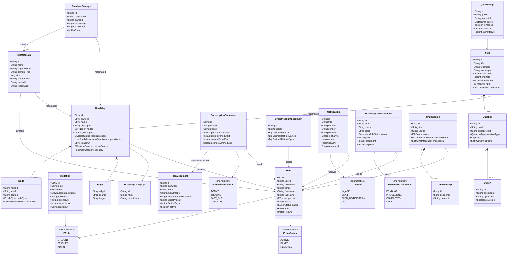

# System Overview — Class Diagram

```mermaid
classDiagram
    %% ── PROFILE SERVICE ──
    class User {
        +UUID id
        +String userId
        +String username
        +String email
        +String firstName
        +String lastName
        +EGender gender
        +String avatar
        +EUserStatus status
        +ERole role
        +Instant joinAt
    }
    class Invitation {
        +UUID id
        +String email
        +ERole role
        +EInvitationStatus status
        +String tokenHash
        +Instant expiresAt
        +Instant acceptedAt
        +String createdBy
    }
    class ERole {
        <<enumeration>>
        STUDENT
        TEACHER
        ADMIN
    }
    class EUserStatus {
        <<enumeration>>
        ACTIVE
        BANED
        REMOVED
    }
    User --> ERole
    User --> EUserStatus
    Invitation --> ERole

    %% ── ROADMAP SERVICE ──
    class RoadMap {
        +String id
        +String ownerId
        +String name
        +String description
        +List~Node~ nodes
        +List~Edge~ edges
        +EAccessStatusRoadmap scope
        +List~RoadMapAccessPermission~ permissions
        +String imageUrl
        +ECreationSource creationSource
        +RoadmapCategory category
    }
    class Node {
        +String nodeId
        +String label
        +String content
        +ENodeType nodeType
        +List~ResourceNode~ resources
    }
    class Edge {
        +String edgeId
        +String source
        +String target
    }
    class RoadmapCategory {
        +String id
        +String name
        +String description
    }
    class Quiz {
        +String id
        +String title
        +String teacherId
        +String roadmapId
        +Instant startDate
        +Instant endDate
        +int durationMinutes
        +int maxAttempts
        +List~Question~ questions
    }
    class Question {
        +String id
        +String quizId
        +String questionText
        +QuestionType questionType
        +int points
        +List~Option~ options
    }
    class Option {
        +String id
        +String questionId
        +String optionText
        +boolean isCorrect
    }
    class QuizAttempt {
        +String id
        +String quizId
        +String studentId
        +BigDecimal score
        +boolean isPassed
        +Instant startedAt
        +Instant submittedAt
    }

    RoadMap "1" *-- "many" Node
    RoadMap "1" *-- "many" Edge
    RoadMap --> RoadmapCategory
    Quiz "1" *-- "many" Question
    Question "1" *-- "many" Option
    QuizAttempt --> Quiz

    %% ── PAYMENT SERVICE ──
    class PlanDocument {
        +String id
        +String planCode
        +String name
        +int maxRoadmaps
        +long maxStoragePerRoadmap
        +String stripePriceId
        +int trialPeriodDays
        +boolean active
    }
    class SubscriptionDocument {
        +String id
        +String userId
        +String planId
        +SubscriptionStatus status
        +Instant currentPeriodStart
        +Instant currentPeriodEnd
        +boolean cancelAtPeriodEnd
    }
    class CreditAccountDocument {
        +String id
        +String userId
        +BigDecimal balance
        +BigDecimal lifetimeEarned
        +BigDecimal lifetimeSpent
    }
    class SubscriptionStatus {
        <<enumeration>>
        ACTIVE
        TRIALING
        PAST_DUE
        CANCELLED
    }

    SubscriptionDocument --> PlanDocument : references planId
    SubscriptionDocument --> SubscriptionStatus

    %% ── STORAGE SERVICE ──
    class FileMetadata {
        +String id
        +String name
        +String originalName
        +String contentType
        +long size
        +String storagePath
        +String ownerId
        +String roadmapId
    }
    class RoadmapStorage {
        +String id
        +String roadmapId
        +String ownerId
        +long usedStorage
        +long maxStorage
        +int fileCount
    }

    RoadmapStorage "1" --> "many" FileMetadata : contains

    %% ── NOTIFICATION SERVICE ──
    class Notification {
        +String id
        +String title
        +String content
        +String sender
        +String receiver
        +Channel channel
        +boolean read
        +Instant readAt
        +String referenceId
    }
    class Channel {
        <<enumeration>>
        IN_APP
        EMAIL
        PUSH_NOTIFICATION
        SMS
    }
    Notification --> Channel

    %% ── AI SERVICE ──
    class RoadmapGenerationJob {
        +String id
        +String jobId
        +String userId
        +String topic
        +GenerationJobStatus status
        +int progress
        +Instant createdAt
        +Instant expireAt
    }
    class ChatSession {
        +Long id
        +String title
        +String userId
        +EAIScope scope
        +EChatSessionStatus sessionStatus
        +List~ChatMessage~ messages
    }
    class ChatMessage {
        +Long id
        +Long sessionId
        +String content
    }
    class GenerationJobStatus {
        <<enumeration>>
        PENDING
        PROCESSING
        COMPLETED
        FAILED
    }

    ChatSession "1" *-- "many" ChatMessage
    RoadmapGenerationJob --> GenerationJobStatus

    %% ── CROSS-SERVICE LINKS ──
    RoadMap --> User : ownerId
    SubscriptionDocument --> User : userId
    CreditAccountDocument --> User : userId
    FileMetadata --> User : ownerId
    FileMetadata --> RoadMap : roadmapId
    RoadmapStorage --> RoadMap : roadmapId
    Quiz --> RoadMap : roadmapId
    Notification --> User : receiver
    RoadmapGenerationJob --> User : userId
    ChatSession --> User : userId
```
