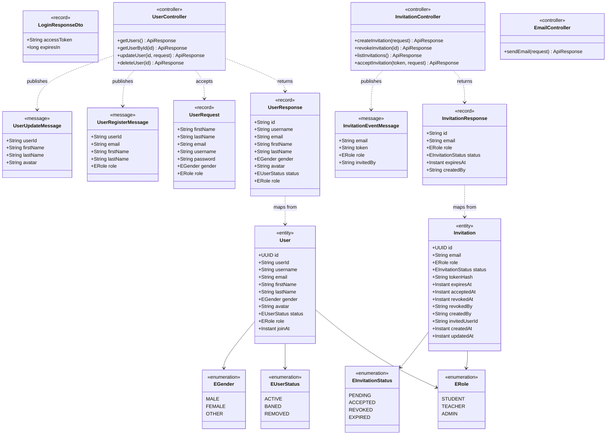

# Profile Service — Class Diagram

```mermaid
classDiagram
    %% ── ENUMERATIONS ──
    class ERole {
        <<enumeration>>
        STUDENT
        TEACHER
        ADMIN
    }
    class EUserStatus {
        <<enumeration>>
        ACTIVE
        BANED
        REMOVED
    }
    class EGender {
        <<enumeration>>
        MALE
        FEMALE
        OTHER
    }
    class EInvitationStatus {
        <<enumeration>>
        PENDING
        ACCEPTED
        REVOKED
        EXPIRED
    }

    %% ── JPA ENTITIES ──
    class User {
        <<entity>>
        +UUID id
        +String userId
        +String username
        +String email
        +String firstName
        +String lastName
        +EGender gender
        +String avatar
        +EUserStatus status
        +ERole role
        +Instant joinAt
    }
    class Invitation {
        <<entity>>
        +UUID id
        +String email
        +ERole role
        +EInvitationStatus status
        +String tokenHash
        +Instant expiresAt
        +Instant acceptedAt
        +Instant revokedAt
        +String revokedBy
        +String createdBy
        +String invitedUserId
        +Instant createdAt
        +Instant updatedAt
    }

    %% ── APPLICATION DTOs ──
    class UserResponse {
        <<record>>
        +String id
        +String username
        +String email
        +String firstName
        +String lastName
        +EGender gender
        +String avatar
        +EUserStatus status
        +ERole role
    }
    class UserRequest {
        <<record>>
        +String firstName
        +String lastName
        +String email
        +String username
        +String password
        +EGender gender
        +ERole role
    }
    class LoginResponseDto {
        <<record>>
        +String accessToken
        +long expiresIn
    }
    class InvitationResponse {
        <<record>>
        +String id
        +String email
        +ERole role
        +EInvitationStatus status
        +Instant expiresAt
        +String createdBy
    }

    %% ── MESSAGING ──
    class UserRegisterMessage {
        <<message>>
        +String userId
        +String email
        +String firstName
        +String lastName
        +ERole role
    }
    class UserUpdateMessage {
        <<message>>
        +String userId
        +String firstName
        +String lastName
        +String avatar
    }
    class InvitationEventMessage {
        <<message>>
        +String email
        +String token
        +ERole role
        +String invitedBy
    }

    %% ── CONTROLLERS ──
    class UserController {
        <<controller>>
        +getUsers() ApiResponse
        +getUserById(id) ApiResponse
        +updateUser(id, request) ApiResponse
        +deleteUser(id) ApiResponse
    }
    class InvitationController {
        <<controller>>
        +createInvitation(request) ApiResponse
        +revokeInvitation(id) ApiResponse
        +listInvitations() ApiResponse
        +acceptInvitation(token, request) ApiResponse
    }
    class EmailController {
        <<controller>>
        +sendEmail(request) ApiResponse
    }

    User --> ERole
    User --> EUserStatus
    User --> EGender
    Invitation --> ERole
    Invitation --> EInvitationStatus
    UserResponse ..> User : maps from
    InvitationResponse ..> Invitation : maps from
    UserController ..> UserResponse : returns
    UserController ..> UserRequest : accepts
    InvitationController ..> InvitationResponse : returns
    UserController ..> UserRegisterMessage : publishes
    UserController ..> UserUpdateMessage : publishes
    InvitationController ..> InvitationEventMessage : publishes
```
