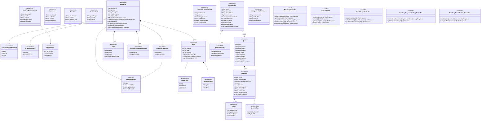

# Roadmap Service — Class Diagram

```mermaid
classDiagram
    %% ── BASE ──
    class BaseDocument {
        <<abstract>>
        +String id
        +Instant createdDate
        +Instant updatedDate
        +boolean isDeleted
    }

    %% ── ENUMERATIONS ──
    class EAccessStatusRoadmap {
        <<enumeration>>
        PUBLIC
        PRIVATE
        GROUP
    }
    class ECreationSource {
        <<enumeration>>
        MANUAL
        AI_GENERATED
    }
    class ENodeType {
        <<enumeration>>
        TOPIC
        RESOURCE
        MILESTONE
    }
    class ENodeStatus {
        <<enumeration>>
        NOT_STARTED
        IN_PROGRESS
        COMPLETED
    }
    class QuestionType {
        <<enumeration>>
        MULTIPLE_CHOICE
        TRUE_FALSE
    }

    %% ── ROADMAP BOUNDED CONTEXT ──
    class RoadMap {
        <<document>>
        +String ownerId
        +String name
        +String description
        +List~Node~ nodes
        +List~Edge~ edges
        +EAccessStatusRoadmap scope
        +List~RoadMapAccessPermission~ permissions
        +String imageUrl
        +ECreationSource creationSource
        +RoadmapCategory category
        +List~RoadmapResource~ resources
    }
    class Node {
        <<embedded>>
        +String nodeId
        +String label
        +String content
        +ENodeType nodeType
        +List~ResourceNode~ resources
        +Map~String,Object~ style
    }
    class Edge {
        <<embedded>>
        +String edgeId
        +String source
        +String target
        +Map~String,Object~ style
    }
    class RoadMapAccessPermission {
        <<embedded>>
        +String userId
        +String permission
    }
    class ResourceNode {
        <<embedded>>
        +String title
        +String url
    }
    class RoadmapCategory {
        <<document>>
        +String name
        +String description
    }
    class Comment {
        <<document>>
        +String roadmapId
        +String authorId
        +String content
        +Instant createdAt
    }
    class Reaction {
        <<document>>
        +String roadmapId
        +String userId
        +String reactionType
    }
    class RoadmapNote {
        <<document>>
        +String roadmapId
        +String userId
        +String content
    }
    class NodeProgressTracking {
        <<document>>
        +String roadmapId
        +String userId
        +String nodeId
        +ENodeStatus status
        +Instant updatedAt
    }
    class RoadmapFocusTracking {
        <<document>>
        +String roadmapId
        +String userId
        +int claimTargetMinutes
        +int focusedMinutes
        +boolean claimReached
        +Instant createdDate
    }

    RoadMap --|> BaseDocument
    RoadmapCategory --|> BaseDocument
    RoadMap "1" *-- "many" Node
    RoadMap "1" *-- "many" Edge
    RoadMap "1" *-- "many" RoadMapAccessPermission
    RoadMap --> RoadmapCategory
    Node "1" *-- "many" ResourceNode
    RoadMap --> EAccessStatusRoadmap
    RoadMap --> ECreationSource
    Node --> ENodeType
    NodeProgressTracking --> ENodeStatus

    %% ── LEARNING BOUNDED CONTEXT ──
    class Quiz {
        <<document>>
        +String title
        +String description
        +String teacherId
        +String roadmapId
        +boolean visible
        +Instant startDate
        +Instant endDate
        +int durationMinutes
        +int maxAttempts
        +List~Question~ questions
    }
    class Question {
        <<document>>
        +String quizId
        +String questionText
        +QuestionType questionType
        +int points
        +int orderIndex
        +String codeSnippet
        +String imageUrl
        +String explanation
        +String correctAnswer
        +List~Option~ options
    }
    class Option {
        <<document>>
        +String questionId
        +String optionText
        +boolean isCorrect
        +int orderIndex
    }
    class QuizAttempt {
        <<document>>
        +String quizId
        +String studentId
        +String studentName
        +BigDecimal score
        +int completionTimeSeconds
        +int attemptNumber
        +boolean isPassed
        +Instant startedAt
        +Instant submittedAt
        +List~AttemptAnswer~ answers
    }
    class AttemptAnswer {
        <<embedded>>
        +String questionId
        +String selectedAnswer
        +boolean isCorrect
    }
    class AssignmentSubmission {
        <<document>>
        +String assignmentId
        +String studentId
        +String content
        +Instant submittedAt
    }

    Quiz "1" *-- "many" Question
    Question "1" *-- "many" Option
    QuizAttempt --> Quiz : quizId
    QuizAttempt "1" *-- "many" AttemptAnswer
    Question --> QuestionType

    %% ── CONTROLLERS ──
    class RoadmapController {
        <<controller>>
        +createRoadmap(request) ApiResponse
        +getRoadmap(id) ApiResponse
        +updateRoadmap(id, request) ApiResponse
        +deleteRoadmap(id) ApiResponse
        +listRoadmaps(pageable) ApiResponse
    }
    class QuizController {
        <<controller>>
        +createQuiz(request) ApiResponse
        +getQuiz(id) ApiResponse
        +updateQuiz(id, request) ApiResponse
        +deleteQuiz(id) ApiResponse
    }
    class QuizAttemptController {
        <<controller>>
        +startAttempt(quizId) ApiResponse
        +submitAttempt(attemptId, answers) ApiResponse
        +getAttemptResult(attemptId) ApiResponse
    }
    class RoadmapProgressTrackingController {
        <<controller>>
        +updateNodeStatus(roadmapId, nodeId, status) ApiResponse
        +getProgress(roadmapId) ApiResponse
    }
    class RoadmapFocusTrackingController {
        <<controller>>
        +startSession(roadmapId, minutes) ApiResponse
        +completeSession(sessionId) ApiResponse
    }
```
