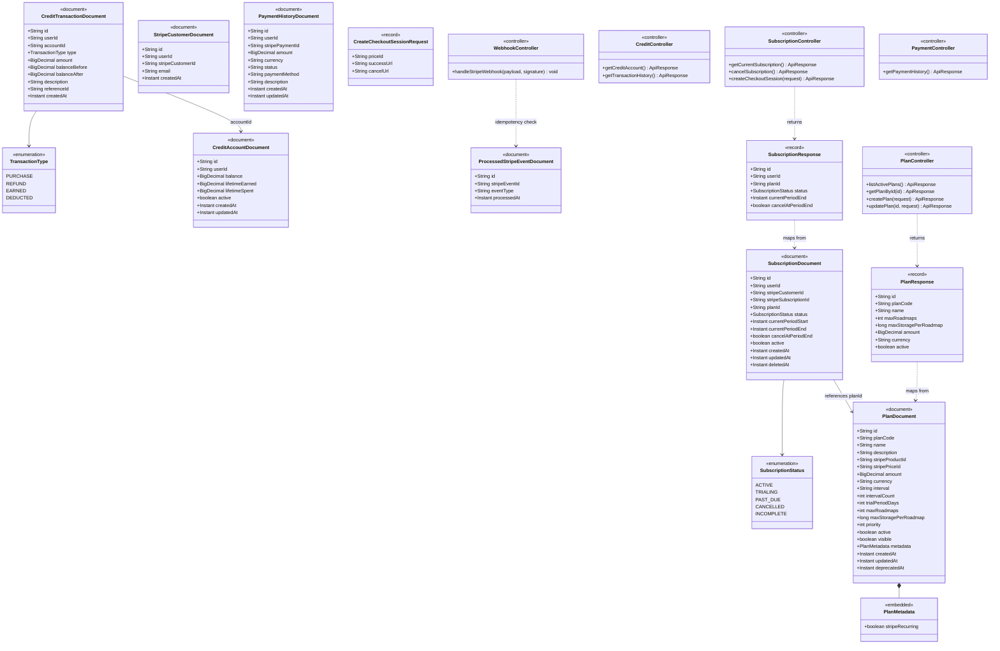

# Payment Service — Class Diagram

```mermaid
classDiagram
    %% ── ENUMERATIONS ──
    class SubscriptionStatus {
        <<enumeration>>
        ACTIVE
        TRIALING
        PAST_DUE
        CANCELLED
        INCOMPLETE
    }
    class TransactionType {
        <<enumeration>>
        PURCHASE
        REFUND
        EARNED
        DEDUCTED
    }

    %% ── PLAN ──
    class PlanDocument {
        <<document>>
        +String id
        +String planCode
        +String name
        +String description
        +String stripeProductId
        +String stripePriceId
        +BigDecimal amount
        +String currency
        +String interval
        +int intervalCount
        +int trialPeriodDays
        +int maxRoadmaps
        +long maxStoragePerRoadmap
        +int priority
        +boolean active
        +boolean visible
        +PlanMetadata metadata
        +Instant createdAt
        +Instant updatedAt
        +Instant deprecatedAt
    }
    class PlanMetadata {
        <<embedded>>
        +boolean stripeRecurring
    }

    %% ── SUBSCRIPTION ──
    class SubscriptionDocument {
        <<document>>
        +String id
        +String userId
        +String stripeCustomerId
        +String stripeSubscriptionId
        +String planId
        +SubscriptionStatus status
        +Instant currentPeriodStart
        +Instant currentPeriodEnd
        +boolean cancelAtPeriodEnd
        +boolean active
        +Instant createdAt
        +Instant updatedAt
        +Instant deletedAt
    }

    %% ── CREDIT ──
    class CreditAccountDocument {
        <<document>>
        +String id
        +String userId
        +BigDecimal balance
        +BigDecimal lifetimeEarned
        +BigDecimal lifetimeSpent
        +boolean active
        +Instant createdAt
        +Instant updatedAt
    }
    class CreditTransactionDocument {
        <<document>>
        +String id
        +String userId
        +String accountId
        +TransactionType type
        +BigDecimal amount
        +BigDecimal balanceBefore
        +BigDecimal balanceAfter
        +String description
        +String referenceId
        +Instant createdAt
    }

    %% ── STRIPE INTEGRATION ──
    class StripeCustomerDocument {
        <<document>>
        +String id
        +String userId
        +String stripeCustomerId
        +String email
        +Instant createdAt
    }
    class PaymentHistoryDocument {
        <<document>>
        +String id
        +String userId
        +String stripePaymentId
        +BigDecimal amount
        +String currency
        +String status
        +String paymentMethod
        +String description
        +Instant createdAt
        +Instant updatedAt
    }
    class ProcessedStripeEventDocument {
        <<document>>
        +String id
        +String stripeEventId
        +String eventType
        +Instant processedAt
    }

    %% ── APPLICATION DTOs ──
    class PlanResponse {
        <<record>>
        +String id
        +String planCode
        +String name
        +int maxRoadmaps
        +long maxStoragePerRoadmap
        +BigDecimal amount
        +String currency
        +boolean active
    }
    class SubscriptionResponse {
        <<record>>
        +String id
        +String userId
        +String planId
        +SubscriptionStatus status
        +Instant currentPeriodEnd
        +boolean cancelAtPeriodEnd
    }
    class CreateCheckoutSessionRequest {
        <<record>>
        +String priceId
        +String successUrl
        +String cancelUrl
    }

    %% ── CONTROLLERS ──
    class PlanController {
        <<controller>>
        +listActivePlans() ApiResponse
        +getPlanById(id) ApiResponse
        +createPlan(request) ApiResponse
        +updatePlan(id, request) ApiResponse
    }
    class SubscriptionController {
        <<controller>>
        +getCurrentSubscription() ApiResponse
        +cancelSubscription() ApiResponse
        +createCheckoutSession(request) ApiResponse
    }
    class CreditController {
        <<controller>>
        +getCreditAccount() ApiResponse
        +getTransactionHistory() ApiResponse
    }
    class WebhookController {
        <<controller>>
        +handleStripeWebhook(payload, signature) void
    }
    class PaymentController {
        <<controller>>
        +getPaymentHistory() ApiResponse
    }

    PlanDocument *-- PlanMetadata
    SubscriptionDocument --> PlanDocument : references planId
    SubscriptionDocument --> SubscriptionStatus
    CreditTransactionDocument --> CreditAccountDocument : accountId
    CreditTransactionDocument --> TransactionType
    PlanResponse ..> PlanDocument : maps from
    SubscriptionResponse ..> SubscriptionDocument : maps from
    PlanController ..> PlanResponse : returns
    SubscriptionController ..> SubscriptionResponse : returns
    WebhookController ..> ProcessedStripeEventDocument : idempotency check
```
