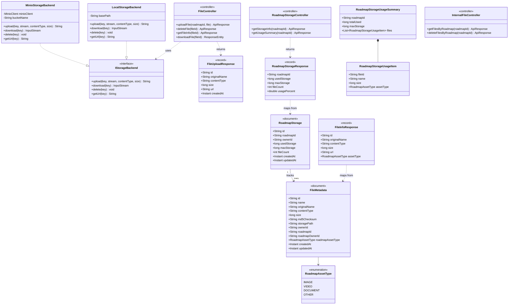

# Storage Service — Class Diagram

```mermaid
classDiagram
    %% ── ENUMERATIONS ──
    class RoadmapAssetType {
        <<enumeration>>
        IMAGE
        VIDEO
        DOCUMENT
        OTHER
    }

    %% ── MONGODB ENTITIES ──
    class FileMetadata {
        <<document>>
        +String id
        +String name
        +String originalName
        +String contentType
        +long size
        +String md5Checksum
        +String storagePath
        +String ownerId
        +String roadmapId
        +String roadmapOwnerId
        +RoadmapAssetType roadmapAssetType
        +Instant createdAt
        +Instant updatedAt
    }
    class RoadmapStorage {
        <<document>>
        +String id
        +String roadmapId
        +String ownerId
        +long usedStorage
        +long maxStorage
        +int fileCount
        +Instant createdAt
        +Instant updatedAt
    }

    %% ── STORAGE BACKEND ──
    class IStorageBackend {
        <<interface>>
        +upload(key, stream, contentType, size) String
        +download(key) InputStream
        +delete(key) void
        +getUrl(key) String
    }
    class MinioStorageBackend {
        -MinioClient minioClient
        -String bucketName
        +upload(key, stream, contentType, size) String
        +download(key) InputStream
        +delete(key) void
        +getUrl(key) String
    }
    class LocalStorageBackend {
        -String basePath
        +upload(key, stream, contentType, size) String
        +download(key) InputStream
        +delete(key) void
        +getUrl(key) String
    }

    %% ── DTOs ──
    class FileUploadResponse {
        <<record>>
        +String id
        +String originalName
        +String contentType
        +long size
        +String url
        +Instant createdAt
    }
    class FileInfoResponse {
        <<record>>
        +String id
        +String originalName
        +String contentType
        +long size
        +String url
        +RoadmapAssetType assetType
    }
    class RoadmapStorageResponse {
        <<record>>
        +String roadmapId
        +long usedStorage
        +long maxStorage
        +int fileCount
        +double usagePercent
    }
    class RoadmapStorageUsageItem {
        +String fileId
        +String name
        +long size
        +RoadmapAssetType assetType
    }
    class RoadmapStorageUsageSummary {
        +String roadmapId
        +long totalUsed
        +long maxStorage
        +List~RoadmapStorageUsageItem~ files
    }

    %% ── CONTROLLERS ──
    class FileController {
        <<controller>>
        +uploadFile(roadmapId, file) ApiResponse
        +deleteFile(fileId) ApiResponse
        +getFileInfo(fileId) ApiResponse
        +downloadFile(fileId) ResponseEntity
    }
    class RoadmapStorageController {
        <<controller>>
        +getStorageInfo(roadmapId) ApiResponse
        +getUsageSummary(roadmapId) ApiResponse
    }
    class InternalFileController {
        <<controller>>
        +getFilesByRoadmap(roadmapId) ApiResponse
        +deleteFilesByRoadmap(roadmapId) ApiResponse
    }

    MinioStorageBackend ..|> IStorageBackend
    LocalStorageBackend ..|> IStorageBackend
    RoadmapStorage "1" --> "many" FileMetadata : tracks
    FileMetadata --> RoadmapAssetType
    FileInfoResponse ..> FileMetadata : maps from
    RoadmapStorageResponse ..> RoadmapStorage : maps from
    RoadmapStorageUsageSummary *-- RoadmapStorageUsageItem
    FileController ..> FileUploadResponse : returns
    FileController ..> IStorageBackend : uses
    RoadmapStorageController ..> RoadmapStorageResponse : returns
```
