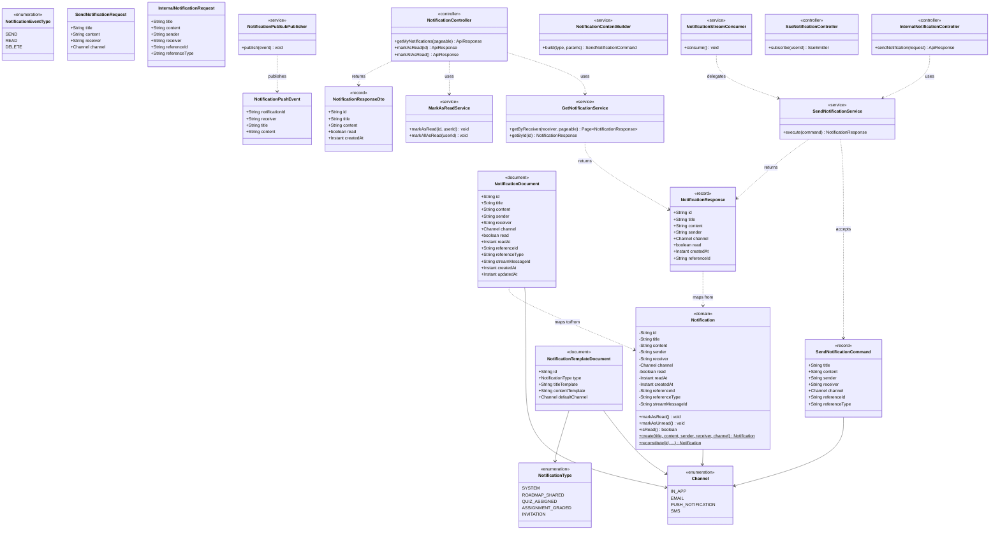

# Notification Service — Class Diagram

```mermaid
classDiagram
    %% ── ENUMERATIONS ──
    class Channel {
        <<enumeration>>
        IN_APP
        EMAIL
        PUSH_NOTIFICATION
        SMS
    }
    class NotificationType {
        <<enumeration>>
        SYSTEM
        ROADMAP_SHARED
        QUIZ_ASSIGNED
        ASSIGNMENT_GRADED
        INVITATION
    }
    class NotificationEventType {
        <<enumeration>>
        SEND
        READ
        DELETE
    }

    %% ── DOMAIN MODEL (Pure) ──
    class Notification {
        <<domain>>
        -String id
        -String title
        -String content
        -String sender
        -String receiver
        -Channel channel
        -boolean read
        -Instant readAt
        -Instant createdAt
        -String referenceId
        -String referenceType
        -String streamMessageId
        +markAsRead() void
        +markAsUnread() void
        +isRead() boolean
        +create(title, content, sender, receiver, channel)$ Notification
        +reconstitute(id, ...)$ Notification
    }

    %% ── PERSISTENCE ──
    class NotificationDocument {
        <<document>>
        +String id
        +String title
        +String content
        +String sender
        +String receiver
        +Channel channel
        +boolean read
        +Instant readAt
        +String referenceId
        +String referenceType
        +String streamMessageId
        +Instant createdAt
        +Instant updatedAt
    }
    class NotificationTemplateDocument {
        <<document>>
        +String id
        +NotificationType type
        +String titleTemplate
        +String contentTemplate
        +Channel defaultChannel
    }

    %% ── APPLICATION DTOs ──
    class SendNotificationCommand {
        <<record>>
        +String title
        +String content
        +String sender
        +String receiver
        +Channel channel
        +String referenceId
        +String referenceType
    }
    class NotificationResponse {
        <<record>>
        +String id
        +String title
        +String content
        +String sender
        +Channel channel
        +boolean read
        +Instant createdAt
        +String referenceId
    }
    class NotificationResponseDto {
        <<record>>
        +String id
        +String title
        +String content
        +boolean read
        +Instant createdAt
    }

    %% ── WEB DTOs ──
    class SendNotificationRequest {
        +String title
        +String content
        +String receiver
        +Channel channel
    }
    class InternalNotificationRequest {
        +String title
        +String content
        +String sender
        +String receiver
        +String referenceId
        +String referenceType
    }
    class NotificationPushEvent {
        +String notificationId
        +String receiver
        +String title
        +String content
    }

    %% ── SERVICES ──
    class SendNotificationService {
        <<service>>
        +execute(command) NotificationResponse
    }
    class GetNotificationService {
        <<service>>
        +getByReceiver(receiver, pageable) Page~NotificationResponse~
        +getById(id) NotificationResponse
    }
    class MarkAsReadService {
        <<service>>
        +markAsRead(id, userId) void
        +markAllAsRead(userId) void
    }
    class NotificationPubSubPublisher {
        <<service>>
        +publish(event) void
    }
    class NotificationStreamConsumer {
        <<service>>
        +consume() void
    }
    class NotificationContentBuilder {
        <<service>>
        +build(type, params) SendNotificationCommand
    }

    %% ── CONTROLLERS ──
    class NotificationController {
        <<controller>>
        +getMyNotifications(pageable) ApiResponse
        +markAsRead(id) ApiResponse
        +markAllAsRead() ApiResponse
    }
    class SseNotificationController {
        <<controller>>
        +subscribe(userId) SseEmitter
    }
    class InternalNotificationController {
        <<controller>>
        +sendNotification(request) ApiResponse
    }

    Notification --> Channel
    NotificationDocument --> Channel
    NotificationTemplateDocument --> Channel
    NotificationTemplateDocument --> NotificationType
    NotificationDocument ..> Notification : maps to/from
    SendNotificationCommand --> Channel
    NotificationResponse ..> Notification : maps from
    SendNotificationService ..> SendNotificationCommand : accepts
    SendNotificationService ..> NotificationResponse : returns
    GetNotificationService ..> NotificationResponse : returns
    NotificationController ..> GetNotificationService : uses
    NotificationController ..> MarkAsReadService : uses
    NotificationController ..> NotificationResponseDto : returns
    InternalNotificationController ..> SendNotificationService : uses
    NotificationPubSubPublisher ..> NotificationPushEvent : publishes
    NotificationStreamConsumer ..> SendNotificationService : delegates
```
