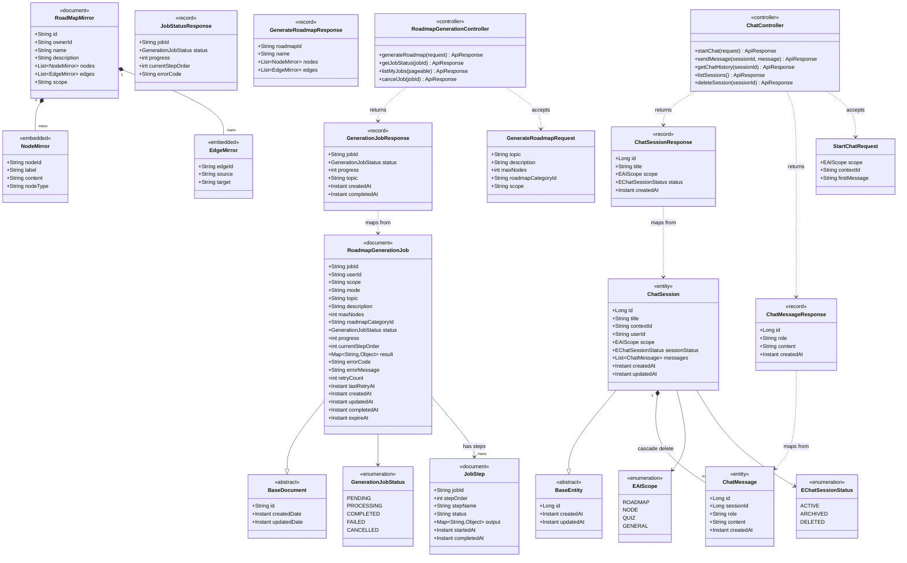

# Roadmap AI Service — Class Diagram

```mermaid
classDiagram
    %% ── ENUMERATIONS ──
    class GenerationJobStatus {
        <<enumeration>>
        PENDING
        PROCESSING
        COMPLETED
        FAILED
        CANCELLED
    }
    class EAIScope {
        <<enumeration>>
        ROADMAP
        NODE
        QUIZ
        GENERAL
    }
    class EChatSessionStatus {
        <<enumeration>>
        ACTIVE
        ARCHIVED
        DELETED
    }

    %% ── BASE ──
    class BaseDocument {
        <<abstract>>
        +String id
        +Instant createdDate
        +Instant updatedDate
    }
    class BaseEntity {
        <<abstract>>
        +Long id
        +Instant createdAt
        +Instant updatedAt
    }

    %% ── JOB TRACKING (MongoDB) ──
    class RoadmapGenerationJob {
        <<document>>
        +String jobId
        +String userId
        +String scope
        +String mode
        +String topic
        +String description
        +int maxNodes
        +String roadmapCategoryId
        +GenerationJobStatus status
        +int progress
        +int currentStepOrder
        +Map~String,Object~ result
        +String errorCode
        +String errorMessage
        +int retryCount
        +Instant lastRetryAt
        +Instant createdAt
        +Instant updatedAt
        +Instant completedAt
        +Instant expireAt
    }
    class JobStep {
        <<document>>
        +String jobId
        +int stepOrder
        +String stepName
        +String status
        +Map~String,Object~ output
        +Instant startedAt
        +Instant completedAt
    }

    %% ── CHAT (JPA / PostgreSQL) ──
    class ChatSession {
        <<entity>>
        +Long id
        +String title
        +String contextId
        +String userId
        +EAIScope scope
        +EChatSessionStatus sessionStatus
        +List~ChatMessage~ messages
        +Instant createdAt
        +Instant updatedAt
    }
    class ChatMessage {
        <<entity>>
        +Long id
        +Long sessionId
        +String role
        +String content
        +Instant createdAt
    }

    %% ── READ-ONLY ROADMAP MIRROR (MongoDB) ──
    class RoadMapMirror {
        <<document>>
        +String id
        +String ownerId
        +String name
        +String description
        +List~NodeMirror~ nodes
        +List~EdgeMirror~ edges
        +String scope
    }
    class NodeMirror {
        <<embedded>>
        +String nodeId
        +String label
        +String content
        +String nodeType
    }
    class EdgeMirror {
        <<embedded>>
        +String edgeId
        +String source
        +String target
    }

    %% ── APPLICATION DTOs ──
    class GenerationJobResponse {
        <<record>>
        +String jobId
        +GenerationJobStatus status
        +int progress
        +String topic
        +Instant createdAt
        +Instant completedAt
    }
    class JobStatusResponse {
        <<record>>
        +String jobId
        +GenerationJobStatus status
        +int progress
        +int currentStepOrder
        +String errorCode
    }
    class GenerateRoadmapResponse {
        <<record>>
        +String roadmapId
        +String name
        +List~NodeMirror~ nodes
        +List~EdgeMirror~ edges
    }
    class ChatSessionResponse {
        <<record>>
        +Long id
        +String title
        +EAIScope scope
        +EChatSessionStatus status
        +Instant createdAt
    }
    class ChatMessageResponse {
        <<record>>
        +Long id
        +String role
        +String content
        +Instant createdAt
    }
    class GenerateRoadmapRequest {
        +String topic
        +String description
        +int maxNodes
        +String roadmapCategoryId
        +String scope
    }
    class StartChatRequest {
        +EAIScope scope
        +String contextId
        +String firstMessage
    }

    %% ── CONTROLLERS ──
    class RoadmapGenerationController {
        <<controller>>
        +generateRoadmap(request) ApiResponse
        +getJobStatus(jobId) ApiResponse
        +listMyJobs(pageable) ApiResponse
        +cancelJob(jobId) ApiResponse
    }
    class ChatController {
        <<controller>>
        +startChat(request) ApiResponse
        +sendMessage(sessionId, message) ApiResponse
        +getChatHistory(sessionId) ApiResponse
        +listSessions() ApiResponse
        +deleteSession(sessionId) ApiResponse
    }

    RoadmapGenerationJob --|> BaseDocument
    RoadmapGenerationJob --> GenerationJobStatus
    RoadmapGenerationJob "1" --> "many" JobStep : has steps
    ChatSession --|> BaseEntity
    ChatSession "1" *-- "many" ChatMessage : cascade delete
    ChatSession --> EAIScope
    ChatSession --> EChatSessionStatus
    RoadMapMirror "1" *-- "many" NodeMirror
    RoadMapMirror "1" *-- "many" EdgeMirror
    GenerationJobResponse ..> RoadmapGenerationJob : maps from
    ChatSessionResponse ..> ChatSession : maps from
    ChatMessageResponse ..> ChatMessage : maps from
    RoadmapGenerationController ..> GenerationJobResponse : returns
    RoadmapGenerationController ..> GenerateRoadmapRequest : accepts
    ChatController ..> ChatSessionResponse : returns
    ChatController ..> ChatMessageResponse : returns
    ChatController ..> StartChatRequest : accepts
```
