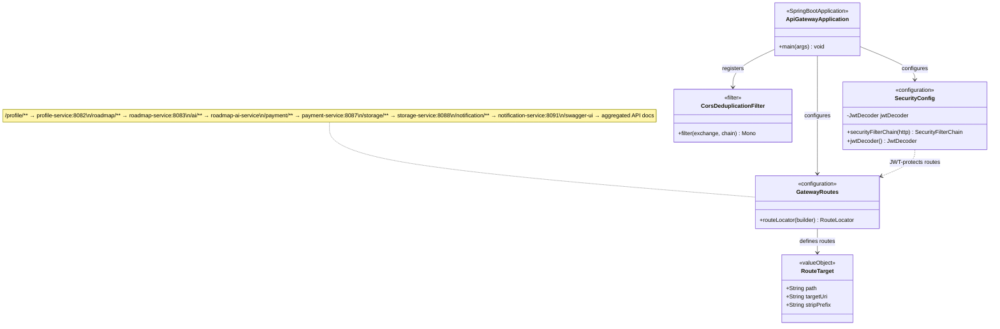

# API Gateway — Class Diagram

```mermaid
classDiagram
    %% ── SPRING CLOUD GATEWAY MVC ──
    class ApiGatewayApplication {
        <<SpringBootApplication>>
        +main(args) void
    }
    class SecurityConfig {
        <<configuration>>
        -JwtDecoder jwtDecoder
        +securityFilterChain(http) SecurityFilterChain
        +jwtDecoder() JwtDecoder
    }
    class CorsDeduplicationFilter {
        <<filter>>
        +filter(exchange, chain) Mono
    }
    class GatewayRoutes {
        <<configuration>>
        +routeLocator(builder) RouteLocator
    }

    %% ── ROUTE TARGETS ──
    class RouteTarget {
        <<valueObject>>
        +String path
        +String targetUri
        +String stripPrefix
    }

    %% ── ROUTE MAP ──
    note for GatewayRoutes "/profile/**  → profile-service:8082\n/roadmap/**  → roadmap-service:8083\n/ai/**       → roadmap-ai-service\n/payment/**  → payment-service:8087\n/storage/**  → storage-service:8088\n/notification/** → notification-service:8091\n/swagger-ui → aggregated API docs"

    ApiGatewayApplication --> SecurityConfig : configures
    ApiGatewayApplication --> GatewayRoutes : configures
    ApiGatewayApplication --> CorsDeduplicationFilter : registers
    GatewayRoutes --> RouteTarget : defines routes
    SecurityConfig ..> GatewayRoutes : JWT-protects routes
```
