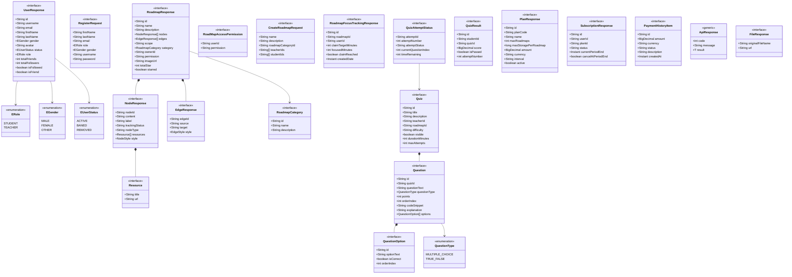

# Memap Frontend (React) — Class Diagram

```mermaid
classDiagram
    %% ── USER TYPES ──
    class UserResponse {
        <<interface>>
        +String id
        +String username
        +String email
        +String firstName
        +String lastName
        +EGender gender
        +String avatar
        +EUserStatus status
        +ERole role
        +int totalFriends
        +int totalFollowers
        +boolean isFollowed
        +boolean isFriend
    }
    class RegisterRequest {
        <<interface>>
        +String firstName
        +String lastName
        +String email
        +ERole role
        +EGender gender
        +String username
        +String password
    }
    class ERole {
        <<enumeration>>
        STUDENT
        TEACHER
    }
    class EGender {
        <<enumeration>>
        MALE
        FEMALE
        OTHER
    }
    class EUserStatus {
        <<enumeration>>
        ACTIVE
        BANED
        REMOVED
    }

    UserResponse --> ERole
    UserResponse --> EGender
    UserResponse --> EUserStatus

    %% ── ROADMAP TYPES ──
    class RoadmapResponse {
        <<interface>>
        +String id
        +String name
        +String description
        +NodeResponse[] nodes
        +EdgeResponse[] edges
        +String scope
        +RoadmapCategory category
        +String ownerId
        +String permission
        +String imageUrl
        +int totalStar
        +boolean starred
    }
    class NodeResponse {
        <<interface>>
        +String nodeId
        +String content
        +String label
        +String trackingStatus
        +String nodeType
        +Resource[] resources
        +NodeStyle style
    }
    class EdgeResponse {
        <<interface>>
        +String edgeId
        +String source
        +String target
        +EdgeStyle style
    }
    class RoadmapCategory {
        <<interface>>
        +String id
        +String name
        +String description
    }
    class RoadMapAccessPermission {
        <<interface>>
        +String userId
        +String permission
    }
    class Resource {
        <<interface>>
        +String title
        +String url
    }
    class CreateRoadmapRequest {
        <<interface>>
        +String name
        +String description
        +String roadmapCategoryId
        +String[] teacherIds
        +String[] studentIds
    }
    class RoadmapFocusTrackingResponse {
        <<interface>>
        +String id
        +String roadmapId
        +String userId
        +int claimTargetMinutes
        +int focusedMinutes
        +boolean claimReached
        +Instant createdDate
    }

    RoadmapResponse *-- NodeResponse
    RoadmapResponse *-- EdgeResponse
    RoadmapResponse --> RoadmapCategory
    NodeResponse *-- Resource

    %% ── QUIZ TYPES ──
    class Quiz {
        <<interface>>
        +String id
        +String title
        +String description
        +String teacherId
        +String roadmapId
        +String difficulty
        +boolean visible
        +int durationMinutes
        +int maxAttempts
    }
    class Question {
        <<interface>>
        +String id
        +String quizId
        +String questionText
        +QuestionType questionType
        +int points
        +int orderIndex
        +String codeSnippet
        +String explanation
        +QuestionOption[] options
    }
    class QuestionOption {
        <<interface>>
        +String id
        +String optionText
        +boolean isCorrect
        +int orderIndex
    }
    class QuizAttemptStatus {
        <<interface>>
        +String attemptId
        +int attemptNumber
        +String attemptStatus
        +int currentQuestionIndex
        +int timeRemaining
    }
    class QuizResult {
        <<interface>>
        +String id
        +String studentId
        +String quizId
        +BigDecimal score
        +boolean isPassed
        +int attemptNumber
    }
    class QuestionType {
        <<enumeration>>
        MULTIPLE_CHOICE
        TRUE_FALSE
    }

    Quiz *-- Question
    Question *-- QuestionOption
    Question --> QuestionType
    QuizAttemptStatus --> Quiz

    %% ── PAYMENT TYPES ──
    class PlanResponse {
        <<interface>>
        +String id
        +String planCode
        +String name
        +int maxRoadmaps
        +long maxStoragePerRoadmap
        +BigDecimal amount
        +String currency
        +String interval
        +boolean active
    }
    class SubscriptionResponse {
        <<interface>>
        +String id
        +String userId
        +String planId
        +String status
        +Instant currentPeriodEnd
        +boolean cancelAtPeriodEnd
    }
    class PaymentHistoryItem {
        <<interface>>
        +String id
        +BigDecimal amount
        +String currency
        +String status
        +String description
        +Instant createdAt
    }

    %% ── COMMON ──
    class ApiResponse {
        <<generic>>
        +int code
        +String message
        +T result
    }
    class FileResponse {
        <<interface>>
        +String originalFileName
        +String url
    }
```
