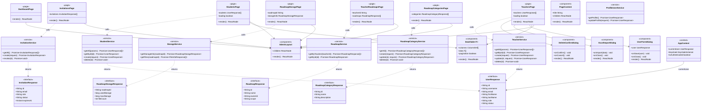

# Memap Admin Frontend (Next.js) — Class Diagram

```mermaid
classDiagram
    %% ── PAGE COMPONENTS ──
    class DashboardPage {
        <<page>>
        +render() ReactNode
    }
    class TeachersPage {
        <<page>>
        -teachers UserResponse[]
        -loading boolean
        +render() ReactNode
    }
    class StudentsPage {
        <<page>>
        -students UserResponse[]
        -loading boolean
        +render() ReactNode
    }
    class InvitationsPage {
        <<page>>
        -invitations InvitationResponse[]
        +render() ReactNode
    }
    class RoadmapCategoriesPage {
        <<page>>
        -categories RoadmapCategoryResponse[]
        +render() ReactNode
    }
    class TeacherRoadmapsPage {
        <<page>>
        -teacherId String
        -roadmaps RoadmapResponse[]
        +render() ReactNode
    }
    class RoadmapStoragePage {
        <<page>>
        -roadmapId String
        -storageInfo RoadmapStorageResponse
        +render() ReactNode
    }

    %% ── REUSABLE COMPONENTS ──
    class AdminLayout {
        <<component>>
        +children ReactNode
        +render() ReactNode
    }
    class DataTable~T~ {
        <<component>>
        +columns ColumnDef[]
        +data T[]
        +pagination boolean
        +render() ReactNode
    }
    class UserFormDialog {
        <<component>>
        +user UserResponse
        +onSave(user) void
        +onClose() void
        +render() ReactNode
    }
    class ExcelImportDialog {
        <<component>>
        +onImport(data) void
        +onClose() void
        +render() ReactNode
    }
    class DeleteConfirmDialog {
        <<component>>
        +onConfirm() void
        +onCancel() void
        +render() ReactNode
    }
    class PageContent {
        <<component>>
        +title String
        +children ReactNode
        +render() ReactNode
    }

    %% ── API SERVICES ──
    class TeacherService {
        <<service>>
        +getAll(params) Promise~UserResponse[]~
        +getById(id) Promise~UserResponse~
        +create(request) Promise~UserResponse~
        +update(id, request) Promise~UserResponse~
        +delete(id) Promise~void~
    }
    class StudentService {
        <<service>>
        +getAll(params) Promise~UserResponse[]~
        +getById(id) Promise~UserResponse~
        +create(request) Promise~UserResponse~
        +delete(id) Promise~void~
    }
    class ProfileUserService {
        <<service>>
        +getProfile() Promise~UserResponse~
        +updateProfile(request) Promise~UserResponse~
    }
    class InvitationService {
        <<service>>
        +getAll() Promise~InvitationResponse[]~
        +create(request) Promise~InvitationResponse~
        +revoke(id) Promise~void~
    }
    class RoadmapService {
        <<service>>
        +getByTeacher(teacherId) Promise~RoadmapResponse[]~
        +getById(id) Promise~RoadmapResponse~
    }
    class RoadmapCategoryService {
        <<service>>
        +getAll() Promise~RoadmapCategoryResponse[]~
        +create(request) Promise~RoadmapCategoryResponse~
        +update(id, request) Promise~RoadmapCategoryResponse~
        +delete(id) Promise~void~
    }
    class StorageService {
        <<service>>
        +getStorageInfo(roadmapId) Promise~RoadmapStorageResponse~
        +getFiles(roadmapId) Promise~FileInfoResponse[]~
    }

    %% ── CONTEXT ──
    class AppContext {
        <<context>>
        +currentUser UserResponse
        +keycloak KeycloakInstance
        +isAuthenticated boolean
    }

    %% ── DTOs ──
    class UserResponse {
        <<interface>>
        +String id
        +String username
        +String email
        +String firstName
        +String lastName
        +String role
        +String status
    }
    class InvitationResponse {
        <<interface>>
        +String id
        +String email
        +String role
        +String status
        +Instant expiresAt
    }
    class RoadmapResponse {
        <<interface>>
        +String id
        +String name
        +String ownerId
        +String scope
    }
    class RoadmapCategoryResponse {
        <<interface>>
        +String id
        +String name
        +String description
    }
    class RoadmapStorageResponse {
        <<interface>>
        +String roadmapId
        +long usedStorage
        +long maxStorage
        +int fileCount
    }

    DashboardPage --> AdminLayout
    TeachersPage --> AdminLayout
    TeachersPage --> DataTable
    TeachersPage --> UserFormDialog
    TeachersPage --> ExcelImportDialog
    TeachersPage --> DeleteConfirmDialog
    StudentsPage --> AdminLayout
    StudentsPage --> DataTable
    InvitationsPage --> AdminLayout
    RoadmapCategoriesPage --> AdminLayout
    TeacherRoadmapsPage --> AdminLayout
    RoadmapStoragePage --> AdminLayout
    TeachersPage ..> TeacherService : calls
    StudentsPage ..> StudentService : calls
    InvitationsPage ..> InvitationService : calls
    RoadmapCategoriesPage ..> RoadmapCategoryService : calls
    TeacherRoadmapsPage ..> RoadmapService : calls
    RoadmapStoragePage ..> StorageService : calls
    TeacherService ..> UserResponse : returns
    StudentService ..> UserResponse : returns
    InvitationService ..> InvitationResponse : returns
    RoadmapService ..> RoadmapResponse : returns
    RoadmapCategoryService ..> RoadmapCategoryResponse : returns
    StorageService ..> RoadmapStorageResponse : returns
    AppContext --> UserResponse : currentUser
```
