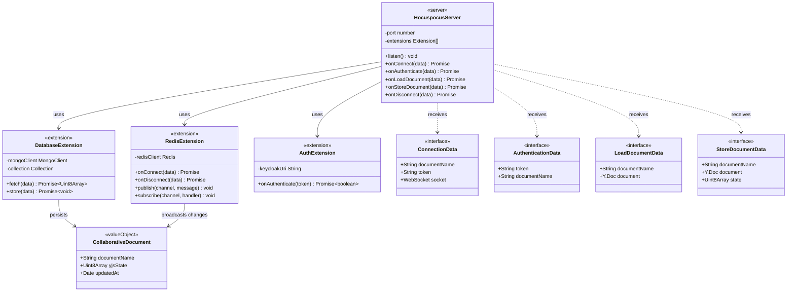

# Hocuspocus Server — Class Diagram

```mermaid
classDiagram
    %% ── SERVER ──
    class HocuspocusServer {
        <<server>>
        -port number
        -extensions Extension[]
        +listen() void
        +onConnect(data) Promise
        +onAuthenticate(data) Promise
        +onLoadDocument(data) Promise
        +onStoreDocument(data) Promise
        +onDisconnect(data) Promise
    }

    %% ── EXTENSIONS ──
    class DatabaseExtension {
        <<extension>>
        -mongoClient MongoClient
        -collection Collection
        +fetch(data) Promise~Uint8Array~
        +store(data) Promise~void~
    }
    class RedisExtension {
        <<extension>>
        -redisClient Redis
        +onConnect(data) Promise
        +onDisconnect(data) Promise
        +publish(channel, message) void
        +subscribe(channel, handler) void
    }
    class AuthExtension {
        <<extension>>
        -keycloakUri String
        +onAuthenticate(token) Promise~boolean~
    }

    %% ── DOCUMENT ──
    class CollaborativeDocument {
        <<valueObject>>
        +String documentName
        +Uint8Array yjsState
        +Date updatedAt
    }

    %% ── TYPES ──
    class ConnectionData {
        <<interface>>
        +String documentName
        +String token
        +WebSocket socket
    }
    class AuthenticationData {
        <<interface>>
        +String token
        +String documentName
    }
    class LoadDocumentData {
        <<interface>>
        +String documentName
        +Y.Doc document
    }
    class StoreDocumentData {
        <<interface>>
        +String documentName
        +Y.Doc document
        +Uint8Array state
    }

    HocuspocusServer --> DatabaseExtension : uses
    HocuspocusServer --> RedisExtension : uses
    HocuspocusServer --> AuthExtension : uses
    DatabaseExtension --> CollaborativeDocument : persists
    RedisExtension --> CollaborativeDocument : broadcasts changes
    HocuspocusServer ..> ConnectionData : receives
    HocuspocusServer ..> AuthenticationData : receives
    HocuspocusServer ..> LoadDocumentData : receives
    HocuspocusServer ..> StoreDocumentData : receives
```
