# Cross-Service Entity Relationships

> This diagram shows the database entity layer (tables/collections) and their relationships across all services in the memap-org system.

## Database Overview

| Service | Database | Type |
|---------|----------|------|
| Profile Service | PostgreSQL (JPA) | Relational |
| Roadmap Service | MongoDB | Document |
| Payment Service | MongoDB | Document |
| Storage Service | MongoDB | Document |
| Notification Service | MongoDB/In-memory | Document |

## Entity Relationship Diagram

```mermaid
erDiagram
    %% ═══════════════════════════════════════════════════════════
    %% PROFILE SERVICE (PostgreSQL)
    %% ═══════════════════════════════════════════════════════════
    "user" {
        string id PK "UUID"
        string userId UK "Business key"
        string username UK "Unique"
        string email UK "Unique"
        string first_name
        string last_name
        enum gender "MALE/FEMALE/OTHER"
        string avatar "URL"
        enum status "ACTIVE/BANED/REMOVED"
        enum role "STUDENT/TEACHER/ADMIN"
        timestamp join_at
    }

    "invitation" {
        string id PK "UUID"
        string email "Indexed"
        enum role "STUDENT/TEACHER/ADMIN"
        enum status "PENDING/ACCEPTED/REVOKED/EXPIRED"
        string token_hash
        timestamp expires_at
        timestamp accepted_at
        timestamp revoked_at
        string revoked_by
        string created_by
        string invited_user_id "FK -> user.userId"
        timestamp created_at
        timestamp updated_at
    }

    %% ═══════════════════════════════════════════════════════════
    %% ROADMAP SERVICE (MongoDB)
    %% ═══════════════════════════════════════════════════════════
    "RoadMap" {
        string id PK "MongoId"
        string ownerId "FK -> user.userId"
        string name
        string description
        enum scope "PUBLIC/PRIVATE/GROUP"
        string image_url
        enum creation_source "MANUAL/AI_GENERATED"
        string category_id "FK -> RoadMapCategory"
        timestamp created_date
        timestamp updated_date
        boolean is_deleted "Soft delete"
    }

    "RoadMapCategory" {
        string id PK "MongoId"
        string name UK "Unique index"
        string description
        timestamp created_date
        timestamp updated_date
        boolean is_deleted
    }

    "RoadMapAccessPermission" {
        string user_id "FK -> user.userId"
        enum permission "VIEW/EDIT/ADMIN"
        enum role "STUDENT/TEACHER/ADMIN"
    }

    "RoadmapResource" {
        string id
        string file_id "FK -> storage.file_metadata"
        string url
        string title
        string type
        date added_at
        string added_by "FK -> user.userId"
    }

    "Node" {
        string node_id
        string label
        string content
        enum node_type "TOPIC/RESOURCE/MILESTONE"
        map style "JSON"
    }

    "Edge" {
        string edge_id
        string source "FK -> Node.nodeId"
        string target "FK -> Node.nodeId"
        map style "JSON"
    }

    "ResourceNode" {
        string title
        string url
    }

    "Comment" {
        string id PK "MongoId"
        string roadmap_id "FK -> RoadMap"
        string node_id "FK -> Node.nodeId"
        string reply_to "FK -> Comment (self-ref)"
        string user_id "FK -> user.userId"
        string content
        timestamp created_date
        timestamp updated_date
        boolean is_deleted
    }

    "Reaction" {
        string id PK "MongoId"
        string user_id "FK -> user.userId"
        enum content "Reaction type"
        string roadmap_id "FK -> RoadMap"
        string comment_id "FK -> Comment"
        timestamp created_date
        timestamp updated_date
        boolean is_deleted
    }

    "RoadmapNote" {
        string id PK "MongoId"
        string roadmap_id "FK -> RoadMap"
        string user_id "FK -> user.userId"
        string content "Max 50000 chars"
        timestamp created_date
        timestamp updated_date
        boolean is_deleted
    }

    "NodeProgressTracking" {
        string id PK "MongoId"
        string node_id "FK -> Node.nodeId"
        string roadmap_id "FK -> RoadMap"
        string user_id "FK -> user.userId"
        enum tracking_status "PENDING/IN_PROGRESS/COMPLETED"
        timestamp created_date
        timestamp updated_date
        boolean is_deleted
    }

    "RoadmapFocusTracking" {
        string id PK "MongoId"
        string user_id "FK -> user.userId"
        string roadmap_id "FK -> RoadMap"
        int claim_target_minutes "Target"
        int focused_minutes "Actual"
        timestamp created_date
        timestamp updated_date
        boolean is_deleted
    }

    "Quiz" {
        string id PK "MongoId"
        string title
        string description
        string teacher_id "FK -> user.userId"
        string roadmap_id "FK -> RoadMap"
        boolean visible
        timestamp start_date
        timestamp end_date
        int duration_minutes
        int max_attempts
        timestamp created_at
        timestamp updated_at
        boolean deleted
    }

    "Question" {
        string id PK "MongoId"
        string quiz_id "FK -> Quiz"
        string question_text
        enum question_type "MULTIPLE_CHOICE/TRUE_FALSE"
        int points
        int order_index
        string code_snippet
        string image_url
        string explanation
        string correct_answer
        timestamp created_at
        timestamp updated_at
        boolean deleted
    }

    "Option" {
        string id PK "MongoId"
        string question_id "FK -> Question"
        string option_text
        boolean is_correct
        int order_index
        timestamp created_at
        timestamp updated_at
        boolean deleted
    }

    "QuizAttempt" {
        string id PK "MongoId"
        string quiz_id "FK -> Quiz"
        string student_id "FK -> user.userId"
        string student_name
        decimal score
        int completion_time_seconds
        int attempt_number
        boolean is_passed
        timestamp started_at
        timestamp submitted_at
        string saved_answers_json
        string flagged_question_ids_json
        int current_question_index
        timestamp created_at
        timestamp updated_at
        boolean deleted
    }

    "AttemptAnswer" {
        string id PK "MongoId"
        string question_id "FK -> Question"
        string selected_option_id "FK -> Option"
        string text_answer
        boolean is_correct
        timestamp created_at
        timestamp updated_at
        boolean deleted
    }

    "Assignment" {
        string id PK "MongoId"
        string roadmap_id "FK -> RoadMap"
        string teacher_id "FK -> user.userId"
        string title
        string description
        enum type "Assignment type"
        boolean visible
        date start_date
        date end_date
        string file_url
        timestamp created_date
        timestamp updated_date
        boolean is_deleted
    }

    "AssignmentSubmission" {
        string id PK "MongoId"
        string assignment_id "FK -> Assignment"
        string roadmap_id "FK -> RoadMap"
        string student_id "FK -> user.userId"
        string student_name
        string text_content
        list file_ids "FK -> storage.file_metadata"
        list legacy_file_urls
        enum status "PENDING/SUBMITTED/GRADED"
        int grade
        string feedback
        timestamp submitted_at
        timestamp created_date
        timestamp updated_date
        boolean is_deleted
    }

    %% ═══════════════════════════════════════════════════════════
    %% PAYMENT SERVICE (MongoDB)
    %% ═══════════════════════════════════════════════════════════
    "PlanDocument" {
        string id PK "MongoId"
        string plan_code UK
        string name
        string description
        string stripe_product_id
        string stripe_price_id
        decimal amount
        string currency
        string interval
        int interval_count
        int trial_period_days
        int max_roadmaps
        long max_storage_per_roadmap
        int priority
        boolean active
        boolean visible
        timestamp created_at
        timestamp updated_at
        timestamp deprecated_at
    }

    "SubscriptionDocument" {
        string id PK "MongoId"
        string user_id "FK -> user.userId"
        string stripe_customer_id
        string stripe_subscription_id
        string plan_id "FK -> PlanDocument"
        enum status "ACTIVE/TRIALING/PAST_DUE/CANCELLED"
        timestamp current_period_start
        timestamp current_period_end
        boolean cancel_at_period_end
        boolean active
        timestamp created_at
        timestamp updated_at
        timestamp deleted_at
    }

    "CreditAccountDocument" {
        string id PK "MongoId"
        string user_id "FK -> user.userId"
        decimal balance
        decimal lifetime_earned
        decimal lifetime_spent
        boolean active
        timestamp created_at
        timestamp updated_at
    }

    "CreditTransactionDocument" {
        string id PK "MongoId"
        string user_id "FK -> user.userId"
        string account_id "FK -> CreditAccountDocument"
        enum type "PURCHASE/REFUND/EARNED/DEDUCTED"
        decimal amount
        decimal balance_before
        decimal balance_after
        string description
        string reference_id
        timestamp created_at
    }

    "StripeCustomerDocument" {
        string id PK "MongoId"
        string user_id "FK -> user.userId"
        string stripe_customer_id
        string email
        timestamp created_at
    }

    "PaymentHistoryDocument" {
        string id PK "MongoId"
        string user_id "FK -> user.userId"
        string stripe_payment_id
        decimal amount
        string currency
        string status
        string payment_method
        string description
        timestamp created_at
        timestamp updated_at
    }

    "ProcessedStripeEventDocument" {
        string id PK "MongoId"
        string stripe_event_id UK
        string event_type
        timestamp processed_at
    }

    %% ═══════════════════════════════════════════════════════════
    %% STORAGE SERVICE (MongoDB)
    %% ═══════════════════════════════════════════════════════════
    "roadmap_storage" {
        string id PK "MongoId"
        string roadmap_id UK "FK -> RoadMap"
        string owner_id "FK -> user.userId"
        long used_storage "Bytes"
        long max_storage "Bytes"
        int file_count
        timestamp created_at
        timestamp updated_at
    }

    "file_metadata" {
        string id PK "MongoId"
        string name
        string original_name
        string content_type "MIME"
        long size "Bytes"
        string md5_checksum
        string storage_path
        string owner_id "FK -> user.userId"
        string roadmap_id "FK -> RoadMap"
        string roadmap_owner_id "FK -> user.userId"
        enum roadmap_asset_type "IMAGE/VIDEO/DOCUMENT/OTHER"
        timestamp created_at
        timestamp updated_at
    }

    %% ═══════════════════════════════════════════════════════════
    %% NOTIFICATION SERVICE (MongoDB/In-memory)
    %% ═══════════════════════════════════════════════════════════
    "NotificationDocument" {
        string id PK
        string title
        string content
        string sender "FK -> user.userId"
        string receiver "FK -> user.userId"
        enum channel "IN_APP/EMAIL/PUSH/SMS"
        boolean read
        timestamp read_at
        string reference_id "Polymorphic FK"
        string reference_type "RoadMap/Quiz/Comment/etc"
        string stream_message_id
        timestamp created_at
        timestamp updated_at
    }

    "NotificationTemplateDocument" {
        string id PK
        enum type "SYSTEM/ROADMAP_SHARED/QUIZ_ASSIGNED/etc"
        string title_template
        string content_template
        enum default_channel "IN_APP/EMAIL/PUSH/SMS"
    }

    %% ═══════════════════════════════════════════════════════════
    %% RELATIONSHIPS
    %% ═══════════════════════════════════════════════════════════

    %% Profile Service relationships
    "invitation" ||--o{ "user" : "invited_user_id references"

    %% RoadMap relationships
    "RoadMap" }o--|| "user" : "ownerId"
    "RoadMap" }o--|| "RoadMapCategory" : "category"
    "RoadMap" ||--o{ "RoadMapAccessPermission" : "permissions"
    "RoadMap" ||--o{ "RoadmapResource" : "resources"
    "RoadMap" ||--o{ "Node" : "nodes (embedded)"
    "RoadMap" ||--o{ "Edge" : "edges (embedded)"

    %% Node relationships
    "Node" ||--o{ "ResourceNode" : "resources (embedded)"
    "Edge" }o--|| "Node" : "source"
    "Edge" }o--|| "Node" : "target"

    %% Comment/Reaction relationships
    "Comment" }o--|| "RoadMap" : "roadmapId"
    "Comment" }o--|| "user" : "userId"
    "Comment" ||--o{ "Comment" : "replyTo (self-ref)"
    "Reaction" }o--|| "user" : "userId"
    "Reaction" }o--|| "RoadMap" : "roadmapId"
    "Reaction" }o--o| "Comment" : "commentId"

    %% Note/Tracking relationships
    "RoadmapNote" }o--|| "RoadMap" : "roadmapId"
    "RoadmapNote" }o--|| "user" : "userId"
    "NodeProgressTracking" }o--|| "RoadMap" : "roadmapId"
    "NodeProgressTracking" }o--|| "user" : "userId"
    "NodeProgressTracking" }o--|| "Node" : "nodeId"
    "RoadmapFocusTracking" }o--|| "RoadMap" : "roadmapId"
    "RoadmapFocusTracking" }o--|| "user" : "userId"

    %% Learning relationships
    "Quiz" }o--|| "RoadMap" : "roadmapId"
    "Quiz" }o--|| "user" : "teacherId"
    "Quiz" ||--o{ "Question" : "questions"
    "Question" ||--o{ "Option" : "options"
    "QuizAttempt" }o--|| "Quiz" : "quizId"
    "QuizAttempt" }o--|| "user" : "studentId"
    "QuizAttempt" ||--o{ "AttemptAnswer" : "answers"
    "AttemptAnswer" }o--|| "Question" : "question"
    "AttemptAnswer" }o--o| "Option" : "selectedOption"

    "Assignment" }o--|| "RoadMap" : "roadmapId"
    "Assignment" }o--|| "user" : "teacherId"
    "AssignmentSubmission" }o--|| "Assignment" : "assignmentId"
    "AssignmentSubmission" }o--|| "RoadMap" : "roadmapId"
    "AssignmentSubmission" }o--|| "user" : "studentId"

    %% Payment relationships
    "SubscriptionDocument" }o--|| "user" : "userId"
    "SubscriptionDocument" }o--|| "PlanDocument" : "planId"
    "CreditAccountDocument" }o--|| "user" : "userId"
    "CreditTransactionDocument" }o--|| "user" : "userId"
    "CreditTransactionDocument" }o--|| "CreditAccountDocument" : "accountId"
    "StripeCustomerDocument" }o--|| "user" : "userId"
    "PaymentHistoryDocument" }o--|| "user" : "userId"

    %% Storage relationships
    "roadmap_storage" }o--|| "RoadMap" : "roadmapId"
    "roadmap_storage" }o--|| "user" : "ownerId"
    "file_metadata" }o--|| "user" : "ownerId"
    "file_metadata" }o--|| "RoadMap" : "roadmapId"
    "file_metadata" }o--|| "user" : "roadmapOwnerId"

    %% Notification relationships
    "NotificationDocument" }o--|| "user" : "sender"
    "NotificationDocument" }o--|| "user" : "receiver"
```



## Key Entity Relationships Summary

### 1. User-Centric Relationships

The `user` entity (Profile Service) is the central reference point:

| Entity | Relationship | Key Field |
|--------|-------------|-----------|
| `RoadMap.ownerId` | User owns roadmaps | `userId` |
| `Quiz.teacherId` | User creates quizzes | `userId` |
| `QuizAttempt.studentId` | User attempts quizzes | `userId` |
| `Assignment.teacherId` | User creates assignments | `userId` |
| `AssignmentSubmission.studentId` | User submits assignments | `userId` |
| `Comment.userId` | User comments | `userId` |
| `Reaction.userId` | User reacts | `userId` |
| `RoadmapNote.userId` | User notes | `userId` |
| `SubscriptionDocument.userId` | User subscription | `userId` |
| `CreditAccountDocument.userId` | User credits | `userId` |
| `file_metadata.ownerId` | User owns files | `userId` |
| `roadmap_storage.ownerId` | User owns storage | `userId` |

### 2. Roadmap-Centric Relationships

The `RoadMap` entity is the central content hub:

| Entity | Relationship | Key Field |
|--------|-------------|-----------|
| `RoadMapCategory` | Category classification | `@DBRef` |
| `Node` | Embedded nodes | `nodes` list |
| `Edge` | Embedded edges | `edges` list |
| `RoadMapAccessPermission` | Access control | `permissions` list |
| `RoadmapResource` | Attached resources | `resources` list |
| `Comment` | Comments on roadmap | `roadmapId` |
| `Reaction` | Reactions on roadmap | `roadmapId` |
| `RoadmapNote` | User notes | `roadmapId` |
| `NodeProgressTracking` | Progress tracking | `roadmapId` |
| `RoadmapFocusTracking` | Focus sessions | `roadmapId` |
| `Quiz` | Quizzes for roadmap | `roadmapId` |
| `Assignment` | Assignments for roadmap | `roadmapId` |
| `AssignmentSubmission` | Submissions for roadmap | `roadmapId` |
| `file_metadata.roadmapId` | Files for roadmap | `roadmapId` |
| `roadmap_storage.roadmapId` | Storage for roadmap | `roadmapId` |

### 3. Learning Module Relationships

```
Quiz (1) ──< Question (many) ──< Option (many)
  │
  └──< QuizAttempt (many) ──< AttemptAnswer (many)
                                │
                                └──> Question (reference)
                                └──> Option (selected)

Assignment (1) ──< AssignmentSubmission (many)
```

### 4. Payment Module Relationships

```
PlanDocument (1) ──< SubscriptionDocument (many)
                        │
                        └──> user (userId)

user (1) ──< CreditAccountDocument (1)
                │
                └──< CreditTransactionDocument (many)

user (1) ──< StripeCustomerDocument (1)
user (1) ──< PaymentHistoryDocument (many)
```

### 5. Storage Module Relationships

```
user (1) ──< roadmap_storage (1 per roadmap)
                │
                └──> RoadMap (roadmapId)

user (1) ──< file_metadata (many)
                │
                ├──> RoadMap (roadmapId)
                └──> user (roadmapOwnerId)
```

### 6. Notification Module Relationships

```
user (sender) ──< NotificationDocument >── user (receiver)
                        │
                        └──> referenceId/referenceType (polymorphic)
                              ├──> RoadMap
                              ├──> Quiz
                              ├──> Comment
                              └──> etc.
```

## Cross-Service Data Flow

```
┌─────────────────┐
│ Profile Service │ (user, invitation)
└────────┬────────┘
         │ userId (reference)
         ▼
┌────────────────────────────────────────────────────────────┐
│                    Roadmap Service                         │
│  ┌──────────┐  ┌───────┐  ┌─────┐  ┌───────────────────┐  │
│  │ RoadMap  │──│ Quiz  │  │Note │  │NodeProgressTracking│ │
│  └────┬─────┘  └───┬───┘  └──┬──┘  └────────┬──────────┘  │
│       │            │        │                │             │
│       ▼            ▼        ▼                ▼             │
│  ┌──────────┐  ┌────────┐ ┌────────┐  ┌──────────────┐    │
│  │ Comment  │  │Attempt │ │Reaction│  │FocusTracking │    │
│  └──────────┘  └────────┘ └────────┘  └──────────────┘    │
└────────────────────────────────────────────────────────────┘
         │                                    │
         │ roadmapId                          │ userId
         ▼                                    ▼
┌──────────────────┐              ┌────────────────────┐
│ Storage Service  │              │ Payment Service    │
│ ┌──────────────┐ │              │ ┌────────────────┐ │
│ │file_metadata │ │              │ │Subscription    │ │
│ │roadmap_storage│ │              │ │CreditAccount   │ │
│ └──────────────┘ │              │ │PaymentHistory  │ │
└──────────────────┘              │ └────────────────┘ │
                                  └────────────────────┘
                                          │
                                          ▼
                                  ┌────────────────────┐
                                  │Notification Service│
                                  │ ┌────────────────┐ │
                                  │ │Notification    │ │
                                  │ │Template        │ │
                                  │ └────────────────┘ │
                                  └────────────────────┘
```

## Embedded vs Referenced Documents

### Embedded Documents (within RoadMap)
- `Node` - embedded in `RoadMap.nodes`
- `Edge` - embedded in `RoadMap.edges`
- `RoadMapAccessPermission` - embedded in `RoadMap.permissions`
- `RoadmapResource` - embedded in `RoadMap.resources`
- `ResourceNode` - embedded in `Node.resources`

### Embedded Documents (within Quiz)
- `Question` - embedded in `Quiz.questions`
- `Option` - embedded in `Question.options`

### Embedded Documents (within QuizAttempt)
- `AttemptAnswer` - embedded in `QuizAttempt.answers`

### Referenced Documents (separate collections)
- `RoadMapCategory` - `@DBRef` from `RoadMap`
- `Comment` - separate collection, references `roadmapId`
- `Reaction` - separate collection, references `roadmapId`/`commentId`
- `RoadmapNote` - separate collection, references `roadmapId`
- `NodeProgressTracking` - separate collection
- `RoadmapFocusTracking` - separate collection
- `Quiz` - separate collection, references `roadmapId`
- `QuizAttempt` - separate collection, references `quizId`
- `Assignment` - separate collection, references `roadmapId`
- `AssignmentSubmission` - separate collection, references `assignmentId`

## Indexing Strategy

### Profile Service (PostgreSQL)
| Table | Index | Columns |
|-------|-------|---------|
| user | idx_user_userId | userId |
| user | idx_user_email | email |
| user | idx_user_status | status |
| user | idx_user_email_status | email, status |
| invitation | idx_email | email |

### Roadmap Service (MongoDB)
| Collection | Index | Fields |
|------------|-------|--------|
| Comment | idx_comment_roadmap_active_created | roadmapId, is_deleted, created_date |
| Comment | idx_comment_node_active_created | roadmapId, nodeId, is_deleted, created_date |
| Reaction | idx_reaction_roadmap_active_created | roadmapId, is_deleted, created_date |
| Reaction | idx_reaction_comment_active_created | commentId, is_deleted, created_date |
| Reaction | ux_reaction_user_roadmap | userId, roadmapId (unique, sparse) |
| Reaction | ux_reaction_user_comment | userId, commentId (unique, sparse) |
| RoadmapNote | idx_roadmap_note_user_unique | roadmapId, userId (unique) |
| RoadmapNote | idx_roadmap_note_list | roadmapId, is_deleted, created_date |
| Quiz | idx_quiz_teacher | teacher_id, deleted, created_at |
| Quiz | idx_quiz_roadmap | roadmap_id, visible, deleted |
| Question | idx_question_quiz | quiz_id, deleted, order_index |
| QuizAttempt | idx_attempt_quiz_student | quiz.id, student_id, deleted |
| QuizAttempt | idx_attempt_student | student_id, deleted, started_at |
| Assignment | idx_assignment_roadmap_list | roadmap_id, is_deleted, created_date |
| Assignment | idx_assignment_teacher_list | teacher_id, is_deleted, created_date |
| AssignmentSubmission | idx_submission_assignment_student_unique | assignment_id, student_id (unique) |
| AssignmentSubmission | idx_submission_assignment_list | assignment_id, is_deleted, submitted_at |

### Storage Service (MongoDB)
| Collection | Index | Fields |
|------------|-------|--------|
| roadmap_storage | (unique) | roadmapId |
| file_metadata | idx_roadmapOwnerId_roadmapId | roadmapOwnerId, roadmapId |
| file_metadata | (indexed) | ownerId |
| file_metadata | (indexed) | roadmapId |
| file_metadata | (indexed) | roadmapOwnerId |

### RoadmapCategory (MongoDB)
| Collection | Index | Fields |
|------------|-------|--------|
| RoadMapCategory | (unique) | name |
