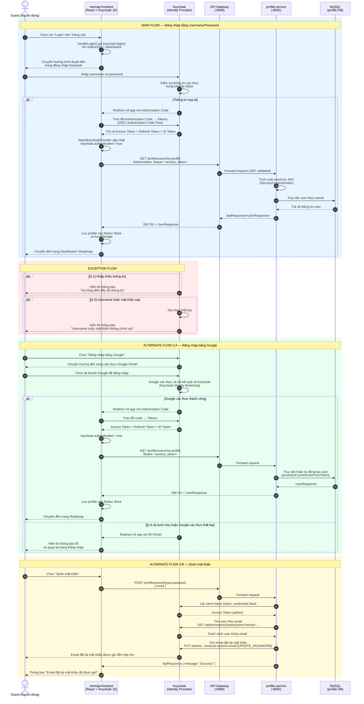

# UC01 — Đăng nhập (Login)

```mermaid
sequenceDiagram
    autonumber
    actor Guest as Guest (Người dùng)
    participant FE as memap-frontend<br/>(React + Keycloak JS)
    participant KC as Keycloak<br/>(Identity Provider)
    participant GW as API Gateway<br/>(:8090)
    participant PS as profile-service<br/>(:8082)
    participant DB as MySQL<br/>(profile DB)

    %% ==================== MAIN FLOW ====================
    rect rgb(230, 245, 255)
        Note over Guest,DB: MAIN FLOW — Đăng nhập bằng Username/Password
        Guest->>FE: Chọn nút "Login" trên Trang chủ
        FE->>FE: handleLogin() gọi keycloak.login()<br/>với redirectUri = /dashboard
        FE-->>Guest: Chuyển hướng trình duyệt đến<br/>trang đăng nhập Keycloak

        Guest->>KC: Nhập username và password
        KC->>KC: Kiểm tra thông tin xác thực<br/>trong Identity Store

        alt Thông tin hợp lệ
            KC-->>FE: Redirect về app với Authorization Code
            FE->>KC: Trao đổi Authorization Code → Tokens<br/>(OIDC Authorization Code Flow)
            KC-->>FE: Trả về Access Token + Refresh Token + ID Token
            FE->>FE: ReactKeycloakProvider cập nhật<br/>keycloak.authenticated = true

            FE->>GW: GET /profile/users/my-profile<br/>Authorization: Bearer <access_token>
            GW->>PS: Forward request (JWT validated)
            PS->>PS: Trích xuất userId từ JWT<br/>(SecurityContextHolder)
            PS->>DB: Truy vấn user theo userId
            DB-->>PS: Trả về thông tin user
            PS-->>GW: ApiResponse<UserResponse>
            GW-->>FE: 200 OK + UserResponse

            FE->>FE: Lưu profile vào Redux Store<br/>và localStorage
            FE-->>Guest: Chuyển đến trang Dashboard / Roadmap
        end
    end

    %% ==================== EXCEPTION FLOW ====================
    rect rgb(255, 235, 235)
        Note over Guest,KC: EXCEPTION FLOW
        opt [4.1] Nhập thiếu thông tin
            KC-->>Guest: Hiển thị thông báo<br/>"Vui lòng điền đầy đủ thông tin"
        end
        opt [4.2] Username hoặc mật khẩu sai
            KC->>KC: Xác thực thất bại
            KC-->>Guest: Hiển thị thông báo<br/>"Username hoặc mật khẩu không chính xác"
        end
    end

    %% ==================== ALTERNATE FLOW 3.A ====================
    rect rgb(230, 255, 240)
        Note over Guest,DB: ALTERNATE FLOW 3.A — Đăng nhập bằng Google
        Guest->>KC: Chọn "Đăng nhập bằng Google"
        KC-->>Guest: Chuyển hướng đến trang xác thực Google OAuth

        Guest->>KC: Chọn tài khoản Google để đăng nhập
        KC->>KC: Google xác thực và trả kết quả về Keycloak<br/>(Keycloak Identity Brokering)

        alt Google xác thực thành công
            KC-->>FE: Redirect về app với Authorization Code
            FE->>KC: Trao đổi code → Tokens
            KC-->>FE: Access Token + Refresh Token + ID Token
            FE->>FE: keycloak.authenticated = true

            FE->>GW: GET /profile/users/my-profile<br/>Bearer <access_token>
            GW->>PS: Forward request
            PS->>DB: Truy vấn hoặc tự động tạo user<br/>(provisionCurrentUserFromToken)
            DB-->>PS: UserResponse
            PS-->>FE: 200 OK + UserResponse

            FE->>FE: Lưu profile vào Redux Store
            FE-->>Guest: Chuyển đến trang Roadmap
        else [3.A.4] Actor hủy hoặc Google xác thực thất bại
            KC-->>FE: Redirect về app với lỗi OAuth
            FE-->>Guest: Hiển thị thông báo lỗi<br/>và quay lại trang Đăng nhập
        end
    end

    %% ==================== ALTERNATE FLOW 3.B ====================
    rect rgb(255, 250, 220)
        Note over Guest,DB: ALTERNATE FLOW 3.B — Quên mật khẩu
        Guest->>FE: Chọn "Quên mật khẩu"
        FE->>GW: POST /profile/users/forgot-password<br/>{ email }
        GW->>PS: Forward request
        PS->>KC: Lấy client token (client_credentials flow)
        KC-->>PS: Access Token (admin)
        PS->>KC: Tìm user theo email<br/>GET /admin/realms/{realm}/users?email=...
        KC-->>PS: Danh sách user khớp email
        PS->>KC: Gửi email đặt lại mật khẩu<br/>PUT /admin/.../execute-actions-email [UPDATE_PASSWORD]
        KC-->>Guest: Email đặt lại mật khẩu được gửi đến hộp thư
        PS-->>FE: ApiResponse { message: "Success" }
        FE-->>Guest: Thông báo "Email đặt lại mật khẩu đã được gửi"
    end
```
