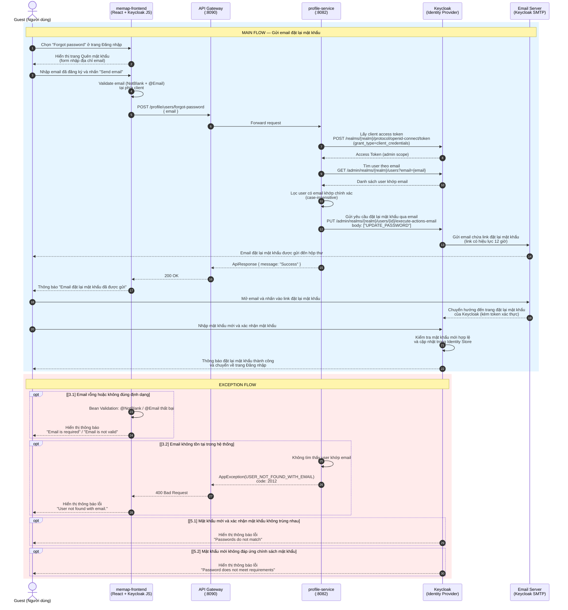

# UC02 — Quên mật khẩu (Forgot Password)

```mermaid
sequenceDiagram
    autonumber
    actor Guest as Guest (Người dùng)
    participant FE as memap-frontend<br/>(React + Keycloak JS)
    participant GW as API Gateway<br/>(:8090)
    participant PS as profile-service<br/>(:8082)
    participant KC as Keycloak<br/>(Identity Provider)
    participant Mail as Email Server<br/>(Keycloak SMTP)

    %% ==================== MAIN FLOW ====================
    rect rgb(230, 245, 255)
        Note over Guest,Mail: MAIN FLOW — Gửi email đặt lại mật khẩu
        Guest->>FE: Chọn "Forgot password" ở trang Đăng nhập
        FE-->>Guest: Hiển thị trang Quên mật khẩu<br/>(form nhập địa chỉ email)

        Guest->>FE: Nhập email đã đăng ký và nhấn "Send email"
        FE->>FE: Validate email (NotBlank + @Email)<br/>tại phía client

        FE->>GW: POST /profile/users/forgot-password<br/>{ email }
        GW->>PS: Forward request

        PS->>KC: Lấy client access token<br/>POST /realms/{realm}/protocol/openid-connect/token<br/>(grant_type=client_credentials)
        KC-->>PS: Access Token (admin scope)

        PS->>KC: Tìm user theo email<br/>GET /admin/realms/{realm}/users?email={email}
        KC-->>PS: Danh sách user khớp email

        PS->>PS: Lọc user có email khớp chính xác<br/>(case-insensitive)

        PS->>KC: Gửi yêu cầu đặt lại mật khẩu qua email<br/>PUT /admin/realms/{realm}/users/{id}/execute-actions-email<br/>body: ["UPDATE_PASSWORD"]
        KC->>Mail: Gửi email chứa link đặt lại mật khẩu<br/>(link có hiệu lực 12 giờ)
        Mail-->>Guest: Email đặt lại mật khẩu được gửi đến hộp thư

        PS-->>GW: ApiResponse { message: "Success" }
        GW-->>FE: 200 OK
        FE-->>Guest: Thông báo "Email đặt lại mật khẩu đã được gửi"

        Guest->>Mail: Mở email và nhấn vào link đặt lại mật khẩu
        Mail-->>KC: Chuyển hướng đến trang đặt lại mật khẩu<br/>của Keycloak (kèm token xác thực)

        Guest->>KC: Nhập mật khẩu mới và xác nhận mật khẩu
        KC->>KC: Kiểm tra mật khẩu mới hợp lệ<br/>và cập nhật trong Identity Store

        KC-->>Guest: Thông báo đặt lại mật khẩu thành công<br/>và chuyển về trang Đăng nhập
    end

    %% ==================== EXCEPTION FLOW ====================
    rect rgb(255, 235, 235)
        Note over Guest,KC: EXCEPTION FLOW
        opt [3.1] Email rỗng hoặc không đúng định dạng
            FE->>FE: Bean Validation: @NotBlank / @Email thất bại
            FE-->>Guest: Hiển thị thông báo<br/>"Email is required" / "Email is not valid"
        end

        opt [3.2] Email không tồn tại trong hệ thống
            PS->>PS: Không tìm thấy user khớp email
            PS-->>GW: AppException(USER_NOT_FOUND_WITH_EMAIL)<br/>code: 2012
            GW-->>FE: 400 Bad Request
            FE-->>Guest: Hiển thị thông báo lỗi<br/>"User not found with email."
        end

        opt [5.1] Mật khẩu mới và xác nhận mật khẩu không trùng nhau
            KC-->>Guest: Hiển thị thông báo lỗi<br/>"Passwords do not match"
        end

        opt [5.2] Mật khẩu mới không đáp ứng chính sách mật khẩu
            KC-->>Guest: Hiển thị thông báo lỗi<br/>"Password does not meet requirements"
        end
    end
```
