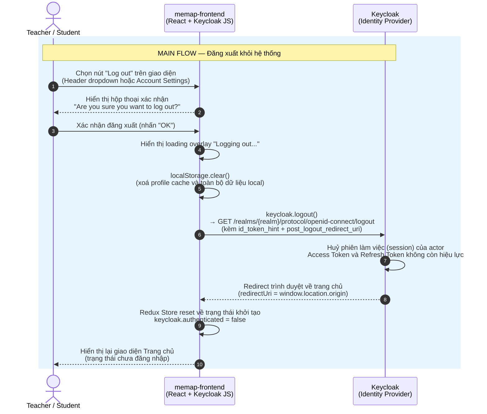

# UC03 — Đăng xuất (Logout)

```mermaid
sequenceDiagram
    autonumber
    actor User as Teacher / Student
    participant FE as memap-frontend<br/>(React + Keycloak JS)
    participant KC as Keycloak<br/>(Identity Provider)

    %% ==================== MAIN FLOW ====================
    rect rgb(230, 245, 255)
        Note over User,KC: MAIN FLOW — Đăng xuất khỏi hệ thống

        User->>FE: Chọn nút "Log out" trên giao diện<br/>(Header dropdown hoặc Account Settings)
        FE-->>User: Hiển thị hộp thoại xác nhận<br/>"Are you sure you want to log out?"

        User->>FE: Xác nhận đăng xuất (nhấn "OK")
        FE->>FE: Hiển thị loading overlay "Logging out..."
        FE->>FE: localStorage.clear()<br/>(xoá profile cache và toàn bộ dữ liệu local)

        FE->>KC: keycloak.logout()<br/>→ GET /realms/{realm}/protocol/openid-connect/logout<br/>(kèm id_token_hint + post_logout_redirect_uri)
        KC->>KC: Huỷ phiên làm việc (session) của actor<br/>Access Token và Refresh Token không còn hiệu lực

        KC-->>FE: Redirect trình duyệt về trang chủ<br/>(redirectUri = window.location.origin)
        FE->>FE: Redux Store reset về trạng thái khởi tạo<br/>keycloak.authenticated = false
        FE-->>User: Hiển thị lại giao diện Trang chủ<br/>(trạng thái chưa đăng nhập)
    end
```
