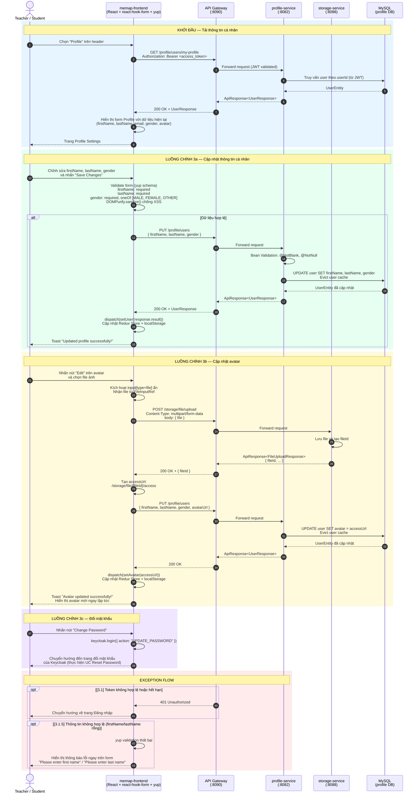

# UC04 — Quản lý thông tin cá nhân (Manage Personal Information)

```mermaid
sequenceDiagram
    autonumber
    actor User as Teacher / Student
    participant FE as memap-frontend<br/>(React + react-hook-form + yup)
    participant GW as API Gateway<br/>(:8090)
    participant PS as profile-service<br/>(:8082)
    participant SS as storage-service<br/>(:8088)
    participant DB as MySQL<br/>(profile DB)

    %% ==================== LOAD PROFILE ====================
    rect rgb(230, 245, 255)
        Note over User,DB: KHỞI ĐẦU — Tải thông tin cá nhân
        User->>FE: Chọn "Profile" trên header
        FE->>GW: GET /profile/users/my-profile<br/>Authorization: Bearer <access_token>
        GW->>PS: Forward request (JWT validated)
        PS->>DB: Truy vấn user theo userId (từ JWT)
        DB-->>PS: UserEntity
        PS-->>GW: ApiResponse<UserResponse>
        GW-->>FE: 200 OK + UserResponse
        FE->>FE: Hiển thị form Profile với dữ liệu hiện tại<br/>(firstName, lastName, email, gender, avatar)
        FE-->>User: Trang Profile Settings
    end

    %% ==================== UPDATE PROFILE INFO ====================
    rect rgb(230, 255, 240)
        Note over User,DB: LUỒNG CHÍNH 3a — Cập nhật thông tin cá nhân
        User->>FE: Chỉnh sửa firstName, lastName, gender<br/>và nhấn "Save Changes"
        FE->>FE: Validate form (yup schema)<br/>firstName: required<br/>lastName: required<br/>gender: required, oneOf [MALE, FEMALE, OTHER]<br/>DOMPurify.sanitize() chống XSS

        alt Dữ liệu hợp lệ
            FE->>GW: PUT /profile/users<br/>{ firstName, lastName, gender }
            GW->>PS: Forward request
            PS->>PS: Bean Validation: @NotBlank, @NotNull
            PS->>DB: UPDATE user SET firstName, lastName, gender<br/>Evict user cache
            DB-->>PS: UserEntity đã cập nhật
            PS-->>GW: ApiResponse<UserResponse>
            GW-->>FE: 200 OK + UserResponse
            FE->>FE: dispatch(setUser(response.result))<br/>Cập nhật Redux Store + localStorage
            FE-->>User: Toast "Updated profile successfully!"
        end
    end

    %% ==================== UPDATE AVATAR ====================
    rect rgb(255, 250, 220)
        Note over User,DB: LUỒNG CHÍNH 3b — Cập nhật avatar
        User->>FE: Nhấn nút "Edit" trên avatar<br/>và chọn file ảnh
        FE->>FE: Kích hoạt input[type=file] ẩn<br/>Nhận file từ FileInputRef

        FE->>GW: POST /storage/file/upload<br/>Content-Type: multipart/form-data<br/>body: { file }
        GW->>SS: Forward request
        SS->>SS: Lưu file và tạo fileId
        SS-->>GW: ApiResponse<FileUploadResponse><br/>{ fileId, ... }
        GW-->>FE: 200 OK + { fileId }

        FE->>FE: Tạo accessUrl:<br/>/storage/file/{fileId}/access

        FE->>GW: PUT /profile/users<br/>{ firstName, lastName, gender, avatarUrl }
        GW->>PS: Forward request
        PS->>DB: UPDATE user SET avatar = accessUrl<br/>Evict user cache
        DB-->>PS: UserEntity đã cập nhật
        PS-->>GW: ApiResponse<UserResponse>
        GW-->>FE: 200 OK

        FE->>FE: dispatch(setAvatar(accessUrl))<br/>Cập nhật Redux Store + localStorage
        FE-->>User: Toast "Avatar updated successfully!"<br/>Hiển thị avatar mới ngay lập tức
    end

    %% ==================== CHANGE PASSWORD ====================
    rect rgb(240, 230, 255)
        Note over User,FE: LUỒNG CHÍNH 3c — Đổi mật khẩu
        User->>FE: Nhấn nút "Change Password"
        FE->>FE: keycloak.login({ action: "UPDATE_PASSWORD" })
        FE-->>User: Chuyển hướng đến trang đổi mật khẩu<br/>của Keycloak (thực hiện UC Reset Password)
    end

    %% ==================== EXCEPTION FLOW ====================
    rect rgb(255, 235, 235)
        Note over User,PS: EXCEPTION FLOW
        opt [3.1] Token không hợp lệ hoặc hết hạn
            GW-->>FE: 401 Unauthorized
            FE-->>User: Chuyển hướng về trang Đăng nhập
        end

        opt [3.1.5] Thông tin không hợp lệ (firstName/lastName rỗng)
            FE->>FE: yup validation thất bại
            FE-->>User: Hiển thị thông báo lỗi ngay trên form<br/>"Please enter first name" / "Please enter last name"
        end
    end
```
