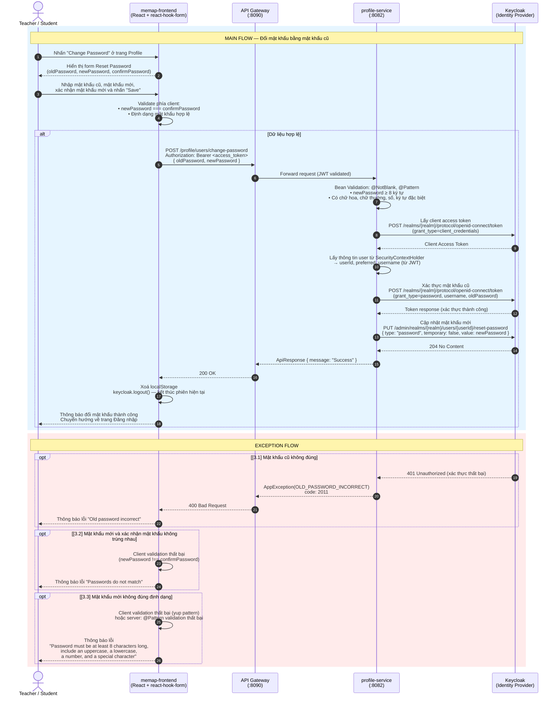

# UC05 — Đổi mật khẩu (Reset Password)

```mermaid
sequenceDiagram
    autonumber
    actor User as Teacher / Student
    participant FE as memap-frontend<br/>(React + react-hook-form)
    participant GW as API Gateway<br/>(:8090)
    participant PS as profile-service<br/>(:8082)
    participant KC as Keycloak<br/>(Identity Provider)

    %% ==================== MAIN FLOW ====================
    rect rgb(230, 245, 255)
        Note over User,KC: MAIN FLOW — Đổi mật khẩu bằng mật khẩu cũ
        User->>FE: Nhấn "Change Password" ở trang Profile
        FE-->>User: Hiển thị form Reset Password<br/>(oldPassword, newPassword, confirmPassword)

        User->>FE: Nhập mật khẩu cũ, mật khẩu mới,<br/>xác nhận mật khẩu mới và nhấn "Save"
        FE->>FE: Validate phía client:<br/>• newPassword === confirmPassword<br/>• Định dạng mật khẩu hợp lệ

        alt Dữ liệu hợp lệ
            FE->>GW: POST /profile/users/change-password<br/>Authorization: Bearer <access_token><br/>{ oldPassword, newPassword }
            GW->>PS: Forward request (JWT validated)

            PS->>PS: Bean Validation: @NotBlank, @Pattern<br/>• newPassword ≥ 8 ký tự<br/>• Có chữ hoa, chữ thường, số, ký tự đặc biệt

            PS->>KC: Lấy client access token<br/>POST /realms/{realm}/protocol/openid-connect/token<br/>(grant_type=client_credentials)
            KC-->>PS: Client Access Token

            PS->>PS: Lấy thông tin user từ SecurityContextHolder<br/>→ userId, preferred_username (từ JWT)

            PS->>KC: Xác thực mật khẩu cũ<br/>POST /realms/{realm}/protocol/openid-connect/token<br/>(grant_type=password, username, oldPassword)
            KC-->>PS: Token response (xác thực thành công)

            PS->>KC: Cập nhật mật khẩu mới<br/>PUT /admin/realms/{realm}/users/{userId}/reset-password<br/>{ type: "password", temporary: false, value: newPassword }
            KC-->>PS: 204 No Content

            PS-->>GW: ApiResponse { message: "Success" }
            GW-->>FE: 200 OK
            FE->>FE: Xoá localStorage<br/>keycloak.logout() — kết thúc phiên hiện tại
            FE-->>User: Thông báo đổi mật khẩu thành công<br/>Chuyển hướng về trang Đăng nhập
        end
    end

    %% ==================== EXCEPTION FLOW ====================
    rect rgb(255, 235, 235)
        Note over User,KC: EXCEPTION FLOW
        opt [3.1] Mật khẩu cũ không đúng
            KC-->>PS: 401 Unauthorized (xác thực thất bại)
            PS-->>GW: AppException(OLD_PASSWORD_INCORRECT)<br/>code: 2011
            GW-->>FE: 400 Bad Request
            FE-->>User: Thông báo lỗi "Old password incorrect"
        end

        opt [3.2] Mật khẩu mới và xác nhận mật khẩu không trùng nhau
            FE->>FE: Client validation thất bại<br/>(newPassword !== confirmPassword)
            FE-->>User: Thông báo lỗi "Passwords do not match"
        end

        opt [3.3] Mật khẩu mới không đúng định dạng
            FE->>FE: Client validation thất bại (yup pattern)<br/>hoặc server: @Pattern validation thất bại
            FE-->>User: Thông báo lỗi<br/>"Password must be at least 8 characters long,<br/>include an uppercase, a lowercase,<br/>a number, and a special character"
        end
    end
```
