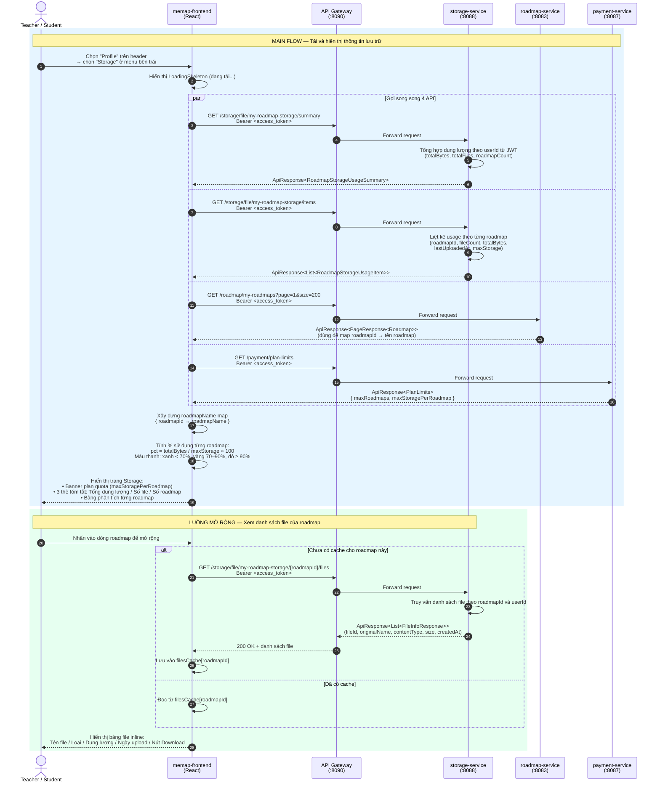

# UC06 — Xem dung lượng lưu trữ (View Storage Usage)

```mermaid
sequenceDiagram
    autonumber
    actor User as Teacher / Student
    participant FE as memap-frontend<br/>(React)
    participant GW as API Gateway<br/>(:8090)
    participant SS as storage-service<br/>(:8088)
    participant RS as roadmap-service<br/>(:8083)
    participant PAY as payment-service<br/>(:8087)

    %% ==================== MAIN FLOW ====================
    rect rgb(230, 245, 255)
        Note over User,PAY: MAIN FLOW — Tải và hiển thị thông tin lưu trữ
        User->>FE: Chọn "Profile" trên header<br/>→ chọn "Storage" ở menu bên trái

        FE->>FE: Hiển thị LoadingSkeleton (đang tải...)

        par Gọi song song 4 API
            FE->>GW: GET /storage/file/my-roadmap-storage/summary<br/>Bearer <access_token>
            GW->>SS: Forward request
            SS->>SS: Tổng hợp dung lượng theo userId từ JWT<br/>(totalBytes, totalFiles, roadmapCount)
            SS-->>FE: ApiResponse<RoadmapStorageUsageSummary>

        and
            FE->>GW: GET /storage/file/my-roadmap-storage/items<br/>Bearer <access_token>
            GW->>SS: Forward request
            SS->>SS: Liệt kê usage theo từng roadmap<br/>(roadmapId, fileCount, totalBytes,<br/>lastUploadedAt, maxStorage)
            SS-->>FE: ApiResponse<List<RoadmapStorageUsageItem>>

        and
            FE->>GW: GET /roadmap/my-roadmaps?page=1&size=200<br/>Bearer <access_token>
            GW->>RS: Forward request
            RS-->>FE: ApiResponse<PageResponse<Roadmap>><br/>(dùng để map roadmapId → tên roadmap)

        and
            FE->>GW: GET /payment/plan-limits<br/>Bearer <access_token>
            GW->>PAY: Forward request
            PAY-->>FE: ApiResponse<PlanLimits><br/>{ maxRoadmaps, maxStoragePerRoadmap }
        end

        FE->>FE: Xây dựng roadmapName map<br/>{ roadmapId → roadmapName }
        FE->>FE: Tính % sử dụng từng roadmap:<br/>pct = totalBytes / maxStorage × 100<br/>Màu thanh: xanh < 70%, vàng 70–90%, đỏ ≥ 90%

        FE-->>User: Hiển thị trang Storage:<br/>• Banner plan quota (maxStoragePerRoadmap)<br/>• 3 thẻ tóm tắt: Tổng dung lượng / Số file / Số roadmap<br/>• Bảng phân tích từng roadmap
    end

    %% ==================== EXPAND ROADMAP FILES ====================
    rect rgb(230, 255, 240)
        Note over User,SS: LUỒNG MỞ RỘNG — Xem danh sách file của roadmap
        User->>FE: Nhấn vào dòng roadmap để mở rộng

        alt Chưa có cache cho roadmap này
            FE->>GW: GET /storage/file/my-roadmap-storage/{roadmapId}/files<br/>Bearer <access_token>
            GW->>SS: Forward request
            SS->>SS: Truy vấn danh sách file theo roadmapId và userId
            SS-->>GW: ApiResponse<List<FileInfoResponse>><br/>(fileId, originalName, contentType, size, createdAt)
            GW-->>FE: 200 OK + danh sách file
            FE->>FE: Lưu vào filesCache[roadmapId]
        else Đã có cache
            FE->>FE: Đọc từ filesCache[roadmapId]
        end

        FE-->>User: Hiển thị bảng file inline:<br/>Tên file / Loại / Dung lượng / Ngày upload / Nút Download
    end
```
