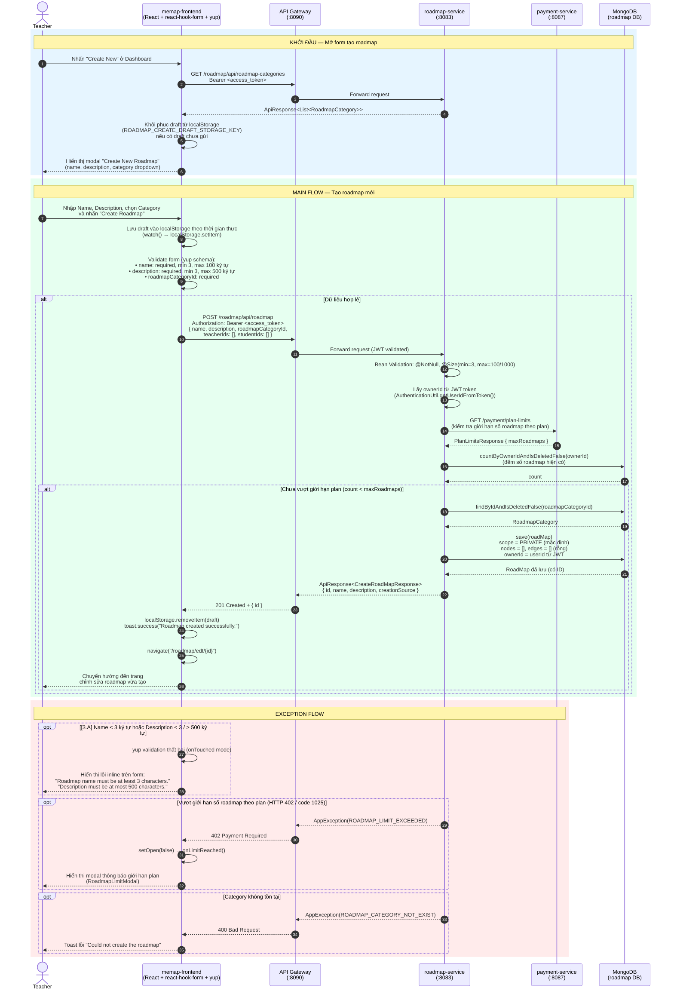

# UC07 — Tạo Roadmap (Create Roadmap)

```mermaid
sequenceDiagram
    autonumber
    actor Teacher as Teacher
    participant FE as memap-frontend<br/>(React + react-hook-form + yup)
    participant GW as API Gateway<br/>(:8090)
    participant RS as roadmap-service<br/>(:8083)
    participant PAY as payment-service<br/>(:8087)
    participant DB as MongoDB<br/>(roadmap DB)

    %% ==================== LOAD FORM ====================
    rect rgb(230, 245, 255)
        Note over Teacher,DB: KHỞI ĐẦU — Mở form tạo roadmap
        Teacher->>FE: Nhấn "Create New" ở Dashboard
        FE->>GW: GET /roadmap/api/roadmap-categories<br/>Bearer <access_token>
        GW->>RS: Forward request
        RS-->>FE: ApiResponse<List<RoadmapCategory>>

        FE->>FE: Khôi phục draft từ localStorage<br/>(ROADMAP_CREATE_DRAFT_STORAGE_KEY)<br/>nếu có draft chưa gửi

        FE-->>Teacher: Hiển thị modal "Create New Roadmap"<br/>(name, description, category dropdown)
    end

    %% ==================== MAIN FLOW ====================
    rect rgb(230, 255, 240)
        Note over Teacher,DB: MAIN FLOW — Tạo roadmap mới
        Teacher->>FE: Nhập Name, Description, chọn Category<br/>và nhấn "Create Roadmap"
        FE->>FE: Lưu draft vào localStorage theo thời gian thực<br/>(watch() → localStorage.setItem)

        FE->>FE: Validate form (yup schema):<br/>• name: required, min 3, max 100 ký tự<br/>• description: required, min 3, max 500 ký tự<br/>• roadmapCategoryId: required

        alt Dữ liệu hợp lệ
            FE->>GW: POST /roadmap/api/roadmap<br/>Authorization: Bearer <access_token><br/>{ name, description, roadmapCategoryId,<br/>  teacherIds: [], studentIds: [] }
            GW->>RS: Forward request (JWT validated)

            RS->>RS: Bean Validation: @NotNull, @Size(min=3, max=100/1000)
            RS->>RS: Lấy ownerId từ JWT token<br/>(AuthenticationUtil.getUserIdFromToken())

            RS->>PAY: GET /payment/plan-limits<br/>(kiểm tra giới hạn số roadmap theo plan)
            PAY-->>RS: PlanLimitsResponse { maxRoadmaps }

            RS->>DB: countByOwnerIdAndIsDeletedFalse(ownerId)<br/>(đếm số roadmap hiện có)
            DB-->>RS: count

            alt Chưa vượt giới hạn plan (count < maxRoadmaps)
                RS->>DB: findByIdAndIsDeletedFalse(roadmapCategoryId)
                DB-->>RS: RoadmapCategory

                RS->>DB: save(roadMap)<br/>scope = PRIVATE (mặc định)<br/>nodes = [], edges = [] (rỗng)<br/>ownerId = userId từ JWT
                DB-->>RS: RoadMap đã lưu (có ID)

                RS-->>GW: ApiResponse<CreateRoadMapResponse><br/>{ id, name, description, creationSource }
                GW-->>FE: 201 Created + { id }

                FE->>FE: localStorage.removeItem(draft)<br/>toast.success("Roadmap created successfully.")
                FE->>FE: navigate("/roadmap/edt/{id}")
                FE-->>Teacher: Chuyển hướng đến trang<br/>chỉnh sửa roadmap vừa tạo
            end
        end
    end

    %% ==================== EXCEPTION FLOW ====================
    rect rgb(255, 235, 235)
        Note over Teacher,PAY: EXCEPTION FLOW
        opt [3.A] Name < 3 ký tự hoặc Description < 3 / > 500 ký tự
            FE->>FE: yup validation thất bại (onTouched mode)
            FE-->>Teacher: Hiển thị lỗi inline trên form:<br/>"Roadmap name must be at least 3 characters."<br/>"Description must be at most 500 characters."
        end

        opt Vượt giới hạn số roadmap theo plan (HTTP 402 / code 1025)
            RS-->>GW: AppException(ROADMAP_LIMIT_EXCEEDED)
            GW-->>FE: 402 Payment Required
            FE->>FE: setOpen(false) → onLimitReached()
            FE-->>Teacher: Hiển thị modal thông báo giới hạn plan<br/>(RoadmapLimitModal)
        end

        opt Category không tồn tại
            RS-->>GW: AppException(ROADMAP_CATEGORY_NOT_EXIST)
            GW-->>FE: 400 Bad Request
            FE-->>Teacher: Toast lỗi "Could not create the roadmap"
        end
    end
```
