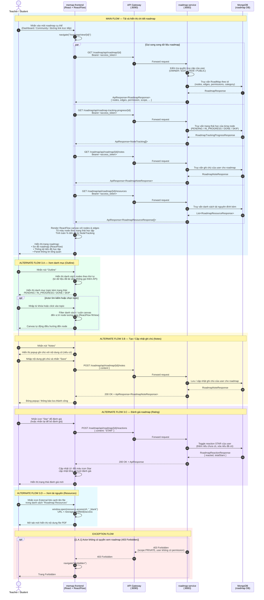

# UC08 — Xem Roadmap (View Roadmap)

```mermaid
sequenceDiagram
    autonumber
    actor User as Teacher / Student
    participant FE as memap-frontend<br/>(React + ReactFlow)
    participant GW as API Gateway<br/>(:8090)
    participant RS as roadmap-service<br/>(:8083)
    participant DB as MongoDB<br/>(roadmap DB)

    %% ==================== MAIN FLOW ====================
    rect rgb(230, 245, 255)
        Note over User,DB: MAIN FLOW — Tải và hiển thị chi tiết roadmap
        User->>FE: Nhấn vào một roadmap cụ thể<br/>(Dashboard / Community / đường link trực tiếp)
        FE->>FE: navigate("/roadmap/view/{id}")

        par Gọi song song dữ liệu roadmap
            FE->>GW: GET /roadmap/api/roadmap/{id}<br/>Bearer <access_token>
            GW->>RS: Forward request
            RS->>RS: Kiểm tra quyền truy cập của user<br/>(OWNER / EDIT / VIEW / PUBLIC)
            RS->>DB: Truy vấn RoadMap theo id<br/>(nodes, edges, permissions, category)
            DB-->>RS: RoadmapResponse
            RS-->>FE: ApiResponse<RoadmapResponse><br/>{ nodes, edges, permission, scope, ... }

        and
            FE->>GW: GET /roadmap/api/roadmap-tracking-progress/{id}<br/>Bearer <access_token>
            GW->>RS: Forward request
            RS->>DB: Truy vấn trạng thái học của từng node<br/>(PENDING / IN_PROGRESS / DONE / SKIP)
            DB-->>RS: RoadmapTrackingProgressResponse
            RS-->>FE: ApiResponse<NodeTracking[]>

        and
            FE->>GW: GET /roadmap/api/roadmap/{id}/notes<br/>Bearer <access_token>
            GW->>RS: Forward request
            RS->>DB: Truy vấn ghi chú của user cho roadmap
            DB-->>RS: RoadmapNoteResponse
            RS-->>FE: ApiResponse<RoadmapNoteResponse>

        and
            FE->>GW: GET /roadmap/api/roadmap/{id}/resources<br/>Bearer <access_token>
            GW->>RS: Forward request
            RS->>DB: Truy vấn danh sách tài nguyên đính kèm
            DB-->>RS: List<RoadmapResourceResponse>
            RS-->>FE: ApiResponse<RoadmapResourceResponse[]>
        end

        FE->>FE: Render ReactFlow canvas với nodes & edges<br/>Tô màu node theo trạng thái học tập<br/>Tính toán % tiến độ từ NodeTracking
        FE-->>User: Hiển thị trang roadmap:<br/>• Sơ đồ roadmap (ReactFlow)<br/>• Thống kê tiến độ học tập<br/>• Panel thông tin tổng quan
    end

    %% ==================== ALT 3.A OUTLINE ====================
    rect rgb(230, 255, 240)
        Note over User,FE: ALTERNATE FLOW 3.A — Xem danh mục (Outline)
        User->>FE: Nhấn nút "Outline"
        FE->>FE: Hiển thị danh sách nodes theo thứ tự<br/>(từ dữ liệu đã tải sẵn, không gọi thêm API)
        FE-->>User: Hiển thị danh mục topic kèm trạng thái:<br/>PENDING / IN_PROGRESS / DONE / SKIP

        opt Actor tìm kiếm hoặc chọn topic
            User->>FE: Nhập từ khóa hoặc click vào topic
            FE->>FE: Filter danh sách / cuộn canvas<br/>đến vị trí node tương ứng (ReactFlow fitView)
            FE-->>User: Canvas tự động điều hướng đến node
        end
    end

    %% ==================== ALT 3.B NOTES ====================
    rect rgb(255, 250, 220)
        Note over User,DB: ALTERNATE FLOW 3.B — Tạo / Cập nhật ghi chú (Notes)
        User->>FE: Nhấn nút "Notes"
        FE-->>User: Hiển thị popup ghi chú với nội dung cũ (nếu có)

        User->>FE: Nhập nội dung ghi chú và nhấn "Save"
        FE->>GW: POST /roadmap/api/roadmap/{id}/notes<br/>{ content }
        GW->>RS: Forward request
        RS->>DB: Lưu / cập nhật ghi chú của user cho roadmap
        DB-->>RS: RoadmapNoteResponse
        RS-->>FE: 200 OK + ApiResponse<RoadmapNoteResponse>
        FE-->>User: Đóng popup / thông báo lưu thành công
    end

    %% ==================== ALT 3.C RATING ====================
    rect rgb(240, 230, 255)
        Note over User,DB: ALTERNATE FLOW 3.C — Đánh giá roadmap (Rating)
        User->>FE: Nhấn icon "Star" để đánh giá<br/>(hoặc nhấn lại để bỏ đánh giá)
        FE->>GW: POST /roadmap/api/roadmap/{id}/reactions<br/>{ content: "STAR" }
        GW->>RS: Forward request
        RS->>DB: Toggle reaction STAR của user<br/>(thêm nếu chưa có, xóa nếu đã có)
        DB-->>RS: RoadmapReactionResponse<br/>{ reacted, totalStars }
        RS-->>FE: 200 OK + ApiResponse
        FE->>FE: Cập nhật UI: đổi màu icon Star<br/>cập nhật tổng số lượt đánh giá
        FE-->>User: Hiển thị trạng thái đánh giá mới
    end

    %% ==================== ALT 3.D RESOURCES ====================
    rect rgb(230, 250, 255)
        Note over User,FE: ALTERNATE FLOW 3.D — Xem tài nguyên (Resources)
        User->>FE: Nhấn icon External link cạnh tên file<br/>trong danh sách "Roadmap Resources"
        FE->>FE: window.open(resource.accessUrl, "_blank")<br/>URL = /storage/file/{fileId}/access
        FE-->>User: Mở tab mới hiển thị nội dung file PDF
    end

    %% ==================== EXCEPTION FLOW ====================
    rect rgb(255, 235, 235)
        Note over User,RS: EXCEPTION FLOW
        opt [1.A.1] Actor không có quyền xem roadmap (403 Forbidden)
            RS-->>GW: 403 Forbidden<br/>(scope PRIVATE, user không có permission)
            GW-->>FE: 403 Forbidden
            FE->>FE: navigate("/forbidden")
            FE-->>User: Trang Forbidden
        end
    end
```
