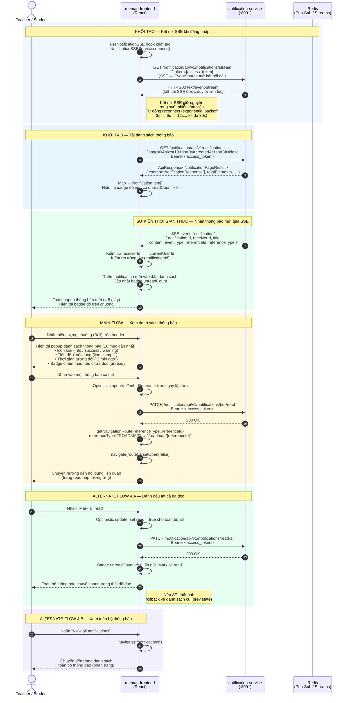

# UC09 — Xem thông báo (View Notifications)

```mermaid
sequenceDiagram
    autonumber
    actor User as Teacher / Student
    participant FE as memap-frontend<br/>(React)
    participant NS as notification-service<br/>(:8091)
    participant Redis as Redis<br/>(Pub-Sub / Streams)

    %% ==================== KẾT NỐI SSE THỜI GIAN THỰC ====================
    rect rgb(240, 248, 255)
        Note over User,Redis: KHỞI TẠO — Kết nối SSE khi đăng nhập
        FE->>FE: useNotificationSSE hook khởi tạo<br/>NotificationSSEService.connect()
        FE->>NS: GET /notification/api/v1/notifications/stream<br/>?token={access_token}<br/>(SSE — EventSource mở kết nối dài)
        NS-->>FE: HTTP 200 text/event-stream<br/>(kết nối SSE được duy trì liên tục)
        Note right of FE: Kết nối SSE giữ nguyên<br/>trong suốt phiên làm việc.<br/>Tự động reconnect (exponential backoff<br/>3s → 6s → 12s... tối đa 30s)
    end

    %% ==================== TẢI THÔNG BÁO BAN ĐẦU ====================
    rect rgb(230, 245, 255)
        Note over User,NS: KHỞI TẠO — Tải danh sách thông báo
        FE->>NS: GET /notification/api/v1/notifications<br/>?page=0&size=10&sortBy=createdAt&sortDir=desc<br/>Bearer <access_token>
        NS-->>FE: ApiResponse<NotificationPageResult><br/>{ content: NotificationResponse[], totalElements, ... }
        FE->>FE: Map → NotificationItem[]<br/>Hiển thị badge đỏ nếu có unreadCount > 0
    end

    %% ==================== NHẬN THÔNG BÁO THỜI GIAN THỰC ====================
    rect rgb(230, 255, 240)
        Note over NS,FE: SỰ KIỆN THỜI GIAN THỰC — Nhận thông báo mới qua SSE
        NS->>FE: SSE event: "notification"<br/>{ notificationId, receiverId, title,<br/>  content, eventType, referenceId, referenceType }
        FE->>FE: Kiểm tra receiverId === currentUserId<br/>Kiểm tra trùng lặp (notificationId)
        FE->>FE: Thêm notification mới vào đầu danh sách<br/>Cập nhật badge unreadCount
        FE-->>User: Toast popup thông báo mới (4.5 giây)<br/>Hiển thị badge đỏ trên chuông
    end

    %% ==================== MAIN FLOW — MỞ POPUP ====================
    rect rgb(255, 248, 220)
        Note over User,NS: MAIN FLOW — Xem danh sách thông báo
        User->>FE: Nhấn biểu tượng chuông (Bell) trên header
        FE-->>User: Hiển thị popup danh sách thông báo (10 mục gần nhất):<br/>• Icon loại (info / success / warning)<br/>• Tiêu đề + nội dung (line-clamp-1)<br/>• Thời gian tương đối ("2 min ago")<br/>• Badge chấm màu nếu chưa đọc (unread)

        User->>FE: Nhấn vào một thông báo cụ thể
        FE->>FE: Optimistic update: đánh dấu read = true ngay lập tức
        FE->>NS: PATCH /notification/api/v1/notifications/{id}/read<br/>Bearer <access_token>
        NS-->>FE: 200 OK

        FE->>FE: getNavigationRoute(referenceType, referenceId)<br/>referenceType="ROADMAP" → "/roadmap/{referenceId}"
        FE->>FE: navigate(route) + setOpen(false)
        FE-->>User: Chuyển hướng đến nội dung liên quan<br/>(trang roadmap tương ứng)
    end

    %% ==================== ALT 4.A MARK ALL READ ====================
    rect rgb(230, 255, 240)
        Note over User,NS: ALTERNATE FLOW 4.A — Đánh dấu tất cả đã đọc
        User->>FE: Nhấn "Mark all read"
        FE->>FE: Optimistic update: set read = true cho toàn bộ list
        FE->>NS: PATCH /notification/api/v1/notifications/read-all<br/>Bearer <access_token>
        NS-->>FE: 200 OK
        FE->>FE: Badge unreadCount về 0, ẩn nút "Mark all read"
        FE-->>User: Toàn bộ thông báo chuyển sang trạng thái đã đọc
        Note right of FE: Nếu API thất bại:<br/>rollback về danh sách cũ (prev state)
    end

    %% ==================== ALT 4.B VIEW ALL ====================
    rect rgb(240, 240, 255)
        Note over User,FE: ALTERNATE FLOW 4.B — Xem toàn bộ thông báo
        User->>FE: Nhấn "View all notifications"
        FE->>FE: navigate("/notifications")
        FE-->>User: Chuyển đến trang danh sách<br/>toàn bộ thông báo (phân trang)
    end
```
