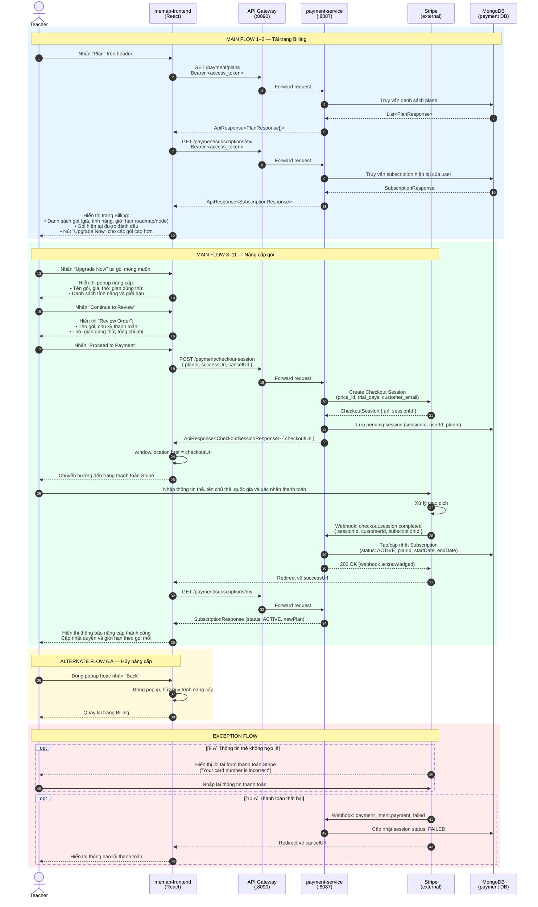

# UC10 — Nâng cấp gói dịch vụ (Upgrade Subscription Plan)

```mermaid
sequenceDiagram
    autonumber
    actor Teacher as Teacher
    participant FE as memap-frontend<br/>(React)
    participant GW as API Gateway<br/>(:8090)
    participant PAY as payment-service<br/>(:8087)
    participant Stripe as Stripe<br/>(external)
    participant DB as MongoDB<br/>(payment DB)

    %% ==================== TẢI TRANG BILLING ====================
    rect rgb(230, 245, 255)
        Note over Teacher,DB: MAIN FLOW 1–2 — Tải trang Billing
        Teacher->>FE: Nhấn "Plan" trên header
        FE->>GW: GET /payment/plans<br/>Bearer <access_token>
        GW->>PAY: Forward request
        PAY->>DB: Truy vấn danh sách plans
        DB-->>PAY: List<PlanResponse>
        PAY-->>FE: ApiResponse<PlanResponse[]>

        FE->>GW: GET /payment/subscriptions/my<br/>Bearer <access_token>
        GW->>PAY: Forward request
        PAY->>DB: Truy vấn subscription hiện tại của user
        DB-->>PAY: SubscriptionResponse
        PAY-->>FE: ApiResponse<SubscriptionResponse>

        FE-->>Teacher: Hiển thị trang Billing:<br/>• Danh sách gói (giá, tính năng, giới hạn roadmap/node)<br/>• Gói hiện tại được đánh dấu<br/>• Nút "Upgrade Now" cho các gói cao hơn
    end

    %% ==================== MAIN FLOW CHỌN GÓI ====================
    rect rgb(230, 255, 240)
        Note over Teacher,Stripe: MAIN FLOW 3–11 — Nâng cấp gói
        Teacher->>FE: Nhấn "Upgrade Now" tại gói mong muốn
        FE-->>Teacher: Hiển thị popup nâng cấp:<br/>• Tên gói, giá, thời gian dùng thử<br/>• Danh sách tính năng và giới hạn

        Teacher->>FE: Nhấn "Continue to Review"
        FE-->>Teacher: Hiển thị "Review Order":<br/>• Tên gói, chu kỳ thanh toán<br/>• Thời gian dùng thử, tổng chi phí

        Teacher->>FE: Nhấn "Proceed to Payment"
        FE->>GW: POST /payment/checkout-session<br/>{ planId, successUrl, cancelUrl }
        GW->>PAY: Forward request
        PAY->>Stripe: Create Checkout Session<br/>(price_id, trial_days, customer_email)
        Stripe-->>PAY: CheckoutSession { url, sessionId }
        PAY->>DB: Lưu pending session (sessionId, userId, planId)
        PAY-->>FE: ApiResponse<CheckoutSessionResponse> { checkoutUrl }

        FE->>FE: window.location.href = checkoutUrl
        FE-->>Teacher: Chuyển hướng đến trang thanh toán Stripe

        Teacher->>Stripe: Nhập thông tin thẻ, tên chủ thẻ, quốc gia và xác nhận thanh toán
        Stripe->>Stripe: Xử lý giao dịch

        Stripe->>PAY: Webhook: checkout.session.completed<br/>{ sessionId, customerId, subscriptionId }
        PAY->>DB: Tạo/cập nhật Subscription<br/>(status: ACTIVE, planId, startDate, endDate)
        PAY-->>Stripe: 200 OK (webhook acknowledged)

        Stripe-->>FE: Redirect về successUrl
        FE->>GW: GET /payment/subscriptions/my
        GW->>PAY: Forward request
        PAY-->>FE: SubscriptionResponse (status: ACTIVE, newPlan)
        FE-->>Teacher: Hiển thị thông báo nâng cấp thành công<br/>Cập nhật quyền và giới hạn theo gói mới
    end

    %% ==================== ALT 6.A HỦY NÂNG CẤP ====================
    rect rgb(255, 250, 220)
        Note over Teacher,FE: ALTERNATE FLOW 6.A — Hủy nâng cấp
        Teacher->>FE: Đóng popup hoặc nhấn "Back"
        FE->>FE: Đóng popup, hủy quy trình nâng cấp
        FE-->>Teacher: Quay lại trang Billing
    end

    %% ==================== EXCEPTION FLOW ====================
    rect rgb(255, 235, 235)
        Note over Teacher,Stripe: EXCEPTION FLOW
        opt [8.A] Thông tin thẻ không hợp lệ
            Stripe-->>Teacher: Hiển thị lỗi tại form thanh toán Stripe<br/>("Your card number is incorrect")
            Teacher->>Stripe: Nhập lại thông tin thanh toán
        end

        opt [10.A] Thanh toán thất bại
            Stripe->>PAY: Webhook: payment_intent.payment_failed
            PAY->>DB: Cập nhật session status: FAILED
            Stripe-->>FE: Redirect về cancelUrl
            FE-->>Teacher: Hiển thị thông báo lỗi thanh toán
        end
    end
```
