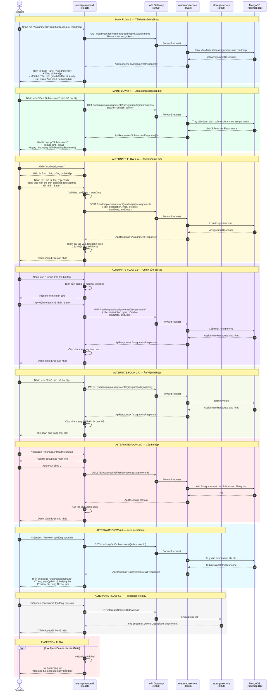

# UC11 — Quản lý bài tập (Manage Assignments)

```mermaid
sequenceDiagram
    autonumber
    actor Teacher as Teacher
    participant FE as memap-frontend<br/>(React)
    participant GW as API Gateway<br/>(:8090)
    participant RS as roadmap-service<br/>(:8083)
    participant SS as storage-service<br/>(:8088)
    participant DB as MongoDB<br/>(roadmap DB)

    %% ==================== TẢI DANH SÁCH BÀI TẬP ====================
    rect rgb(230, 245, 255)
        Note over Teacher,DB: MAIN FLOW 1 — Tải danh sách bài tập
        Teacher->>FE: Nhấn nút "Assignments" trên thanh công cụ Roadmap
        FE->>GW: GET /roadmap/api/roadmap/{roadmapId}/assignments<br/>Bearer <access_token>
        GW->>RS: Forward request
        RS->>DB: Truy vấn danh sách assignments của roadmap
        DB-->>RS: List<AssignmentResponse>
        RS-->>FE: ApiResponse<AssignmentResponse[]>
        FE-->>Teacher: Hiển thị Side Panel "Assignments":<br/>• Tổng số bài tập<br/>• Mỗi thẻ: Tên, thời gian bắt đầu, tỷ lệ nộp<br/>• Nút: Sửa / Ẩn/Hiện / Xem nộp bài
    end

    %% ==================== MAIN FLOW XEM NỘP BÀI ====================
    rect rgb(230, 255, 240)
        Note over Teacher,DB: MAIN FLOW 2–4 — Xem danh sách nộp bài
        Teacher->>FE: Nhấn icon "View Submissions" trên thẻ bài tập
        FE->>GW: GET /roadmap/api/assignments/{assignmentId}/submissions<br/>Bearer <access_token>
        GW->>RS: Forward request
        RS->>DB: Truy vấn danh sách submissions theo assignmentId
        DB-->>RS: List<SubmissionResponse>
        RS-->>FE: ApiResponse<SubmissionResponse[]>
        FE-->>Teacher: Hiển thị popup "Submissions":<br/>• Tên học sinh, email<br/>• Ngày nộp, trạng thái (Pending/Reviewed)
    end

    %% ==================== ALT 2.A THÊM BÀI TẬP ====================
    rect rgb(255, 250, 220)
        Note over Teacher,DB: ALTERNATE FLOW 2.A — Thêm bài tập mới
        Teacher->>FE: Nhấn "Add Assignment"
        FE-->>Teacher: Hiển thị form nhập thông tin bài tập

        Teacher->>FE: Nhập tên, mô tả, loại (File/Text),<br/>trạng thái hiển thị, thời gian bắt đầu/kết thúc<br/>rồi nhấn "Save"
        FE->>FE: Validate: endDate > startDate

        FE->>GW: POST /roadmap/api/roadmap/{roadmapId}/assignments<br/>{ title, description, type, isVisible,<br/>  startDate, endDate }
        GW->>RS: Forward request
        RS->>DB: Lưu Assignment mới
        DB-->>RS: AssignmentResponse
        RS-->>FE: ApiResponse<AssignmentResponse>
        FE->>FE: Thêm bài tập vào đầu danh sách<br/>Cập nhật tổng số (N+1)
        FE-->>Teacher: Danh sách được cập nhật
    end

    %% ==================== ALT 2.B CHỈNH SỬA ====================
    rect rgb(240, 230, 255)
        Note over Teacher,DB: ALTERNATE FLOW 2.B — Chỉnh sửa bài tập
        Teacher->>FE: Nhấn icon "Pencil" trên thẻ bài tập
        FE->>FE: Điền sẵn thông tin hiện tại vào form
        FE-->>Teacher: Hiển thị form chỉnh sửa

        Teacher->>FE: Thay đổi thông tin và nhấn "Save"
        FE->>GW: PUT /roadmap/api/assignments/{assignmentId}<br/>{ title, description, type, isVisible,<br/>  startDate, endDate }
        GW->>RS: Forward request
        RS->>DB: Cập nhật Assignment
        DB-->>RS: AssignmentResponse cập nhật
        RS-->>FE: ApiResponse<AssignmentResponse>
        FE->>FE: Cập nhật thẻ trong danh sách
        FE-->>Teacher: Danh sách được cập nhật
    end

    %% ==================== ALT 2.C ẨN/HIỆN ====================
    rect rgb(245, 250, 235)
        Note over Teacher,DB: ALTERNATE FLOW 2.C — Ẩn/Hiện bài tập
        Teacher->>FE: Nhấn icon "Eye" trên thẻ bài tập
        FE->>GW: PATCH /roadmap/api/assignments/{assignmentId}/visibility
        GW->>RS: Forward request
        RS->>DB: Toggle isVisible
        DB-->>RS: AssignmentResponse cập nhật
        RS-->>FE: ApiResponse<AssignmentResponse>
        FE->>FE: Cập nhật trạng thái hiển thị của thẻ
        FE-->>Teacher: Thẻ phản ánh trạng thái mới
    end

    %% ==================== ALT 2.D XÓA ====================
    rect rgb(255, 235, 235)
        Note over Teacher,DB: ALTERNATE FLOW 2.D — Xóa bài tập
        Teacher->>FE: Nhấn icon "Thùng rác" trên thẻ bài tập
        FE-->>Teacher: Hiển thị popup xác nhận xóa

        Teacher->>FE: Xác nhận đồng ý
        FE->>GW: DELETE /roadmap/api/assignments/{assignmentId}
        GW->>RS: Forward request
        RS->>DB: Xóa Assignment và các Submission liên quan
        DB-->>RS: OK
        RS-->>FE: ApiResponse<string>
        FE->>FE: Xóa thẻ khỏi danh sách
        FE-->>Teacher: Danh sách được cập nhật
    end

    %% ==================== ALT 4.A XEM CHI TIẾT FILE ====================
    rect rgb(230, 250, 255)
        Note over Teacher,SS: ALTERNATE FLOW 4.A — Xem file bài làm
        Teacher->>FE: Nhấn icon "Preview" tại dòng học sinh
        FE->>GW: GET /roadmap/api/submissions/{submissionId}
        GW->>RS: Forward request
        RS->>DB: Truy vấn submission chi tiết
        DB-->>RS: SubmissionDetailResponse
        RS-->>FE: ApiResponse<SubmissionDetailResponse>
        FE-->>Teacher: Hiển thị popup "Submission Details":<br/>• Thông tin nộp bài, định dạng file<br/>• Preview nội dung file bài làm
    end

    %% ==================== ALT 4.B TẢI BÀI LÀM ====================
    rect rgb(245, 245, 245)
        Note over Teacher,SS: ALTERNATE FLOW 4.B — Tải bài làm về máy
        Teacher->>FE: Nhấn icon "Download" tại dòng học sinh
        FE->>GW: GET /storage/file/{fileId}/download
        GW->>SS: Forward request
        SS-->>FE: File stream (Content-Disposition: attachment)
        FE-->>Teacher: Trình duyệt tải file về máy
    end

    %% ==================== EXCEPTION FLOW ====================
    rect rgb(255, 235, 235)
        Note over Teacher,FE: EXCEPTION FLOW
        opt [2.A.3] endDate trước startDate
            FE->>FE: Validation thất bại
            FE-->>Teacher: Bôi đỏ trường lỗi:<br/>"Hạn nộp bài phải sau ngày bắt đầu"
        end
    end
```
