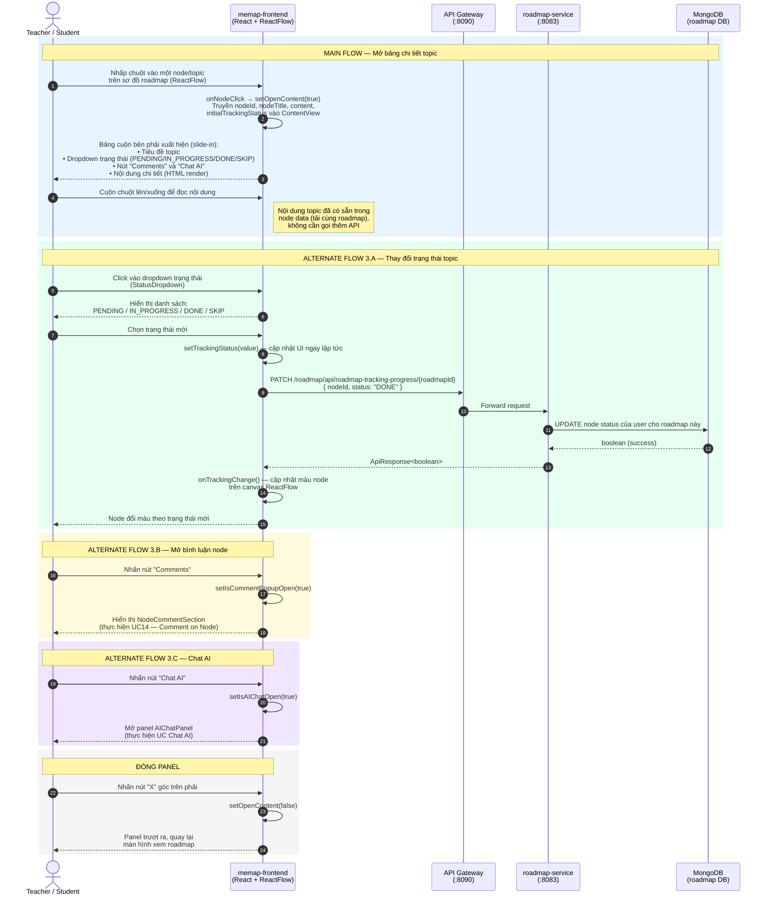

# UC13 — Xem nội dung Topic (View Topic Content)

```mermaid
sequenceDiagram
    autonumber
    actor User as Teacher / Student
    participant FE as memap-frontend<br/>(React + ReactFlow)
    participant GW as API Gateway<br/>(:8090)
    participant RS as roadmap-service<br/>(:8083)
    participant DB as MongoDB<br/>(roadmap DB)

    %% ==================== MỞ PANEL ====================
    rect rgb(230, 245, 255)
        Note over User,DB: MAIN FLOW — Mở bảng chi tiết topic
        User->>FE: Nhấp chuột vào một node/topic<br/>trên sơ đồ roadmap (ReactFlow)
        FE->>FE: onNodeClick → setOpenContent(true)<br/>Truyền nodeId, nodeTitle, content,<br/>initialTrackingStatus vào ContentView

        FE-->>User: Bảng cuộn bên phải xuất hiện (slide-in):<br/>• Tiêu đề topic<br/>• Dropdown trạng thái (PENDING/IN_PROGRESS/DONE/SKIP)<br/>• Nút "Comments" và "Chat AI"<br/>• Nội dung chi tiết (HTML render)

        User->>FE: Cuộn chuột lên/xuống để đọc nội dung
        Note right of FE: Nội dung topic đã có sẵn trong<br/>node data (tải cùng roadmap),<br/>không cần gọi thêm API
    end

    %% ==================== ALT 3.A ĐỔI TRẠNG THÁI ====================
    rect rgb(230, 255, 240)
        Note over User,DB: ALTERNATE FLOW 3.A — Thay đổi trạng thái topic
        User->>FE: Click vào dropdown trạng thái<br/>(StatusDropdown)
        FE-->>User: Hiển thị danh sách:<br/>PENDING / IN_PROGRESS / DONE / SKIP

        User->>FE: Chọn trạng thái mới
        FE->>FE: setTrackingStatus(value) — cập nhật UI ngay lập tức
        FE->>GW: PATCH /roadmap/api/roadmap-tracking-progress/{roadmapId}<br/>{ nodeId, status: "DONE" }
        GW->>RS: Forward request
        RS->>DB: UPDATE node status của user cho roadmap này
        DB-->>RS: boolean (success)
        RS-->>FE: ApiResponse<boolean>
        FE->>FE: onTrackingChange() — cập nhật màu node<br/>trên canvas ReactFlow
        FE-->>User: Node đổi màu theo trạng thái mới
    end

    %% ==================== ALT 3.B COMMENTS ====================
    rect rgb(255, 250, 220)
        Note over User,FE: ALTERNATE FLOW 3.B — Mở bình luận node
        User->>FE: Nhấn nút "Comments"
        FE->>FE: setIsCommentPopupOpen(true)
        FE-->>User: Hiển thị NodeCommentSection<br/>(thực hiện UC14 — Comment on Node)
    end

    %% ==================== ALT 3.C CHAT AI ====================
    rect rgb(240, 230, 255)
        Note over User,FE: ALTERNATE FLOW 3.C — Chat AI
        User->>FE: Nhấn nút "Chat AI"
        FE->>FE: setIsAIChatOpen(true)
        FE-->>User: Mở panel AIChatPanel<br/>(thực hiện UC Chat AI)
    end

    %% ==================== ĐÓNG PANEL ====================
    rect rgb(245, 245, 245)
        Note over User,FE: ĐÓNG PANEL
        User->>FE: Nhấn nút "X" góc trên phải
        FE->>FE: setOpenContent(false)
        FE-->>User: Panel trượt ra, quay lại<br/>màn hình xem roadmap
    end
```
