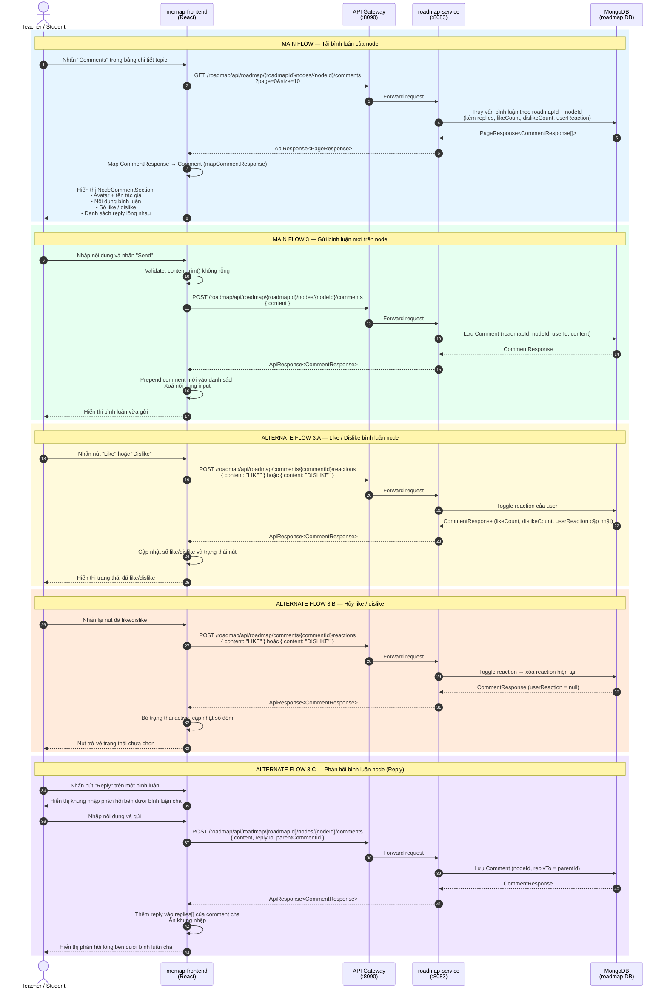

# UC14 — Bình luận trên Node (Comment On Node)

```mermaid
sequenceDiagram
    autonumber
    actor User as Teacher / Student
    participant FE as memap-frontend<br/>(React)
    participant GW as API Gateway<br/>(:8090)
    participant RS as roadmap-service<br/>(:8083)
    participant DB as MongoDB<br/>(roadmap DB)

    %% ==================== TẢI BÌNH LUẬN NODE ====================
    rect rgb(230, 245, 255)
        Note over User,DB: MAIN FLOW — Tải bình luận của node
        User->>FE: Nhấn "Comments" trong bảng chi tiết topic
        FE->>GW: GET /roadmap/api/roadmap/{roadmapId}/nodes/{nodeId}/comments<br/>?page=0&size=10
        GW->>RS: Forward request
        RS->>DB: Truy vấn bình luận theo roadmapId + nodeId<br/>(kèm replies, likeCount, dislikeCount, userReaction)
        DB-->>RS: PageResponse<CommentResponse[]>
        RS-->>FE: ApiResponse<PageResponse>
        FE->>FE: Map CommentResponse → Comment (mapCommentResponse)
        FE-->>User: Hiển thị NodeCommentSection:<br/>• Avatar + tên tác giả<br/>• Nội dung bình luận<br/>• Số like / dislike<br/>• Danh sách reply lồng nhau
    end

    %% ==================== GỬI BÌNH LUẬN ====================
    rect rgb(230, 255, 240)
        Note over User,DB: MAIN FLOW 3 — Gửi bình luận mới trên node
        User->>FE: Nhập nội dung và nhấn "Send"
        FE->>FE: Validate: content.trim() không rỗng
        FE->>GW: POST /roadmap/api/roadmap/{roadmapId}/nodes/{nodeId}/comments<br/>{ content }
        GW->>RS: Forward request
        RS->>DB: Lưu Comment (roadmapId, nodeId, userId, content)
        DB-->>RS: CommentResponse
        RS-->>FE: ApiResponse<CommentResponse>
        FE->>FE: Prepend comment mới vào danh sách<br/>Xoá nội dung input
        FE-->>User: Hiển thị bình luận vừa gửi
    end

    %% ==================== ALT 3.A LIKE/DISLIKE ====================
    rect rgb(255, 250, 220)
        Note over User,DB: ALTERNATE FLOW 3.A — Like / Dislike bình luận node
        User->>FE: Nhấn nút "Like" hoặc "Dislike"
        FE->>GW: POST /roadmap/api/roadmap/comments/{commentId}/reactions<br/>{ content: "LIKE" } hoặc { content: "DISLIKE" }
        GW->>RS: Forward request
        RS->>DB: Toggle reaction của user
        DB-->>RS: CommentResponse (likeCount, dislikeCount, userReaction cập nhật)
        RS-->>FE: ApiResponse<CommentResponse>
        FE->>FE: Cập nhật số like/dislike và trạng thái nút
        FE-->>User: Hiển thị trạng thái đã like/dislike
    end

    %% ==================== ALT 3.B HỦY LIKE/DISLIKE ====================
    rect rgb(255, 235, 220)
        Note over User,DB: ALTERNATE FLOW 3.B — Hủy like / dislike
        User->>FE: Nhấn lại nút đã like/dislike
        FE->>GW: POST /roadmap/api/roadmap/comments/{commentId}/reactions<br/>{ content: "LIKE" } hoặc { content: "DISLIKE" }
        GW->>RS: Forward request
        RS->>DB: Toggle reaction → xóa reaction hiện tại
        DB-->>RS: CommentResponse (userReaction = null)
        RS-->>FE: ApiResponse<CommentResponse>
        FE->>FE: Bỏ trạng thái active, cập nhật số đếm
        FE-->>User: Nút trở về trạng thái chưa chọn
    end

    %% ==================== ALT 3.C REPLY ====================
    rect rgb(240, 230, 255)
        Note over User,DB: ALTERNATE FLOW 3.C — Phản hồi bình luận node (Reply)
        User->>FE: Nhấn nút "Reply" trên một bình luận
        FE-->>User: Hiển thị khung nhập phản hồi bên dưới bình luận cha

        User->>FE: Nhập nội dung và gửi
        FE->>GW: POST /roadmap/api/roadmap/{roadmapId}/nodes/{nodeId}/comments<br/>{ content, replyTo: parentCommentId }
        GW->>RS: Forward request
        RS->>DB: Lưu Comment (nodeId, replyTo = parentId)
        DB-->>RS: CommentResponse
        RS-->>FE: ApiResponse<CommentResponse>
        FE->>FE: Thêm reply vào replies[] của comment cha<br/>Ẩn khung nhập
        FE-->>User: Hiển thị phản hồi lồng bên dưới bình luận cha
    end
```
