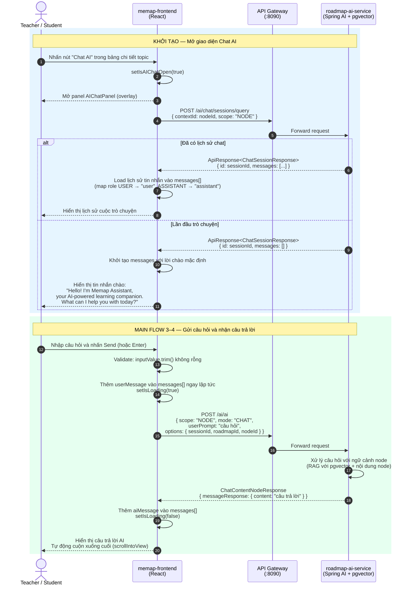

# UC15 — Chat AI

```mermaid
sequenceDiagram
    autonumber
    actor User as Teacher / Student
    participant FE as memap-frontend<br/>(React)
    participant GW as API Gateway<br/>(:8090)
    participant AI as roadmap-ai-service<br/>(Spring AI + pgvector)

    %% ==================== MỞ VÀ TẢI LỊCH SỬ CHAT ====================
    rect rgb(230, 245, 255)
        Note over User,AI: KHỞI TẠO — Mở giao diện Chat AI
        User->>FE: Nhấn nút "Chat AI" trong bảng chi tiết topic
        FE->>FE: setIsAIChatOpen(true)
        FE-->>User: Mở panel AIChatPanel (overlay)

        FE->>GW: POST /ai/chat/sessions/query<br/>{ contextId: nodeId, scope: "NODE" }
        GW->>AI: Forward request

        alt Đã có lịch sử chat
            AI-->>FE: ApiResponse<ChatSessionResponse><br/>{ id: sessionId, messages: [...] }
            FE->>FE: Load lịch sử tin nhắn vào messages[]<br/>(map role USER → "user", ASSISTANT → "assistant")
            FE-->>User: Hiển thị lịch sử cuộc trò chuyện
        else Lần đầu trò chuyện
            AI-->>FE: ApiResponse<ChatSessionResponse><br/>{ id: sessionId, messages: [] }
            FE->>FE: Khởi tạo messages với lời chào mặc định
            FE-->>User: Hiển thị tin nhắn chào:<br/>"Hello! I'm Memap Assistant,<br/>your AI-powered learning companion.<br/>What can I help you with today?"
        end
    end

    %% ==================== MAIN FLOW — GỬI CÂU HỎI ====================
    rect rgb(230, 255, 240)
        Note over User,AI: MAIN FLOW 3–4 — Gửi câu hỏi và nhận câu trả lời
        User->>FE: Nhập câu hỏi và nhấn Send (hoặc Enter)
        FE->>FE: Validate: inputValue.trim() không rỗng
        FE->>FE: Thêm userMessage vào messages[] ngay lập tức<br/>setIsLoading(true)

        FE->>GW: POST /ai/ai<br/>{ scope: "NODE", mode: "CHAT",<br/>  userPrompt: "câu hỏi",<br/>  options: { sessionId, roadmapId, nodeId } }
        GW->>AI: Forward request

        AI->>AI: Xử lý câu hỏi với ngữ cảnh node<br/>(RAG với pgvector + nội dung node)
        AI-->>FE: ChatContentNodeResponse<br/>{ messageResponse: { content: "câu trả lời" } }

        FE->>FE: Thêm aiMessage vào messages[]<br/>setIsLoading(false)
        FE-->>User: Hiển thị câu trả lời AI<br/>Tự động cuộn xuống cuối (scrollIntoView)
    end
```
