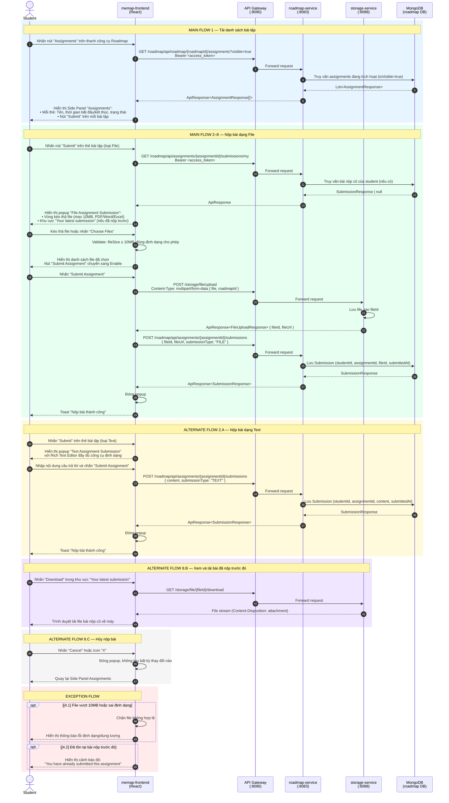

# UC16 — Nộp bài tập (Submit Assignment)

```mermaid
sequenceDiagram
    autonumber
    actor Student as Student
    participant FE as memap-frontend<br/>(React)
    participant GW as API Gateway<br/>(:8090)
    participant RS as roadmap-service<br/>(:8083)
    participant SS as storage-service<br/>(:8088)
    participant DB as MongoDB<br/>(roadmap DB)

    %% ==================== TẢI DANH SÁCH BÀI TẬP ====================
    rect rgb(230, 245, 255)
        Note over Student,DB: MAIN FLOW 1 — Tải danh sách bài tập
        Student->>FE: Nhấn nút "Assignments" trên thanh công cụ Roadmap
        FE->>GW: GET /roadmap/api/roadmap/{roadmapId}/assignments?visible=true<br/>Bearer <access_token>
        GW->>RS: Forward request
        RS->>DB: Truy vấn assignments đang kích hoạt (isVisible=true)
        DB-->>RS: List<AssignmentResponse>
        RS-->>FE: ApiResponse<AssignmentResponse[]>
        FE-->>Student: Hiển thị Side Panel "Assignments":<br/>• Mỗi thẻ: Tên, thời gian bắt đầu/kết thúc, trạng thái<br/>• Nút "Submit" trên mỗi bài tập
    end

    %% ==================== MAIN FLOW NỘP FILE ====================
    rect rgb(230, 255, 240)
        Note over Student,DB: MAIN FLOW 2–8 — Nộp bài dạng File
        Student->>FE: Nhấn nút "Submit" trên thẻ bài tập (loại File)
        FE->>GW: GET /roadmap/api/assignments/{assignmentId}/submissions/my<br/>Bearer <access_token>
        GW->>RS: Forward request
        RS->>DB: Truy vấn bài nộp cũ của student (nếu có)
        DB-->>RS: SubmissionResponse | null
        RS-->>FE: ApiResponse

        FE-->>Student: Hiển thị popup "File Assignment Submission":<br/>• Vùng kéo thả file (max 10MB, PDF/Word/Excel)<br/>• Khu vực "Your latest submission" (nếu đã nộp trước)

        Student->>FE: Kéo thả file hoặc nhấn "Choose Files"
        FE->>FE: Validate: fileSize ≤ 10MB, đúng định dạng cho phép
        FE-->>Student: Hiển thị danh sách file đã chọn<br/>Nút "Submit Assignment" chuyển sang Enable

        Student->>FE: Nhấn "Submit Assignment"
        FE->>GW: POST /storage/file/upload<br/>Content-Type: multipart/form-data { file, roadmapId }
        GW->>SS: Forward request
        SS->>SS: Lưu file, tạo fileId
        SS-->>FE: ApiResponse<FileUploadResponse> { fileId, fileUrl }

        FE->>GW: POST /roadmap/api/assignments/{assignmentId}/submissions<br/>{ fileId, fileUrl, submissionType: "FILE" }
        GW->>RS: Forward request
        RS->>DB: Lưu Submission (studentId, assignmentId, fileId, submittedAt)
        DB-->>RS: SubmissionResponse
        RS-->>FE: ApiResponse<SubmissionResponse>

        FE->>FE: Đóng popup
        FE-->>Student: Toast "Nộp bài thành công"
    end

    %% ==================== ALT 2.A NỘP VĂN BẢN ====================
    rect rgb(255, 250, 220)
        Note over Student,DB: ALTERNATE FLOW 2.A — Nộp bài dạng Text
        Student->>FE: Nhấn "Submit" trên thẻ bài tập (loại Text)
        FE-->>Student: Hiển thị popup "Text Assignment Submission"<br/>với Rich Text Editor đầy đủ công cụ định dạng

        Student->>FE: Nhập nội dung câu trả lời và nhấn "Submit Assignment"
        FE->>GW: POST /roadmap/api/assignments/{assignmentId}/submissions<br/>{ content, submissionType: "TEXT" }
        GW->>RS: Forward request
        RS->>DB: Lưu Submission (studentId, assignmentId, content, submittedAt)
        DB-->>RS: SubmissionResponse
        RS-->>FE: ApiResponse<SubmissionResponse>
        FE->>FE: Đóng popup
        FE-->>Student: Toast "Nộp bài thành công"
    end

    %% ==================== ALT 8.B XEM/TẢI BÀI CŨ ====================
    rect rgb(240, 230, 255)
        Note over Student,SS: ALTERNATE FLOW 8.B — Xem và tải bài đã nộp trước đó
        Student->>FE: Nhấn "Download" trong khu vực "Your latest submission"
        FE->>GW: GET /storage/file/{fileId}/download
        GW->>SS: Forward request
        SS-->>FE: File stream (Content-Disposition: attachment)
        FE-->>Student: Trình duyệt tải file bài nộp cũ về máy
    end

    %% ==================== ALT 8.C HỦY ====================
    rect rgb(245, 245, 245)
        Note over Student,FE: ALTERNATE FLOW 8.C — Hủy nộp bài
        Student->>FE: Nhấn "Cancel" hoặc icon "X"
        FE->>FE: Đóng popup, không lưu bất kỳ thay đổi nào
        FE-->>Student: Quay lại Side Panel Assignments
    end

    %% ==================== EXCEPTION FLOW ====================
    rect rgb(255, 235, 235)
        Note over Student,FE: EXCEPTION FLOW
        opt [4.1] File vượt 10MB hoặc sai định dạng
            FE->>FE: Chặn file không hợp lệ
            FE-->>Student: Hiển thị thông báo lỗi định dạng/dung lượng
        end

        opt [4.2] Đã tồn tại bài nộp trước đó
            FE-->>Student: Hiển thị cảnh báo đỏ:<br/>"You have already submitted this assignment"
        end
    end
```
