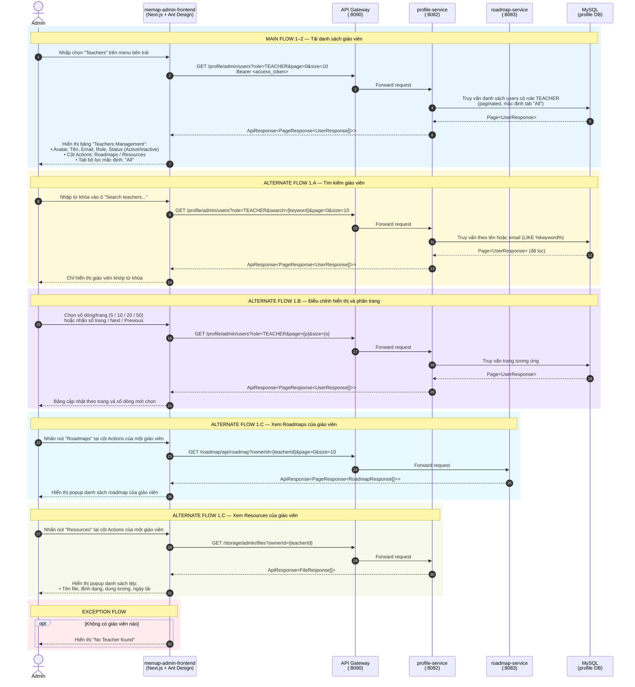

# UC17 — Quản lý giáo viên (Manage Teachers)

```mermaid
sequenceDiagram
    autonumber
    actor Admin as Admin
    participant FE as memap-admin-frontend<br/>(Next.js + Ant Design)
    participant GW as API Gateway<br/>(:8090)
    participant PS as profile-service<br/>(:8082)
    participant RS as roadmap-service<br/>(:8083)
    participant DB as MySQL<br/>(profile DB)

    %% ==================== TẢI DANH SÁCH GIÁO VIÊN ====================
    rect rgb(230, 245, 255)
        Note over Admin,DB: MAIN FLOW 1–2 — Tải danh sách giáo viên
        Admin->>FE: Nhấp chọn "Teachers" trên menu bên trái
        FE->>GW: GET /profile/admin/users?role=TEACHER&page=0&size=10<br/>Bearer <access_token>
        GW->>PS: Forward request
        PS->>DB: Truy vấn danh sách users có role TEACHER<br/>(paginated, mặc định tab "All")
        DB-->>PS: Page<UserResponse>
        PS-->>FE: ApiResponse<PageResponse<UserResponse[]>>
        FE-->>Admin: Hiển thị bảng "Teachers Management":<br/>• Avatar, Tên, Email, Role, Status (Active/Inactive)<br/>• Cột Actions: Roadmaps / Resources<br/>• Tab bộ lọc mặc định: "All"
    end

    %% ==================== ALT 1.A TÌM KIẾM ====================
    rect rgb(255, 250, 220)
        Note over Admin,DB: ALTERNATE FLOW 1.A — Tìm kiếm giáo viên
        Admin->>FE: Nhập từ khóa vào ô "Search teachers..."
        FE->>GW: GET /profile/admin/users?role=TEACHER&search={keyword}&page=0&size=10
        GW->>PS: Forward request
        PS->>DB: Truy vấn theo tên hoặc email (LIKE %keyword%)
        DB-->>PS: Page<UserResponse> (đã lọc)
        PS-->>FE: ApiResponse<PageResponse<UserResponse[]>>
        FE-->>Admin: Chỉ hiển thị giáo viên khớp từ khóa
    end

    %% ==================== ALT 1.B PHÂN TRANG ====================
    rect rgb(240, 230, 255)
        Note over Admin,DB: ALTERNATE FLOW 1.B — Điều chỉnh hiển thị và phân trang
        Admin->>FE: Chọn số dòng/trang (5 / 10 / 20 / 50)<br/>hoặc nhấn số trang / Next / Previous
        FE->>GW: GET /profile/admin/users?role=TEACHER&page={p}&size={s}
        GW->>PS: Forward request
        PS->>DB: Truy vấn trang tương ứng
        DB-->>PS: Page<UserResponse>
        PS-->>FE: ApiResponse<PageResponse<UserResponse[]>>
        FE-->>Admin: Bảng cập nhật theo trang và số dòng mới chọn
    end

    %% ==================== ALT 1.C XEM ROADMAP ====================
    rect rgb(230, 250, 255)
        Note over Admin,RS: ALTERNATE FLOW 1.C — Xem Roadmaps của giáo viên
        Admin->>FE: Nhấn nút "Roadmaps" tại cột Actions của một giáo viên
        FE->>GW: GET /roadmap/api/roadmap?ownerId={teacherId}&page=0&size=10
        GW->>RS: Forward request
        RS-->>FE: ApiResponse<PageResponse<RoadmapResponse[]>>
        FE-->>Admin: Hiển thị popup danh sách roadmap của giáo viên
    end

    %% ==================== ALT 1.C XEM RESOURCES ====================
    rect rgb(245, 250, 235)
        Note over Admin,PS: ALTERNATE FLOW 1.C — Xem Resources của giáo viên
        Admin->>FE: Nhấn nút "Resources" tại cột Actions của một giáo viên
        FE->>GW: GET /storage/admin/files?ownerId={teacherId}
        GW->>PS: Forward request
        PS-->>FE: ApiResponse<FileResponse[]>
        FE-->>Admin: Hiển thị popup danh sách tệp:<br/>• Tên file, định dạng, dung lượng, ngày tải
    end

    %% ==================== EXCEPTION FLOW ====================
    rect rgb(255, 235, 235)
        Note over Admin,FE: EXCEPTION FLOW
        opt Không có giáo viên nào
            FE-->>Admin: Hiển thị "No Teacher found"
        end
    end
```
