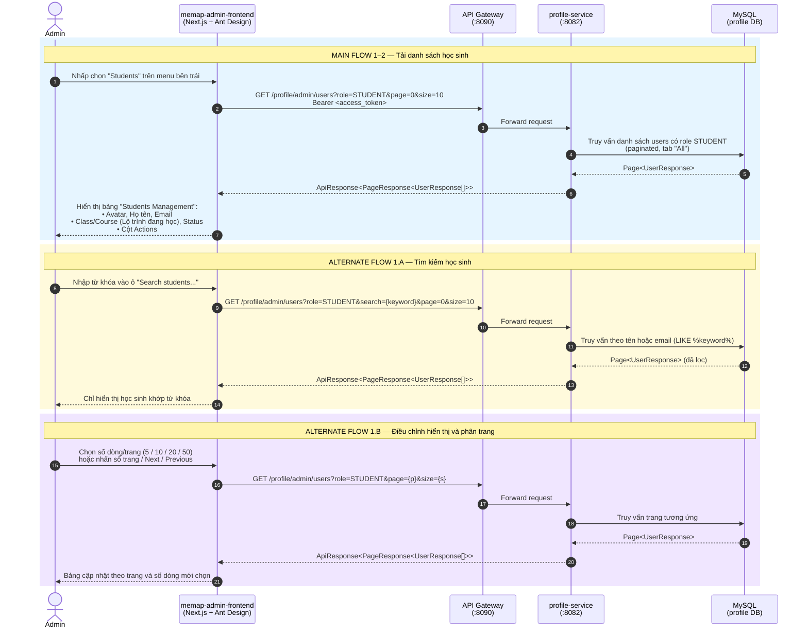

# UC18 — Quản lý học sinh (Manage Students)

```mermaid
sequenceDiagram
    autonumber
    actor Admin as Admin
    participant FE as memap-admin-frontend<br/>(Next.js + Ant Design)
    participant GW as API Gateway<br/>(:8090)
    participant PS as profile-service<br/>(:8082)
    participant DB as MySQL<br/>(profile DB)

    %% ==================== TẢI DANH SÁCH HỌC SINH ====================
    rect rgb(230, 245, 255)
        Note over Admin,DB: MAIN FLOW 1–2 — Tải danh sách học sinh
        Admin->>FE: Nhấp chọn "Students" trên menu bên trái
        FE->>GW: GET /profile/admin/users?role=STUDENT&page=0&size=10<br/>Bearer <access_token>
        GW->>PS: Forward request
        PS->>DB: Truy vấn danh sách users có role STUDENT<br/>(paginated, tab "All")
        DB-->>PS: Page<UserResponse>
        PS-->>FE: ApiResponse<PageResponse<UserResponse[]>>
        FE-->>Admin: Hiển thị bảng "Students Management":<br/>• Avatar, Họ tên, Email<br/>• Class/Course (Lộ trình đang học), Status<br/>• Cột Actions
    end

    %% ==================== ALT 1.A TÌM KIẾM ====================
    rect rgb(255, 250, 220)
        Note over Admin,DB: ALTERNATE FLOW 1.A — Tìm kiếm học sinh
        Admin->>FE: Nhập từ khóa vào ô "Search students..."
        FE->>GW: GET /profile/admin/users?role=STUDENT&search={keyword}&page=0&size=10
        GW->>PS: Forward request
        PS->>DB: Truy vấn theo tên hoặc email (LIKE %keyword%)
        DB-->>PS: Page<UserResponse> (đã lọc)
        PS-->>FE: ApiResponse<PageResponse<UserResponse[]>>
        FE-->>Admin: Chỉ hiển thị học sinh khớp từ khóa
    end

    %% ==================== ALT 1.B PHÂN TRANG ====================
    rect rgb(240, 230, 255)
        Note over Admin,DB: ALTERNATE FLOW 1.B — Điều chỉnh hiển thị và phân trang
        Admin->>FE: Chọn số dòng/trang (5 / 10 / 20 / 50)<br/>hoặc nhấn số trang / Next / Previous
        FE->>GW: GET /profile/admin/users?role=STUDENT&page={p}&size={s}
        GW->>PS: Forward request
        PS->>DB: Truy vấn trang tương ứng
        DB-->>PS: Page<UserResponse>
        PS-->>FE: ApiResponse<PageResponse<UserResponse[]>>
        FE-->>Admin: Bảng cập nhật theo trang và số dòng mới chọn
    end
```
