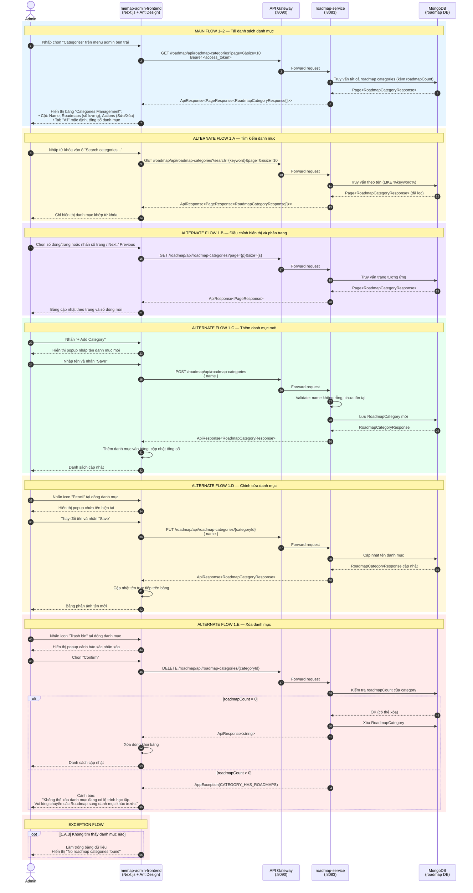

# UC19 — Quản lý danh mục Roadmap (Manage Roadmap Categories)

```mermaid
sequenceDiagram
    autonumber
    actor Admin as Admin
    participant FE as memap-admin-frontend<br/>(Next.js + Ant Design)
    participant GW as API Gateway<br/>(:8090)
    participant RS as roadmap-service<br/>(:8083)
    participant DB as MongoDB<br/>(roadmap DB)

    %% ==================== TẢI DANH SÁCH DANH MỤC ====================
    rect rgb(230, 245, 255)
        Note over Admin,DB: MAIN FLOW 1–2 — Tải danh sách danh mục
        Admin->>FE: Nhấp chọn "Categories" trên menu admin bên trái
        FE->>GW: GET /roadmap/api/roadmap-categories?page=0&size=10<br/>Bearer <access_token>
        GW->>RS: Forward request
        RS->>DB: Truy vấn tất cả roadmap categories (kèm roadmapCount)
        DB-->>RS: Page<RoadmapCategoryResponse>
        RS-->>FE: ApiResponse<PageResponse<RoadmapCategoryResponse[]>>
        FE-->>Admin: Hiển thị bảng "Categories Management":<br/>• Cột: Name, Roadmaps (số lượng), Actions (Sửa/Xóa)<br/>• Tab "All" mặc định, tổng số danh mục
    end

    %% ==================== ALT 1.A TÌM KIẾM ====================
    rect rgb(255, 250, 220)
        Note over Admin,DB: ALTERNATE FLOW 1.A — Tìm kiếm danh mục
        Admin->>FE: Nhập từ khóa vào ô "Search categories..."
        FE->>GW: GET /roadmap/api/roadmap-categories?search={keyword}&page=0&size=10
        GW->>RS: Forward request
        RS->>DB: Truy vấn theo tên (LIKE %keyword%)
        DB-->>RS: Page<RoadmapCategoryResponse> (đã lọc)
        RS-->>FE: ApiResponse<PageResponse<RoadmapCategoryResponse[]>>
        FE-->>Admin: Chỉ hiển thị danh mục khớp từ khóa
    end

    %% ==================== ALT 1.B PHÂN TRANG ====================
    rect rgb(240, 230, 255)
        Note over Admin,DB: ALTERNATE FLOW 1.B — Điều chỉnh hiển thị và phân trang
        Admin->>FE: Chọn số dòng/trang hoặc nhấn số trang / Next / Previous
        FE->>GW: GET /roadmap/api/roadmap-categories?page={p}&size={s}
        GW->>RS: Forward request
        RS->>DB: Truy vấn trang tương ứng
        DB-->>RS: Page<RoadmapCategoryResponse>
        RS-->>FE: ApiResponse<PageResponse>
        FE-->>Admin: Bảng cập nhật theo trang và số dòng mới
    end

    %% ==================== ALT 1.C THÊM DANH MỤC ====================
    rect rgb(230, 255, 240)
        Note over Admin,DB: ALTERNATE FLOW 1.C — Thêm danh mục mới
        Admin->>FE: Nhấn "+ Add Category"
        FE-->>Admin: Hiển thị popup nhập tên danh mục mới

        Admin->>FE: Nhập tên và nhấn "Save"
        FE->>GW: POST /roadmap/api/roadmap-categories<br/>{ name }
        GW->>RS: Forward request
        RS->>RS: Validate: name không rỗng, chưa tồn tại
        RS->>DB: Lưu RoadmapCategory mới
        DB-->>RS: RoadmapCategoryResponse
        RS-->>FE: ApiResponse<RoadmapCategoryResponse>
        FE->>FE: Thêm danh mục vào bảng, cập nhật tổng số
        FE-->>Admin: Danh sách cập nhật
    end

    %% ==================== ALT 1.D CHỈNH SỬA ====================
    rect rgb(255, 248, 220)
        Note over Admin,DB: ALTERNATE FLOW 1.D — Chỉnh sửa danh mục
        Admin->>FE: Nhấn icon "Pencil" tại dòng danh mục
        FE-->>Admin: Hiển thị popup chứa tên hiện tại

        Admin->>FE: Thay đổi tên và nhấn "Save"
        FE->>GW: PUT /roadmap/api/roadmap-categories/{categoryId}<br/>{ name }
        GW->>RS: Forward request
        RS->>DB: Cập nhật tên danh mục
        DB-->>RS: RoadmapCategoryResponse cập nhật
        RS-->>FE: ApiResponse<RoadmapCategoryResponse>
        FE->>FE: Cập nhật tên trực tiếp trên bảng
        FE-->>Admin: Bảng phản ánh tên mới
    end

    %% ==================== ALT 1.E XÓA ====================
    rect rgb(255, 235, 235)
        Note over Admin,DB: ALTERNATE FLOW 1.E — Xóa danh mục
        Admin->>FE: Nhấn icon "Trash bin" tại dòng danh mục
        FE-->>Admin: Hiển thị popup cảnh báo xác nhận xóa

        Admin->>FE: Chọn "Confirm"
        FE->>GW: DELETE /roadmap/api/roadmap-categories/{categoryId}
        GW->>RS: Forward request
        RS->>DB: Kiểm tra roadmapCount của category
        alt roadmapCount = 0
            DB-->>RS: OK (có thể xóa)
            RS->>DB: Xóa RoadmapCategory
            RS-->>FE: ApiResponse<string>
            FE->>FE: Xóa dòng khỏi bảng
            FE-->>Admin: Danh sách cập nhật
        else roadmapCount > 0
            RS-->>FE: AppException(CATEGORY_HAS_ROADMAPS)
            FE-->>Admin: Cảnh báo:<br/>"Không thể xóa danh mục đang có lộ trình học tập.<br/>Vui lòng chuyển các Roadmap sang danh mục khác trước."
        end
    end

    %% ==================== EXCEPTION FLOW ====================
    rect rgb(255, 235, 235)
        Note over Admin,FE: EXCEPTION FLOW
        opt [1.A.3] Không tìm thấy danh mục nào
            FE-->>Admin: Làm trống bảng dữ liệu<br/>Hiển thị "No roadmap categories found"
        end
    end
```
