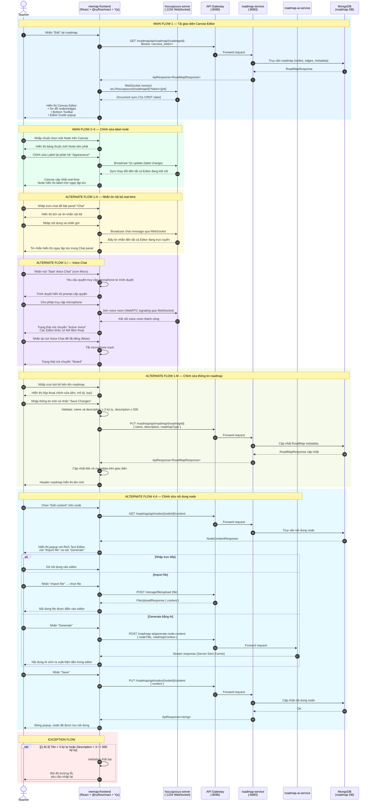

# UC20 — Chỉnh sửa Roadmap (Edit Roadmap)

```mermaid
sequenceDiagram
    autonumber
    actor Teacher as Teacher
    participant FE as memap-frontend<br/>(React + @xyflow/react + Yjs)
    participant HC as hocuspocus-server<br/>(:1234 WebSocket)
    participant GW as API Gateway<br/>(:8090)
    participant RS as roadmap-service<br/>(:8083)
    participant AI as roadmap-ai-service
    participant DB as MongoDB<br/>(roadmap DB)

    %% ==================== TẢI CANVAS EDITOR ====================
    rect rgb(230, 245, 255)
        Note over Teacher,DB: MAIN FLOW 1 — Tải giao diện Canvas Editor
        Teacher->>FE: Nhấn "Edit" tại roadmap
        FE->>GW: GET /roadmap/api/roadmap/{roadmapId}<br/>Bearer <access_token>
        GW->>RS: Forward request
        RS->>DB: Truy vấn roadmap (nodes, edges, metadata)
        DB-->>RS: RoadMapResponse
        RS-->>FE: ApiResponse<RoadMapResponse>

        FE->>HC: WebSocket connect<br/>ws://hocuspocus/{roadmapId}?token={jwt}
        HC-->>FE: Document sync (Yjs CRDT state)

        FE-->>Teacher: Hiển thị Canvas Editor:<br/>• Sơ đồ nodes/edges<br/>• Bottom Toolbar<br/>• Editor Guide popup
    end

    %% ==================== MAIN FLOW CHỈNH SỬA NODE ====================
    rect rgb(230, 255, 240)
        Note over Teacher,HC: MAIN FLOW 2–5 — Chỉnh sửa label node
        Teacher->>FE: Nhấp chuột chọn một Node trên Canvas
        FE-->>Teacher: Hiển thị bảng thuộc tính Node bên phải

        Teacher->>FE: Chỉnh sửa Label tại phân hệ "Appearance"
        FE->>HC: Broadcast Yjs update (label change)
        HC-->>FE: Sync thay đổi đến tất cả Editor đang kết nối
        FE-->>Teacher: Canvas cập nhật real-time<br/>Node hiển thị label mới ngay lập tức
    end

    %% ==================== ALT 1.H CHAT NỘI BỘ ====================
    rect rgb(255, 250, 220)
        Note over Teacher,HC: ALTERNATE FLOW 1.H — Nhắn tin nội bộ real-time
        Teacher->>FE: Nhấp icon chat để bật panel "Chat"
        FE-->>Teacher: Hiển thị lịch sử tin nhắn nội bộ

        Teacher->>FE: Nhập nội dung và nhấn gửi
        FE->>HC: Broadcast chat message qua WebSocket
        HC-->>FE: Đẩy tin nhắn đến tất cả Editor đang trực tuyến
        FE-->>Teacher: Tin nhắn hiển thị ngay lập tức trong Chat panel
    end

    %% ==================== ALT 1.I VOICE CHAT ====================
    rect rgb(240, 230, 255)
        Note over Teacher,FE: ALTERNATE FLOW 1.I — Voice Chat
        Teacher->>FE: Nhấn nút "Start Voice Chat" (icon Micro)
        FE->>FE: Yêu cầu quyền truy cập microphone từ trình duyệt
        FE-->>Teacher: Trình duyệt hiển thị prompt cấp quyền

        Teacher->>FE: Cho phép truy cập microphone
        FE->>HC: Join voice room (WebRTC signaling qua WebSocket)
        HC-->>FE: Kết nối voice room thành công
        FE-->>Teacher: Trạng thái nút chuyển "Active Voice"<br/>Các Editor khác có thể đàm thoại

        Teacher->>FE: Nhấn lại nút Voice Chat để tắt tiếng (Mute)
        FE->>FE: Tắt microphone track
        FE-->>Teacher: Trạng thái nút chuyển "Muted"
    end

    %% ==================== ALT 1.M SỬA THÔNG TIN ROADMAP ====================
    rect rgb(245, 250, 235)
        Note over Teacher,DB: ALTERNATE FLOW 1.M — Chỉnh sửa thông tin roadmap
        Teacher->>FE: Nhấp icon bút kế bên tên roadmap
        FE-->>Teacher: Hiển thị hộp thoại chỉnh sửa (tên, mô tả, loại)

        Teacher->>FE: Nhập thông tin mới và nhấn "Save Changes"
        FE->>FE: Validate: name và description ≥ 3 ký tự, description ≤ 500

        FE->>GW: PUT /roadmap/api/roadmap/{roadmapId}<br/>{ name, description, roadmapType }
        GW->>RS: Forward request
        RS->>DB: Cập nhật RoadMap metadata
        DB-->>RS: RoadMapResponse cập nhật
        RS-->>FE: ApiResponse<RoadMapResponse>
        FE->>FE: Cập nhật title và metadata trên giao diện
        FE-->>Teacher: Header roadmap hiển thị tên mới
    end

    %% ==================== ALT 4.A CHỈNH SỬA NỘI DUNG NODE ====================
    rect rgb(230, 250, 255)
        Note over Teacher,AI: ALTERNATE FLOW 4.A — Chỉnh sửa nội dung node
        Teacher->>FE: Chọn "Edit content" trên node
        FE->>GW: GET /roadmap/api/nodes/{nodeId}/content
        GW->>RS: Forward request
        RS->>DB: Truy vấn nội dung node
        DB-->>FE: NodeContentResponse
        FE-->>Teacher: Hiển thị popup với Rich Text Editor,<br/>nút "Import file" và nút "Generate"

        alt Nhập trực tiếp
            Teacher->>FE: Gõ nội dung vào editor
        else Import file
            Teacher->>FE: Nhấn "Import file" → chọn file
            FE->>GW: POST /storage/file/upload (file)
            GW-->>FE: FileUploadResponse { content }
            FE-->>Teacher: Nội dung file được điền vào editor
        else Generate bằng AI
            Teacher->>FE: Nhấn "Generate"
            FE->>GW: POST /roadmap-ai/generate-node-content<br/>{ nodeTitle, roadmapContext }
            GW->>AI: Forward request
            AI-->>FE: Stream response (Server-Sent Events)
            FE-->>Teacher: Nội dung AI sinh ra xuất hiện dần trong editor
        end

        Teacher->>FE: Nhấn "Save"
        FE->>GW: PUT /roadmap/api/nodes/{nodeId}/content<br/>{ content }
        GW->>RS: Forward request
        RS->>DB: Cập nhật nội dung node
        DB-->>RS: OK
        RS-->>FE: ApiResponse<string>
        FE-->>Teacher: Đóng popup, node đã được lưu nội dung
    end

    %% ==================== EXCEPTION FLOW ====================
    rect rgb(255, 235, 235)
        Note over Teacher,FE: EXCEPTION FLOW
        opt [1.M.3] Tên < 3 ký tự hoặc Description < 3 / > 500 ký tự
            FE->>FE: Validation thất bại
            FE-->>Teacher: Bôi đỏ trường lỗi,<br/>yêu cầu nhập lại
        end
    end
```
