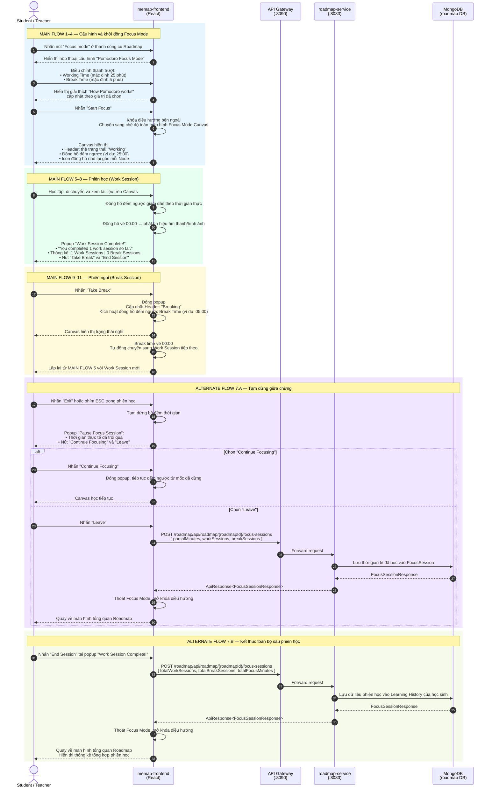

# UC21 — Học theo Pomodoro Focus Mode (Study With Pomodoro Focus Mode)

```mermaid
sequenceDiagram
    autonumber
    actor User as Student / Teacher
    participant FE as memap-frontend<br/>(React)
    participant GW as API Gateway<br/>(:8090)
    participant RS as roadmap-service<br/>(:8083)
    participant DB as MongoDB<br/>(roadmap DB)

    %% ==================== CẤU HÌNH POMODORO ====================
    rect rgb(230, 245, 255)
        Note over User,FE: MAIN FLOW 1–4 — Cấu hình và khởi động Focus Mode
        User->>FE: Nhấn nút "Focus mode" ở thanh công cụ Roadmap
        FE-->>User: Hiển thị hộp thoại cấu hình "Pomodoro Focus Mode"

        User->>FE: Điều chỉnh thanh trượt:<br/>• Working Time (mặc định 25 phút)<br/>• Break Time (mặc định 5 phút)
        FE-->>User: Hiển thị giải thích "How Pomodoro works"<br/>cập nhật theo giá trị đã chọn

        User->>FE: Nhấn "Start Focus"
        FE->>FE: Khóa điều hướng bên ngoài<br/>Chuyển sang chế độ toàn màn hình Focus Mode Canvas
        FE-->>User: Canvas hiển thị:<br/>• Header: thẻ trạng thái "Working"<br/>• Đồng hồ đếm ngược (ví dụ: 25:00)<br/>• Icon đồng hồ nhỏ tại góc mỗi Node
    end

    %% ==================== PHIÊN HỌC ====================
    rect rgb(230, 255, 240)
        Note over User,FE: MAIN FLOW 5–8 — Phiên học (Work Session)
        User->>FE: Học tập, di chuyển và xem tài liệu trên Canvas

        FE->>FE: Đồng hồ đếm ngược giảm dần theo thời gian thực
        FE->>FE: Đồng hồ về 00:00 → phát tín hiệu âm thanh/hình ảnh
        FE-->>User: Popup "Work Session Complete!":<br/>• "You completed 1 work session so far."<br/>• Thống kê: 1 Work Sessions | 0 Break Sessions<br/>• Nút "Take Break" và "End Session"
    end

    %% ==================== NGHỈ GIẢI LAO ====================
    rect rgb(255, 250, 220)
        Note over User,FE: MAIN FLOW 9–11 — Phiên nghỉ (Break Session)
        User->>FE: Nhấn "Take Break"
        FE->>FE: Đóng popup<br/>Cập nhật Header: "Breaking"<br/>Kích hoạt đồng hồ đếm ngược Break Time (ví dụ: 05:00)
        FE-->>User: Canvas hiển thị trạng thái nghỉ

        FE->>FE: Break time về 00:00<br/>Tự động chuyển sang Work Session tiếp theo
        FE-->>User: Lặp lại từ MAIN FLOW 5 với Work Session mới
    end

    %% ==================== ALT 7.A TẠM DỪNG / THOÁT ====================
    rect rgb(240, 230, 255)
        Note over User,DB: ALTERNATE FLOW 7.A — Tạm dừng giữa chừng
        User->>FE: Nhấn "Exit" hoặc phím ESC trong phiên học
        FE->>FE: Tạm dừng bộ đếm thời gian
        FE-->>User: Popup "Pause Focus Session":<br/>• Thời gian thực tế đã trôi qua<br/>• Nút "Continue Focusing" và "Leave"

        alt Chọn "Continue Focusing"
            User->>FE: Nhấn "Continue Focusing"
            FE->>FE: Đóng popup, tiếp tục đếm ngược từ mốc đã dừng
            FE-->>User: Canvas học tiếp tục
        else Chọn "Leave"
            User->>FE: Nhấn "Leave"
            FE->>GW: POST /roadmap/api/roadmap/{roadmapId}/focus-sessions<br/>{ partialMinutes, workSessions, breakSessions }
            GW->>RS: Forward request
            RS->>DB: Lưu thời gian lẻ đã học vào FocusSession
            DB-->>RS: FocusSessionResponse
            RS-->>FE: ApiResponse<FocusSessionResponse>
            FE->>FE: Thoát Focus Mode, mở khóa điều hướng
            FE-->>User: Quay về màn hình tổng quan Roadmap
        end
    end

    %% ==================== ALT 7.B KẾT THÚC TOÀN BỘ ====================
    rect rgb(245, 250, 235)
        Note over User,DB: ALTERNATE FLOW 7.B — Kết thúc toàn bộ sau phiên học
        User->>FE: Nhấn "End Session" tại popup "Work Session Complete!"
        FE->>GW: POST /roadmap/api/roadmap/{roadmapId}/focus-sessions<br/>{ totalWorkSessions, totalBreakSessions, totalFocusMinutes }
        GW->>RS: Forward request
        RS->>DB: Lưu dữ liệu phiên học vào Learning History của học sinh
        DB-->>RS: FocusSessionResponse
        RS-->>FE: ApiResponse<FocusSessionResponse>
        FE->>FE: Thoát Focus Mode, mở khóa điều hướng
        FE-->>User: Quay về màn hình tổng quan Roadmap<br/>Hiển thị thống kê tổng hợp phiên học
    end
```
