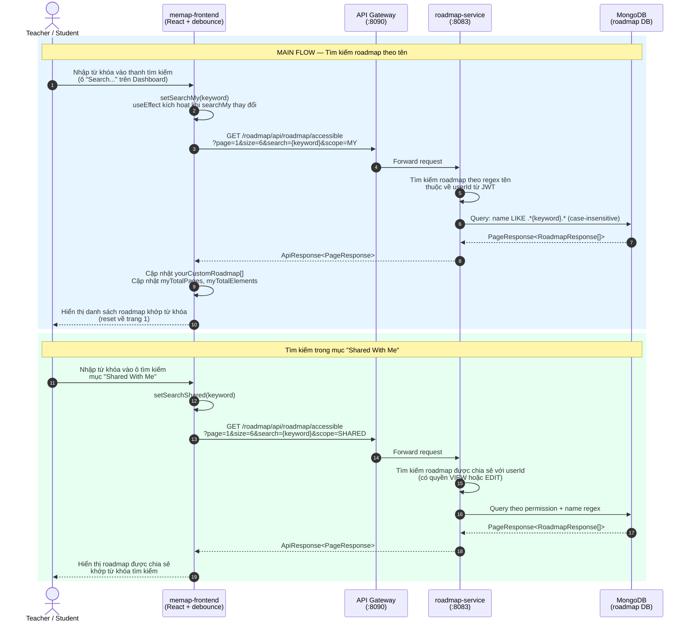

# UC22 — Tìm kiếm Roadmap (Search Roadmap)

```mermaid
sequenceDiagram
    autonumber
    actor User as Teacher / Student
    participant FE as memap-frontend<br/>(React + debounce)
    participant GW as API Gateway<br/>(:8090)
    participant RS as roadmap-service<br/>(:8083)
    participant DB as MongoDB<br/>(roadmap DB)

    %% ==================== MAIN FLOW ====================
    rect rgb(230, 245, 255)
        Note over User,DB: MAIN FLOW — Tìm kiếm roadmap theo tên
        User->>FE: Nhập từ khóa vào thanh tìm kiếm<br/>(ô "Search..." trên Dashboard)
        FE->>FE: setSearchMy(keyword)<br/>useEffect kích hoạt khi searchMy thay đổi

        FE->>GW: GET /roadmap/api/roadmap/accessible<br/>?page=1&size=6&search={keyword}&scope=MY
        GW->>RS: Forward request
        RS->>RS: Tìm kiếm roadmap theo regex tên<br/>thuộc về userId từ JWT
        RS->>DB: Query: name LIKE .*{keyword}.* (case-insensitive)
        DB-->>RS: PageResponse<RoadmapResponse[]>
        RS-->>FE: ApiResponse<PageResponse>

        FE->>FE: Cập nhật yourCustomRoadmap[]<br/>Cập nhật myTotalPages, myTotalElements
        FE-->>User: Hiển thị danh sách roadmap khớp từ khóa<br/>(reset về trang 1)
    end

    %% ==================== TÌM KIẾM ROADMAP ĐƯỢC CHIA SẺ ====================
    rect rgb(230, 255, 240)
        Note over User,DB: Tìm kiếm trong mục "Shared With Me"
        User->>FE: Nhập từ khóa vào ô tìm kiếm<br/>mục "Shared With Me"
        FE->>FE: setSearchShared(keyword)

        FE->>GW: GET /roadmap/api/roadmap/accessible<br/>?page=1&size=6&search={keyword}&scope=SHARED
        GW->>RS: Forward request
        RS->>RS: Tìm kiếm roadmap được chia sẻ với userId<br/>(có quyền VIEW hoặc EDIT)
        RS->>DB: Query theo permission + name regex
        DB-->>RS: PageResponse<RoadmapResponse[]>
        RS-->>FE: ApiResponse<PageResponse>

        FE-->>User: Hiển thị roadmap được chia sẻ<br/>khớp từ khóa tìm kiếm
    end
```
