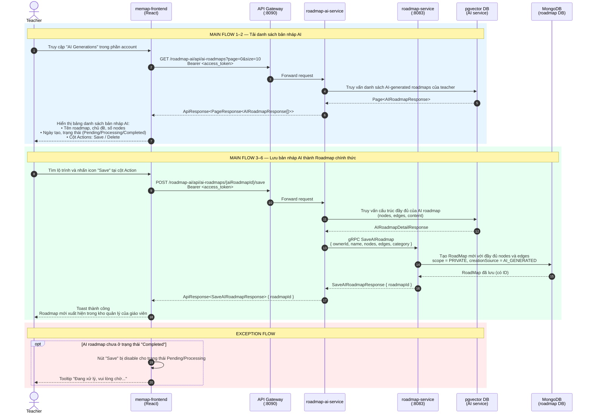

# UC23 — Quản lý Roadmap được tạo bởi AI (Manage AI-Generated Roadmaps)

```mermaid
sequenceDiagram
    autonumber
    actor Teacher as Teacher
    participant FE as memap-frontend<br/>(React)
    participant GW as API Gateway<br/>(:8090)
    participant AI as roadmap-ai-service
    participant RS as roadmap-service<br/>(:8083)
    participant DB_AI as pgvector DB<br/>(AI service)
    participant DB_RS as MongoDB<br/>(roadmap DB)

    %% ==================== TẢI DANH SÁCH AI GENERATIONS ====================
    rect rgb(230, 245, 255)
        Note over Teacher,DB_AI: MAIN FLOW 1–2 — Tải danh sách bản nháp AI
        Teacher->>FE: Truy cập "AI Generations" trong phần account
        FE->>GW: GET /roadmap-ai/api/ai-roadmaps?page=0&size=10<br/>Bearer <access_token>
        GW->>AI: Forward request
        AI->>DB_AI: Truy vấn danh sách AI-generated roadmaps của teacher
        DB_AI-->>AI: Page<AIRoadmapResponse>
        AI-->>FE: ApiResponse<PageResponse<AIRoadmapResponse[]>>
        FE-->>Teacher: Hiển thị bảng danh sách bản nháp AI:<br/>• Tên roadmap, chủ đề, số nodes<br/>• Ngày tạo, trạng thái (Pending/Processing/Completed)<br/>• Cột Actions: Save / Delete
    end

    %% ==================== MAIN FLOW LƯU ROADMAP ====================
    rect rgb(230, 255, 240)
        Note over Teacher,DB_RS: MAIN FLOW 3–6 — Lưu bản nháp AI thành Roadmap chính thức
        Teacher->>FE: Tìm lộ trình và nhấn icon "Save" tại cột Action
        FE->>GW: POST /roadmap-ai/api/ai-roadmaps/{aiRoadmapId}/save<br/>Bearer <access_token>
        GW->>AI: Forward request

        AI->>DB_AI: Truy vấn cấu trúc đầy đủ của AI roadmap<br/>(nodes, edges, content)
        DB_AI-->>AI: AIRoadmapDetailResponse

        AI->>RS: gRPC SaveAIRoadmap<br/>{ ownerId, name, nodes, edges, category }
        RS->>DB_RS: Tạo RoadMap mới với đầy đủ nodes và edges<br/>scope = PRIVATE, creationSource = AI_GENERATED
        DB_RS-->>RS: RoadMap đã lưu (có ID)
        RS-->>AI: SaveAIRoadmapResponse { roadmapId }

        AI-->>FE: ApiResponse<SaveAIRoadmapResponse> { roadmapId }
        FE-->>Teacher: Toast thành công<br/>Roadmap mới xuất hiện trong kho quản lý của giáo viên
    end

    %% ==================== EXCEPTION FLOW ====================
    rect rgb(255, 235, 235)
        Note over Teacher,DB_AI: EXCEPTION FLOW
        opt AI roadmap chưa ở trạng thái "Completed"
            FE->>FE: Nút "Save" bị disable cho trạng thái Pending/Processing
            FE-->>Teacher: Tooltip "Đang xử lý, vui lòng chờ..."
        end
    end
```
