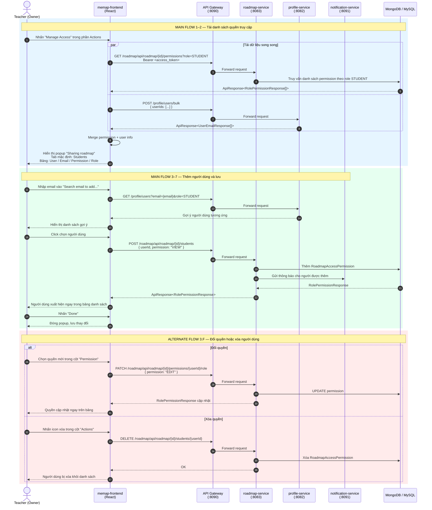

# UC24 — Quản lý quyền truy cập Roadmap (Manage Access Of Roadmap)

> **Lưu ý:** Nội dung chi tiết của use case này đã được tài liệu hoá đầy đủ trong file
> [`UC26-ManageAccessOfRoadmap.md`](UC26-ManageAccessOfRoadmap.md).
> File đó chứa toàn bộ sequence diagram bao gồm: thêm người dùng, đổi/xóa quyền,
> import hàng loạt, export danh sách, copy link và lọc danh sách.

