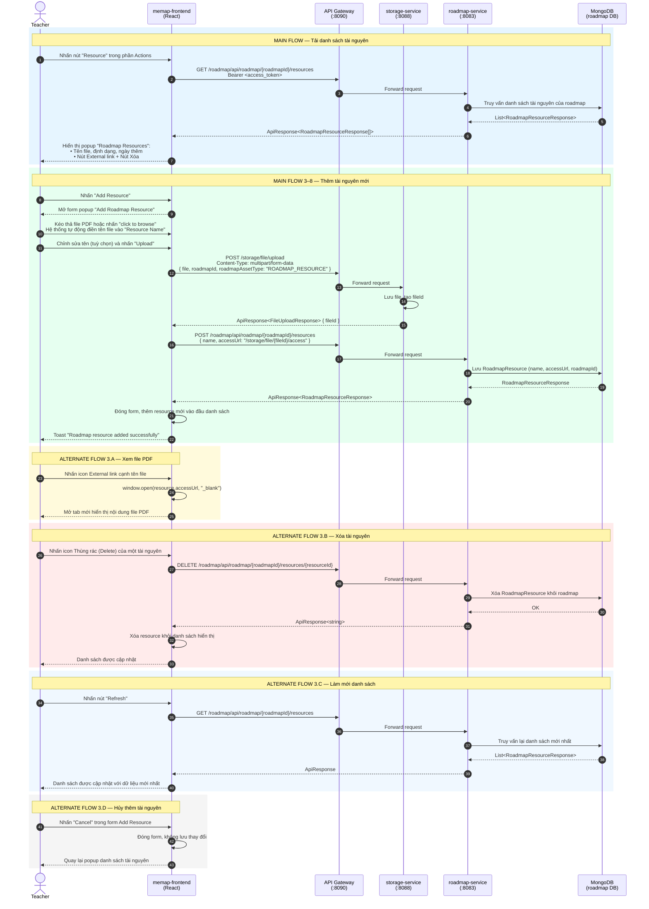

# UC25 — Quản lý tài nguyên Roadmap (Manage Resource Of Roadmap)

```mermaid
sequenceDiagram
    autonumber
    actor Teacher as Teacher
    participant FE as memap-frontend<br/>(React)
    participant GW as API Gateway<br/>(:8090)
    participant SS as storage-service<br/>(:8088)
    participant RS as roadmap-service<br/>(:8083)
    participant DB as MongoDB<br/>(roadmap DB)

    %% ==================== MỞ POPUP ====================
    rect rgb(230, 245, 255)
        Note over Teacher,DB: MAIN FLOW — Tải danh sách tài nguyên
        Teacher->>FE: Nhấn nút "Resource" trong phần Actions
        FE->>GW: GET /roadmap/api/roadmap/{roadmapId}/resources<br/>Bearer <access_token>
        GW->>RS: Forward request
        RS->>DB: Truy vấn danh sách tài nguyên của roadmap
        DB-->>RS: List<RoadmapResourceResponse>
        RS-->>FE: ApiResponse<RoadmapResourceResponse[]>
        FE-->>Teacher: Hiển thị popup "Roadmap Resources":<br/>• Tên file, định dạng, ngày thêm<br/>• Nút External link + Nút Xóa
    end

    %% ==================== UPLOAD TÀI NGUYÊN ====================
    rect rgb(230, 255, 240)
        Note over Teacher,DB: MAIN FLOW 3–8 — Thêm tài nguyên mới
        Teacher->>FE: Nhấn "Add Resource"
        FE-->>Teacher: Mở form popup "Add Roadmap Resource"

        Teacher->>FE: Kéo thả file PDF hoặc nhấn "click to browse"<br/>Hệ thống tự động điền tên file vào "Resource Name"
        Teacher->>FE: Chỉnh sửa tên (tuỳ chọn) và nhấn "Upload"

        FE->>GW: POST /storage/file/upload<br/>Content-Type: multipart/form-data<br/>{ file, roadmapId, roadmapAssetType: "ROADMAP_RESOURCE" }
        GW->>SS: Forward request
        SS->>SS: Lưu file, tạo fileId
        SS-->>FE: ApiResponse<FileUploadResponse> { fileId }

        FE->>GW: POST /roadmap/api/roadmap/{roadmapId}/resources<br/>{ name, accessUrl: "/storage/file/{fileId}/access" }
        GW->>RS: Forward request
        RS->>DB: Lưu RoadmapResource (name, accessUrl, roadmapId)
        DB-->>RS: RoadmapResourceResponse
        RS-->>FE: ApiResponse<RoadmapResourceResponse>

        FE->>FE: Đóng form, thêm resource mới vào đầu danh sách
        FE-->>Teacher: Toast "Roadmap resource added successfully"
    end

    %% ==================== ALT 3.A XEM TÀI NGUYÊN ====================
    rect rgb(255, 250, 220)
        Note over Teacher,FE: ALTERNATE FLOW 3.A — Xem file PDF
        Teacher->>FE: Nhấn icon External link cạnh tên file
        FE->>FE: window.open(resource.accessUrl, "_blank")
        FE-->>Teacher: Mở tab mới hiển thị nội dung file PDF
    end

    %% ==================== ALT 3.B XÓA TÀI NGUYÊN ====================
    rect rgb(255, 235, 235)
        Note over Teacher,DB: ALTERNATE FLOW 3.B — Xóa tài nguyên
        Teacher->>FE: Nhấn icon Thùng rác (Delete) của một tài nguyên
        FE->>GW: DELETE /roadmap/api/roadmap/{roadmapId}/resources/{resourceId}
        GW->>RS: Forward request
        RS->>DB: Xóa RoadmapResource khỏi roadmap
        DB-->>RS: OK
        RS-->>FE: ApiResponse<string>
        FE->>FE: Xóa resource khỏi danh sách hiển thị
        FE-->>Teacher: Danh sách được cập nhật
    end

    %% ==================== ALT 3.C LÀM MỚI ====================
    rect rgb(240, 248, 255)
        Note over Teacher,DB: ALTERNATE FLOW 3.C — Làm mới danh sách
        Teacher->>FE: Nhấn nút "Refresh"
        FE->>GW: GET /roadmap/api/roadmap/{roadmapId}/resources
        GW->>RS: Forward request
        RS->>DB: Truy vấn lại danh sách mới nhất
        DB-->>RS: List<RoadmapResourceResponse>
        RS-->>FE: ApiResponse
        FE-->>Teacher: Danh sách được cập nhật với dữ liệu mới nhất
    end

    %% ==================== ALT 3.D HỦY ====================
    rect rgb(245, 245, 245)
        Note over Teacher,FE: ALTERNATE FLOW 3.D — Hủy thêm tài nguyên
        Teacher->>FE: Nhấn "Cancel" trong form Add Resource
        FE->>FE: Đóng form, không lưu thay đổi
        FE-->>Teacher: Quay lại popup danh sách tài nguyên
    end
```
