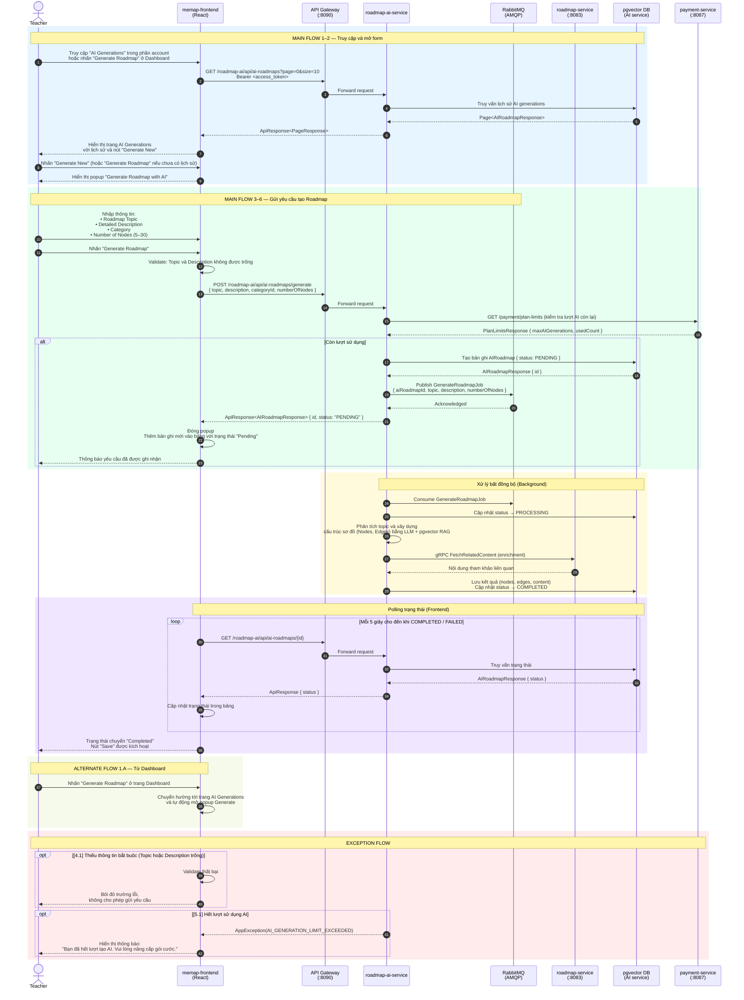

# UC26 — Tạo Roadmap bằng AI (Generate Roadmap With AI)

```mermaid
sequenceDiagram
    autonumber
    actor Teacher as Teacher
    participant FE as memap-frontend<br/>(React)
    participant GW as API Gateway<br/>(:8090)
    participant AI as roadmap-ai-service
    participant MQ as RabbitMQ<br/>(AMQP)
    participant RS as roadmap-service<br/>(:8083)
    participant DB_AI as pgvector DB<br/>(AI service)
    participant PAY as payment-service<br/>(:8087)

    %% ==================== TẢI TRANG AI GENERATIONS ====================
    rect rgb(230, 245, 255)
        Note over Teacher,DB_AI: MAIN FLOW 1–2 — Truy cập và mở form
        Teacher->>FE: Truy cập "AI Generations" trong phần account<br/>hoặc nhấn "Generate Roadmap" ở Dashboard
        FE->>GW: GET /roadmap-ai/api/ai-roadmaps?page=0&size=10<br/>Bearer <access_token>
        GW->>AI: Forward request
        AI->>DB_AI: Truy vấn lịch sử AI generations
        DB_AI-->>AI: Page<AIRoadmapResponse>
        AI-->>FE: ApiResponse<PageResponse>
        FE-->>Teacher: Hiển thị trang AI Generations<br/>với lịch sử và nút "Generate New"

        Teacher->>FE: Nhấn "Generate New" (hoặc "Generate Roadmap" nếu chưa có lịch sử)
        FE-->>Teacher: Hiển thị popup "Generate Roadmap with AI"
    end

    %% ==================== MAIN FLOW GỬI YÊU CẦU ====================
    rect rgb(230, 255, 240)
        Note over Teacher,MQ: MAIN FLOW 3–6 — Gửi yêu cầu tạo Roadmap
        Teacher->>FE: Nhập thông tin:<br/>• Roadmap Topic<br/>• Detailed Description<br/>• Category<br/>• Number of Nodes (5–30)

        Teacher->>FE: Nhấn "Generate Roadmap"
        FE->>FE: Validate: Topic và Description không được trống

        FE->>GW: POST /roadmap-ai/api/ai-roadmaps/generate<br/>{ topic, description, categoryId, numberOfNodes }
        GW->>AI: Forward request

        AI->>PAY: GET /payment/plan-limits (kiểm tra lượt AI còn lại)
        PAY-->>AI: PlanLimitsResponse { maxAIGenerations, usedCount }

        alt Còn lượt sử dụng
            AI->>DB_AI: Tạo bản ghi AIRoadmap { status: PENDING }
            DB_AI-->>AI: AIRoadmapResponse { id }

            AI->>MQ: Publish GenerateRoadmapJob<br/>{ aiRoadmapId, topic, description, numberOfNodes }
            MQ-->>AI: Acknowledged

            AI-->>FE: ApiResponse<AIRoadmapResponse> { id, status: "PENDING" }
            FE->>FE: Đóng popup<br/>Thêm bản ghi mới vào bảng với trạng thái "Pending"
            FE-->>Teacher: Thông báo yêu cầu đã được ghi nhận
        end
    end

    %% ==================== XỬ LÝ ASYNC ====================
    rect rgb(255, 250, 220)
        Note over AI,DB_AI: Xử lý bất đồng bộ (Background)
        AI->>MQ: Consume GenerateRoadmapJob
        AI->>DB_AI: Cập nhật status → PROCESSING
        AI->>AI: Phân tích topic và xây dựng<br/>cấu trúc sơ đồ (Nodes, Edges) bằng LLM + pgvector RAG
        AI->>RS: gRPC FetchRelatedContent (enrichment)
        RS-->>AI: Nội dung tham khảo liên quan
        AI->>DB_AI: Lưu kết quả (nodes, edges, content)<br/>Cập nhật status → COMPLETED
    end

    %% ==================== POLLING TRẠNG THÁI ====================
    rect rgb(240, 230, 255)
        Note over FE,DB_AI: Polling trạng thái (Frontend)
        loop Mỗi 5 giây cho đến khi COMPLETED / FAILED
            FE->>GW: GET /roadmap-ai/api/ai-roadmaps/{id}
            GW->>AI: Forward request
            AI->>DB_AI: Truy vấn trạng thái
            DB_AI-->>AI: AIRoadmapResponse { status }
            AI-->>FE: ApiResponse { status }
            FE->>FE: Cập nhật trạng thái trong bảng
        end

        FE-->>Teacher: Trạng thái chuyển "Completed"<br/>Nút "Save" được kích hoạt
    end

    %% ==================== ALT 1.A DASHBOARD ====================
    rect rgb(245, 250, 235)
        Note over Teacher,FE: ALTERNATE FLOW 1.A — Từ Dashboard
        Teacher->>FE: Nhấn "Generate Roadmap" ở trang Dashboard
        FE->>FE: Chuyển hướng tới trang AI Generations<br/>và tự động mở popup Generate
    end

    %% ==================== EXCEPTION FLOW ====================
    rect rgb(255, 235, 235)
        Note over Teacher,PAY: EXCEPTION FLOW
        opt [4.1] Thiếu thông tin bắt buộc (Topic hoặc Description trống)
            FE->>FE: Validate thất bại
            FE-->>Teacher: Bôi đỏ trường lỗi,<br/>không cho phép gửi yêu cầu
        end

        opt [5.1] Hết lượt sử dụng AI
            AI-->>FE: AppException(AI_GENERATION_LIMIT_EXCEEDED)
            FE-->>Teacher: Hiển thị thông báo:<br/>"Bạn đã hết lượt tạo AI. Vui lòng nâng cấp gói cước."
        end
    end
```
