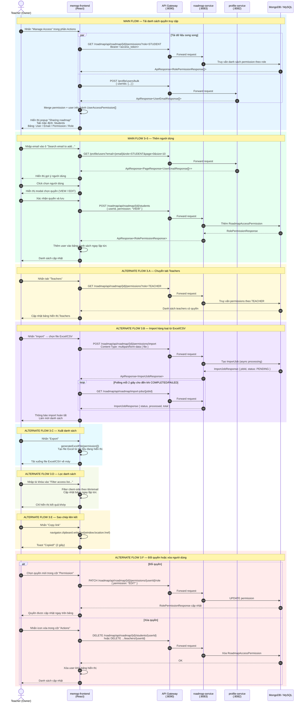

# UC26 — Quản lý quyền truy cập Roadmap (Manage Access Of Roadmap)

```mermaid
sequenceDiagram
    autonumber
    actor Teacher as Teacher (Owner)
    participant FE as memap-frontend<br/>(React)
    participant GW as API Gateway<br/>(:8090)
    participant RS as roadmap-service<br/>(:8083)
    participant PS as profile-service<br/>(:8082)
    participant DB as MongoDB / MySQL

    %% ==================== MỞ POPUP ====================
    rect rgb(230, 245, 255)
        Note over Teacher,DB: MAIN FLOW — Tải danh sách quyền truy cập
        Teacher->>FE: Nhấn "Manage Access" trong phần Actions

        par Tải dữ liệu song song
            FE->>GW: GET /roadmap/api/roadmap/{id}/permissions?role=STUDENT<br/>Bearer <access_token>
            GW->>RS: Forward request
            RS->>DB: Truy vấn danh sách permission theo role
            DB-->>FE: ApiResponse<RolePermissionResponse[]>

        and
            FE->>GW: POST /profile/users/bulk<br/>{ userIds: [...] }
            GW->>PS: Forward request
            PS-->>FE: ApiResponse<UserEmailResponse[]>
        end

        FE->>FE: Merge permission + user info thành UserAccessPermission[]
        FE-->>Teacher: Hiển thị popup "Sharing roadmap"<br/>Tab mặc định: Students<br/>Bảng: User / Email / Permission / Role
    end

    %% ==================== MAIN FLOW THÊM USER ====================
    rect rgb(230, 255, 240)
        Note over Teacher,DB: MAIN FLOW 3–5 — Thêm người dùng
        Teacher->>FE: Nhập email vào ô "Search email to add..."
        FE->>GW: GET /profile/users?email={email}&role=STUDENT&page=0&size=10
        GW->>PS: Forward request
        PS-->>FE: ApiResponse<PageResponse<UserEmailResponse[]>>
        FE-->>Teacher: Hiển thị gợi ý người dùng

        Teacher->>FE: Click chọn người dùng
        FE-->>Teacher: Hiển thị modal chọn quyền (VIEW / EDIT)

        Teacher->>FE: Xác nhận quyền và lưu
        FE->>GW: POST /roadmap/api/roadmap/{id}/students<br/>{ userId, permission: "VIEW" }
        GW->>RS: Forward request
        RS->>DB: Thêm RoadmapAccessPermission
        DB-->>RS: RolePermissionResponse
        RS-->>FE: ApiResponse<RolePermissionResponse>
        FE->>FE: Thêm user vào bảng danh sách ngay lập tức
        FE-->>Teacher: Danh sách cập nhật
    end

    %% ==================== ALT 3.A CHUYỂN TAB ====================
    rect rgb(255, 250, 220)
        Note over Teacher,DB: ALTERNATE FLOW 3.A — Chuyển tab Teachers
        Teacher->>FE: Nhấn tab "Teachers"
        FE->>GW: GET /roadmap/api/roadmap/{id}/permissions?role=TEACHER
        GW->>RS: Forward request
        RS->>DB: Truy vấn permissions theo TEACHER
        DB-->>FE: Danh sách teachers có quyền
        FE-->>Teacher: Cập nhật bảng hiển thị Teachers
    end

    %% ==================== ALT 3.B IMPORT ====================
    rect rgb(240, 230, 255)
        Note over Teacher,DB: ALTERNATE FLOW 3.B — Import hàng loạt từ Excel/CSV
        Teacher->>FE: Nhấn "Import" → chọn file Excel/CSV
        FE->>GW: POST /roadmap/api/roadmap/{id}/permissions/import<br/>Content-Type: multipart/form-data { file }
        GW->>RS: Forward request
        RS->>DB: Tạo ImportJob (async processing)
        DB-->>RS: ImportJobResponse { jobId, status: PENDING }
        RS-->>FE: ApiResponse<ImportJobResponse>

        loop Polling mỗi 2 giây cho đến khi COMPLETED/FAILED
            FE->>GW: GET /roadmap/api/roadmap/import-jobs/{jobId}
            GW->>RS: Forward request
            RS-->>FE: ImportJobResponse { status, processed, total }
        end

        FE-->>Teacher: Thông báo import hoàn tất<br/>Làm mới danh sách
    end

    %% ==================== ALT 3.C EXPORT ====================
    rect rgb(230, 250, 255)
        Note over Teacher,FE: ALTERNATE FLOW 3.C — Xuất danh sách
        Teacher->>FE: Nhấn "Export"
        FE->>FE: generateExcelFile(permission[])<br/>Tạo file Excel từ dữ liệu đang hiển thị
        FE-->>Teacher: Tải xuống file Excel/CSV về máy
    end

    %% ==================== ALT 3.D FILTER ====================
    rect rgb(245, 250, 235)
        Note over Teacher,FE: ALTERNATE FLOW 3.D — Lọc danh sách
        Teacher->>FE: Nhập từ khóa vào "Filter access list..."
        FE->>FE: Filter client-side theo tên/email<br/>Cập nhật bảng ngay lập tức
        FE-->>Teacher: Chỉ hiển thị kết quả khớp
    end

    %% ==================== ALT 3.E COPY LINK ====================
    rect rgb(255, 248, 220)
        Note over Teacher,FE: ALTERNATE FLOW 3.E — Sao chép liên kết
        Teacher->>FE: Nhấn "Copy link"
        FE->>FE: navigator.clipboard.writeText(window.location.href)
        FE-->>Teacher: Toast "Copied!" (2 giây)
    end

    %% ==================== ALT 3.F ĐỔI/XÓA QUYỀN ====================
    rect rgb(255, 235, 235)
        Note over Teacher,DB: ALTERNATE FLOW 3.F — Đổi quyền hoặc xóa người dùng
        alt Đổi quyền
            Teacher->>FE: Chọn quyền mới trong cột "Permission"
            FE->>GW: PATCH /roadmap/api/roadmap/{id}/permissions/{userId}/role<br/>{ permission: "EDIT" }
            GW->>RS: Forward request
            RS->>DB: UPDATE permission
            DB-->>FE: RolePermissionResponse cập nhật
            FE-->>Teacher: Quyền được cập nhật ngay trên bảng
        else Xóa quyền
            Teacher->>FE: Nhấn icon xóa trong cột "Actions"
            FE->>GW: DELETE /roadmap/api/roadmap/{id}/students/{userId}<br/>hoặc DELETE .../teachers/{userId}
            GW->>RS: Forward request
            RS->>DB: Xóa RoadmapAccessPermission
            DB-->>FE: OK
            FE->>FE: Xóa user khỏi bảng hiển thị
            FE-->>Teacher: Danh sách cập nhật
        end
    end
```
