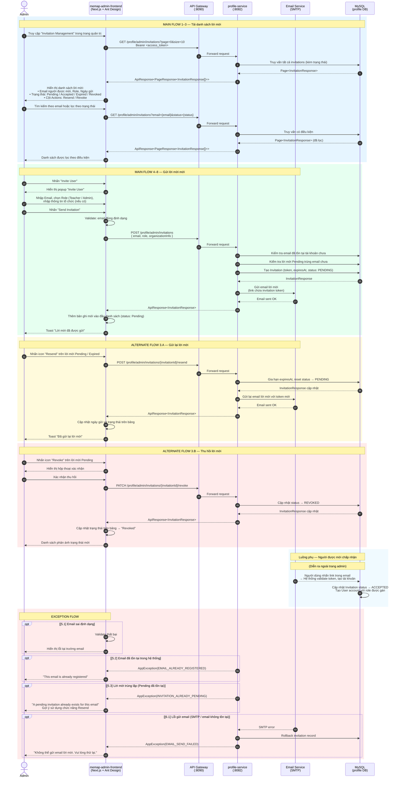

# UC27 — Quản lý lời mời (Manage Invitations)

```mermaid
sequenceDiagram
    autonumber
    actor Admin as Admin
    participant FE as memap-admin-frontend<br/>(Next.js + Ant Design)
    participant GW as API Gateway<br/>(:8090)
    participant PS as profile-service<br/>(:8082)
    participant Mail as Email Service<br/>(SMTP)
    participant DB as MySQL<br/>(profile DB)

    %% ==================== TẢI DANH SÁCH LỜI MỜI ====================
    rect rgb(230, 245, 255)
        Note over Admin,DB: MAIN FLOW 1–3 — Tải danh sách lời mời
        Admin->>FE: Truy cập "Invitation Management" trong trang quản trị
        FE->>GW: GET /profile/admin/invitations?page=0&size=10<br/>Bearer <access_token>
        GW->>PS: Forward request
        PS->>DB: Truy vấn tất cả invitations (kèm trạng thái)
        DB-->>PS: Page<InvitationResponse>
        PS-->>FE: ApiResponse<PageResponse<InvitationResponse[]>>
        FE-->>Admin: Hiển thị danh sách lời mời:<br/>• Email người được mời, Role, Ngày gửi<br/>• Trạng thái: Pending / Accepted / Expired / Revoked<br/>• Cột Actions: Resend / Revoke

        Admin->>FE: Tìm kiếm theo email hoặc lọc theo trạng thái
        FE->>GW: GET /profile/admin/invitations?email={email}&status={status}
        GW->>PS: Forward request
        PS->>DB: Truy vấn có điều kiện
        DB-->>PS: Page<InvitationResponse> (đã lọc)
        PS-->>FE: ApiResponse<PageResponse<InvitationResponse[]>>
        FE-->>Admin: Danh sách được lọc theo điều kiện
    end

    %% ==================== MAIN FLOW GỬI LỜI MỜI ====================
    rect rgb(230, 255, 240)
        Note over Admin,Mail: MAIN FLOW 4–8 — Gửi lời mời mới
        Admin->>FE: Nhấn "Invite User"
        FE-->>Admin: Hiển thị popup "Invite User"

        Admin->>FE: Nhập Email, chọn Role (Teacher / Admin),<br/>nhập thông tin tổ chức (nếu có)
        Admin->>FE: Nhấn "Send Invitation"
        FE->>FE: Validate: email đúng định dạng

        FE->>GW: POST /profile/admin/invitations<br/>{ email, role, organizationInfo }
        GW->>PS: Forward request

        PS->>DB: Kiểm tra email đã tồn tại tài khoản chưa
        PS->>DB: Kiểm tra lời mời Pending trùng email chưa

        PS->>DB: Tạo Invitation (token, expiresAt, status: PENDING)
        DB-->>PS: InvitationResponse

        PS->>Mail: Gửi email lời mời<br/>(link chứa invitation token)
        Mail-->>PS: Email sent OK

        PS-->>FE: ApiResponse<InvitationResponse>
        FE->>FE: Thêm bản ghi mới vào đầu danh sách (status: Pending)
        FE-->>Admin: Toast "Lời mời đã được gửi"
    end

    %% ==================== ALT 3.A GỬI LẠI ====================
    rect rgb(255, 250, 220)
        Note over Admin,Mail: ALTERNATE FLOW 3.A — Gửi lại lời mời
        Admin->>FE: Nhấn icon "Resend" trên lời mời Pending / Expired
        FE->>GW: POST /profile/admin/invitations/{invitationId}/resend
        GW->>PS: Forward request
        PS->>DB: Gia hạn expiresAt, reset status → PENDING
        DB-->>PS: InvitationResponse cập nhật
        PS->>Mail: Gửi lại email lời mời với token mới
        Mail-->>PS: Email sent OK
        PS-->>FE: ApiResponse<InvitationResponse>
        FE->>FE: Cập nhật ngày gửi và trạng thái trên bảng
        FE-->>Admin: Toast "Đã gửi lại lời mời"
    end

    %% ==================== ALT 3.B THU HỒI ====================
    rect rgb(255, 235, 235)
        Note over Admin,DB: ALTERNATE FLOW 3.B — Thu hồi lời mời
        Admin->>FE: Nhấn icon "Revoke" trên lời mời Pending
        FE-->>Admin: Hiển thị hộp thoại xác nhận

        Admin->>FE: Xác nhận thu hồi
        FE->>GW: PATCH /profile/admin/invitations/{invitationId}/revoke
        GW->>PS: Forward request
        PS->>DB: Cập nhật status → REVOKED
        DB-->>PS: InvitationResponse cập nhật
        PS-->>FE: ApiResponse<InvitationResponse>
        FE->>FE: Cập nhật trạng thái trên bảng → "Revoked"
        FE-->>Admin: Danh sách phản ánh trạng thái mới
    end

    %% ==================== NGƯỜI ĐƯỢC MỜI CHẤP NHẬN ====================
    rect rgb(240, 250, 255)
        Note over DB,Mail: Luồng phụ — Người được mời chấp nhận
        Note over DB,Mail: (Diễn ra ngoài trang admin)
        Mail-->>DB: Người dùng nhấn link trong email<br/>→ Hệ thống validate token, tạo tài khoản
        DB->>DB: Cập nhật Invitation status → ACCEPTED<br/>Tạo User account với role được gán
    end

    %% ==================== EXCEPTION FLOW ====================
    rect rgb(255, 235, 235)
        Note over Admin,FE: EXCEPTION FLOW
        opt [5.1] Email sai định dạng
            FE->>FE: Validate thất bại
            FE-->>Admin: Hiển thị lỗi tại trường email
        end

        opt [5.2] Email đã tồn tại trong hệ thống
            PS-->>FE: AppException(EMAIL_ALREADY_REGISTERED)
            FE-->>Admin: "This email is already registered"
        end

        opt [5.3] Lời mời trùng lặp (Pending đã tồn tại)
            PS-->>FE: AppException(INVITATION_ALREADY_PENDING)
            FE-->>Admin: "A pending invitation already exists for this email"<br/>Gợi ý sử dụng chức năng Resend
        end

        opt [6.1] Lỗi gửi email (SMTP / email không tồn tại)
            Mail-->>PS: SMTP error
            PS->>DB: Rollback invitation record
            PS-->>FE: AppException(EMAIL_SEND_FAILED)
            FE-->>Admin: "Không thể gửi email lời mời. Vui lòng thử lại."
        end
    end
```
